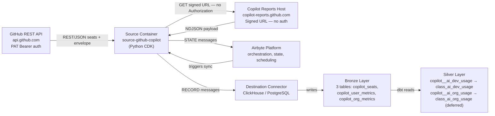
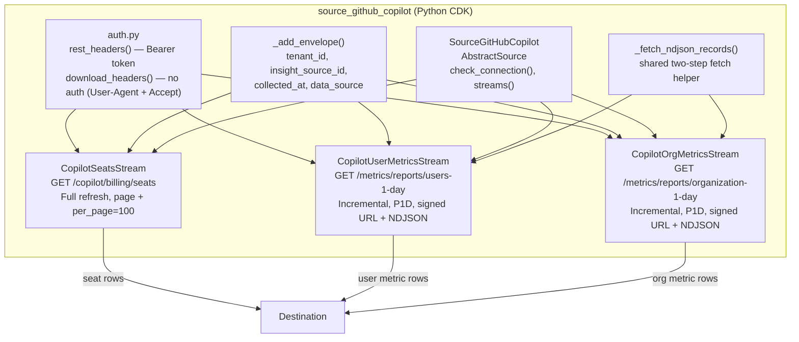
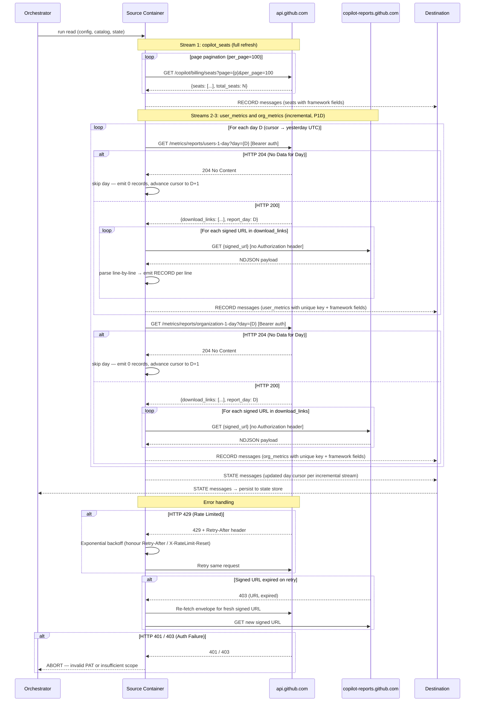

# DESIGN — GitHub Copilot Connector

- [ ] `p3` - **ID**: `cpt-insightspec-design-ghcopilot-connector`

<!-- toc -->

- [1. Architecture Overview](#1-architecture-overview)
  - [1.1 Architectural Vision](#11-architectural-vision)
  - [1.2 Architecture Drivers](#12-architecture-drivers)
  - [1.3 Architecture Layers](#13-architecture-layers)
- [2. Principles & Constraints](#2-principles--constraints)
  - [2.1 Design Principles](#21-design-principles)
  - [2.2 Constraints](#22-constraints)
- [3. Technical Architecture](#3-technical-architecture)
  - [3.1 Domain Model](#31-domain-model)
  - [3.2 Component Model](#32-component-model)
  - [3.3 API Contracts](#33-api-contracts)
  - [3.4 Internal Dependencies](#34-internal-dependencies)
  - [3.5 External Dependencies](#35-external-dependencies)
  - [3.6 Interactions & Sequences](#36-interactions--sequences)
  - [3.7 Database schemas & tables](#37-database-schemas--tables)
  - [3.8 Deployment Topology](#38-deployment-topology)
- [4. Additional context](#4-additional-context)
  - [Identity Resolution Strategy](#identity-resolution-strategy)
  - [Silver / Gold Mappings](#silver--gold-mappings)
  - [Incremental Sync Strategy](#incremental-sync-strategy)
  - [Capacity Estimates](#capacity-estimates)
  - [Non-Applicable Domains](#non-applicable-domains)
  - [Architecture Decision Records](#architecture-decision-records)
- [5. Traceability](#5-traceability)

<!-- /toc -->

## 1. Architecture Overview

### 1.1 Architectural Vision

The GitHub Copilot connector is an Airbyte Python CDK connector implemented as an `AbstractSource` with three streams. It extracts seat roster and daily usage metrics from the GitHub REST API and writes to the Bronze layer under the `bronze_github_copilot` namespace. The Python CDK is required over the declarative manifest framework due to the two-step signed-URL fetch pattern (per-request auth suppression + NDJSON parsing) — see [ADR-0001](./ADR/0001-python-cdk-over-declarative-manifest.md).

One `AbstractSource` (`SourceGitHubCopilot`) exposes three streams:

- `copilot_seats` — full-refresh seat roster with offset pagination
- `copilot_user_metrics` — incremental per-user daily usage via the two-step signed URL fetch
- `copilot_org_metrics` — incremental org-level daily aggregates via the same two-step pattern

Two dbt Silver models are defined alongside the connector. Both follow the project-wide ADR-0001 staging pattern (`engine='ReplacingMergeTree(_version)'`, `order_by=['unique_key']`, `incremental_strategy='append'`, `_version` column projected from `_airbyte_extracted_at`).

- `copilot__ai_dev_usage` — Bronze `copilot_user_metrics` joined with `copilot_seats` to resolve `user_login` → `user_email`. Feeds the existing `class_ai_dev_usage` Silver class with `tool='copilot'`, `source='copilot'`. **Activated** in this PR — `silver/ai/schema.yml` `tool` and `source` enums extended with `'copilot'`. Boolean activity flags (`used_chat`, `used_agent`, `used_cli`) are mapped without schema additions: `used_agent` / `used_chat` flow into `agent_sessions` / `chat_requests` as 1-markers; `used_cli` is preserved together with the other two as a JSON object in `tool_action_breakdown_json`.
- `copilot__ai_org_usage` — Bronze `copilot_org_metrics` → `class_ai_org_usage`. **Deferred**: `class_ai_org_usage` Silver class is not yet created — Copilot is its first contributor. Staging model is present, tagged `silver:class_ai_org_usage`, and includes `{{ config(enabled=false) }}` until the class is created in a coordinated PR. When activated, MUST also follow the ADR-0001 pattern.

#### System Context



### 1.2 Architecture Drivers

**PRD**: [PRD.md](./PRD.md)

#### Functional Drivers

| Requirement | Design Response |
|-------------|-----------------|
| `cpt-insightspec-fr-ghcopilot-seats-collect` | Stream `copilot_seats` → `GET /orgs/{org}/copilot/billing/seats` (full refresh, offset pagination) |
| `cpt-insightspec-fr-ghcopilot-seats-paginate` | `page` + `per_page=100` query params; advance until empty page or fewer than 100 items |
| `cpt-insightspec-fr-ghcopilot-user-metrics-collect` | Stream `copilot_user_metrics` → `GET /orgs/{org}/copilot/metrics/reports/users-1-day?day=YYYY-MM-DD` → signed URL → NDJSON |
| `cpt-insightspec-fr-ghcopilot-signed-url-fetch` | `_fetch_ndjson_records()` shared mixin: API call → envelope → GET each signed URL without `Authorization` → parse NDJSON line-by-line |
| `cpt-insightspec-fr-ghcopilot-user-metrics-incremental` | `IncrementalMixin` + manual `_state` dict, `step: P1D`; cursor advances per-slice even on HTTP 204 days (Major #5 fix); first run starts from `github_start_date` (default 90 days ago) |
| `cpt-insightspec-fr-ghcopilot-org-metrics-collect` | Stream `copilot_org_metrics` → `GET /orgs/{org}/copilot/metrics/reports/organization-1-day?day=YYYY-MM-DD` → signed URL → NDJSON |
| `cpt-insightspec-fr-ghcopilot-org-metrics-incremental` | Same `IncrementalMixin` + manual `_state` pattern as user metrics |
| `cpt-insightspec-fr-ghcopilot-collection-runs` | **Deferred to Phase 2** — monitoring table produced by Argo orchestrator |
| `cpt-insightspec-fr-ghcopilot-deduplication` | Per ADR-0004: every Bronze row carries a `unique_key` String column with formula `{tenant_id}-{insight_source_id}-{natural_key}` (`-` separator). Natural key per stream: `user_login` (seats), `user_login-day` (user metrics), `day` (org metrics). |
| `cpt-insightspec-fr-ghcopilot-tenant-tagging` | `_add_envelope()` applied in each stream's `parse_response()` — injects `tenant_id`, `insight_source_id`, `collected_at`, `data_source = 'insight_github_copilot'` |
| `cpt-insightspec-fr-ghcopilot-identity-key` | `copilot_seats.user_email` primary identity key; `copilot_user_metrics.user_login` resolved to email via Silver join |
| `cpt-insightspec-fr-ghcopilot-identity-email-only` | Silver model uses only `user_email` for cross-system resolution; GitHub numeric IDs retained in Bronze only |

#### NFR Allocation

| NFR ID | NFR Summary | Allocated To | Design Response | Verification Approach |
|--------|-------------|--------------|-----------------|----------------------|
| `cpt-insightspec-nfr-ghcopilot-auth` | PAT Bearer auth; no auth on download | `rest_headers()` / `download_headers()` in `auth.py` | `Authorization: Bearer {token}` for `api.github.com`; `download_headers()` returns `User-Agent` + `Accept` (no `Authorization`) for signed-URL download | Integration test with valid/invalid PAT |
| `cpt-insightspec-nfr-ghcopilot-rate-limiting` | Exponential backoff on 429 | `RateLimitedSession` wrapper | Inspects `Retry-After` / `X-RateLimit-Reset`; exponential backoff with jitter | Observed behaviour during backfill |
| `cpt-insightspec-nfr-ghcopilot-freshness` | Data for day D within 48h | Scheduler config | Daily schedule at 02:00 UTC; cursor covers D-1 at minimum | SLA monitoring |
| `cpt-insightspec-nfr-ghcopilot-data-source` | `data_source = 'insight_github_copilot'` on all rows | `_add_envelope()` | Hard-coded constant injected in every stream's `parse_response()` | Row-level assertion in integration tests |
| `cpt-insightspec-nfr-ghcopilot-idempotent` | No duplicates on re-sync | Primary key definitions | `user_login` (seats), composite `unique` (metrics streams) as Airbyte dedup keys | Run sync twice; verify row counts unchanged |
| `cpt-insightspec-nfr-ghcopilot-schema-stability` | Stable Bronze schema; additive-only changes | `spec.json` + versioning policy | Fixed column set per stream; new API fields handled via nullable columns or pass-through JSON | Schema diff in CI |

#### Architecture Decision Records

- **ADR-0001**: [Python CDK over declarative manifest](./ADR/0001-python-cdk-over-declarative-manifest.md) — `status: accepted`

### 1.3 Architecture Layers

- [ ] `p3` - **ID**: `cpt-insightspec-tech-ghcopilot-connector`

| Layer | Responsibility | Technology |
|-------|---------------|------------|
| Source API | GitHub Copilot REST API | REST / JSON (seats) + REST / NDJSON via signed URL (metrics) |
| Authentication | PAT Bearer for `api.github.com`; no auth for `copilot-reports.github.com` | `rest_headers()` / `download_headers()` in `auth.py` |
| Connector | Stream definitions, pagination, incremental sync, NDJSON parsing | Airbyte Python CDK (`AbstractSource` + `HttpStream`) |
| Execution | Container runtime for source and destination | Python CDK Docker image |
| Bronze | Raw data storage with source-native schema | Destination connector (ClickHouse / PostgreSQL) |
| Silver | Bronze → `class_ai_*` transformations | dbt (`copilot__ai_dev_usage`, `copilot__ai_org_usage`) |

## 2. Principles & Constraints

### 2.1 Design Principles

#### Python CDK for Non-Standard Fetch Patterns

- [ ] `p1` - **ID**: `cpt-insightspec-principle-ghcopilot-python-cdk`
- **ADR**: [ADR-0001](./ADR/0001-python-cdk-over-declarative-manifest.md)

Use the Airbyte Python CDK (`AbstractSource`) when the API fetch pattern cannot be expressed in the declarative manifest framework. The Copilot reports API requires two requests with different auth behaviors (Bearer token to `api.github.com`; no auth to `copilot-reports.github.com`) and NDJSON line-by-line parsing — neither of which the declarative framework supports natively.

#### Source-Native Schema with Framework Field Injection

- [ ] `p2` - **ID**: `cpt-insightspec-principle-ghcopilot-source-native-schema`

Bronze tables preserve GitHub API field names without renaming. Boolean flags (`used_chat`, `used_agent`, `used_cli`) are retained as-is from the NDJSON payload. Framework fields (`tenant_id`, `insight_source_id`, `collected_at`, `data_source`) are injected by `_add_envelope()` and are not present in the API response.

#### Email as the Sole Cross-System Identity Key

- [ ] `p2` - **ID**: `cpt-insightspec-principle-ghcopilot-email-identity`

`copilot_seats.user_email` is the only field used for cross-system identity resolution. `copilot_user_metrics.user_login` is a GitHub username, not an email, and is resolved to `user_email` exclusively through the Silver join with `copilot_seats.user_login`. GitHub's numeric user IDs are not consumed downstream for person resolution.

#### Two-Step Fetch Encapsulation

- [ ] `p2` - **ID**: `cpt-insightspec-principle-ghcopilot-two-step-fetch`

The two-step signed URL pattern is encapsulated in a shared `_fetch_ndjson_records()` method used by both `CopilotUserMetricsStream` and `CopilotOrgMetricsStream`. This method handles envelope parsing, signed-URL download (without auth header), and NDJSON iteration. `CopilotSeatsStream` does not use this method — it is a conventional offset-paginated REST stream.

### 2.2 Constraints

#### PAT Classic Required

- [ ] `p1` - **ID**: `cpt-insightspec-constraint-ghcopilot-pat-classic`

Only a GitHub Personal Access Token (classic) is supported. `manage_billing:copilot` scope is required for the seats endpoint (`/copilot/billing/seats`). Either `manage_billing:copilot` **or** `read:org` scope is sufficient for the metrics reports endpoints (`/copilot/metrics/reports/*`) — `manage_billing:copilot` is recommended as it covers all three endpoints with a single scope. Only Organization Owners can create such tokens. Fine-grained PATs do not support these scopes. The connector does not support GitHub App authentication for the Copilot Admin API.

Additionally, the **"Copilot usage metrics"** policy must be enabled under the GitHub Organization Settings → Copilot → Policies. When the policy is disabled the metrics endpoints return HTTP 403; `check_connection()` detects this and surfaces an actionable error message.

#### No Authorization Header on Signed-URL Download

- [ ] `p1` - **ID**: `cpt-insightspec-constraint-ghcopilot-no-auth-download`

Download requests to `copilot-reports.github.com` **MUST NOT** include the `Authorization` header. The signed URLs are pre-authenticated; sending auth headers to this domain may cause request failures. The `download_headers()` function returns only a non-auth set (`User-Agent`, `Accept: application/x-ndjson, text/plain, */*`) — explicitly without `Authorization`. This is the primary reason the connector cannot use the Airbyte declarative manifest framework.

#### Signed URLs Are Short-Lived

- [ ] `p1` - **ID**: `cpt-insightspec-constraint-ghcopilot-signed-url-expiry`

Signed download URLs expire shortly after issuance. The connector **MUST NOT** cache or store signed URLs across retry attempts; each retry of a failed download requires re-fetching the envelope from the GitHub API to obtain a fresh signed URL.

#### Incremental Step Is P1D

- [ ] `p2` - **ID**: `cpt-insightspec-constraint-ghcopilot-p1d-step`

The metrics endpoints accept a single `day=YYYY-MM-DD` query parameter — one day per request. The connector requests one day per API call. The Copilot reports API does not support multi-day range parameters; each call covers exactly one day.

#### All Endpoints Are HTTP GET

- [ ] `p2` - **ID**: `cpt-insightspec-constraint-ghcopilot-get-endpoints`

All three GitHub API endpoint calls use HTTP GET with query parameters. There are no write operations. The connector is read-only.

## 3. Technical Architecture

### 3.1 Domain Model

**Technology**: Airbyte Python CDK stream classes (Python + JSON Schema definitions in `spec.json`)

**Core Entities**:

| Entity | Description | Maps To |
|--------|-------------|---------|
| `SeatAssignment` | One assigned Copilot seat for a GitHub user. Key: `user_login`. | `copilot_seats` |
| `UserDailyMetrics` | Per-user daily code acceptance and feature engagement. Key: composite `{tenant}-{source}-{user_login}-{day}` (per ADR-0004). | `copilot_user_metrics` |
| `OrgDailyMetrics` | Org-level daily aggregates across all users. Key: composite `{tenant}-{source}-{day}` (per ADR-0004). | `copilot_org_metrics` |

**Relationships**:

- `SeatAssignment.user_login` → `UserDailyMetrics.user_login` — Silver join that resolves `user_login` to `user_email`
- `SeatAssignment.user_email` → `person_id` via Identity Manager (Silver step 2)
- `OrgDailyMetrics` has no direct user attribution — org-wide aggregate only

**Schema format**: JSON Schema definitions per stream, embedded in `spec.json`.

**Schema location**: `src/ingestion/connectors/ai/github-copilot/source_github_copilot/spec.json`

### 3.2 Component Model



#### Connector Package Structure

```text
src/ingestion/connectors/ai/github-copilot/
├── README.md
├── descriptor.yaml
├── Dockerfile
├── pyproject.toml
├── source_github_copilot/
│   ├── __init__.py
│   ├── source.py               # SourceGitHubCopilot(AbstractSource)
│   ├── auth.py                 # rest_headers(), download_headers()
│   ├── streams/
│   │   ├── __init__.py
│   │   ├── seats.py            # CopilotSeatsStream
│   │   ├── user_metrics.py     # CopilotUserMetricsStream
│   │   └── org_metrics.py      # CopilotOrgMetricsStream
│   └── spec.json               # Connector spec + stream JSON Schemas
└── dbt/
    ├── schema.yml
    ├── copilot__ai_dev_usage.sql
    └── copilot__ai_org_usage.sql   # tagged + config(enabled=false) — deferred
```

#### Connector Package Descriptor

- [ ] `p2` - **ID**: `cpt-insightspec-component-ghcopilot-descriptor`

The `descriptor.yaml` at `src/ingestion/connectors/ai/github-copilot/descriptor.yaml` registers the connector with the platform. Key fields:

| Field | Value | Purpose |
|-------|-------|---------|
| `schedule` | `0 2 * * *` | Daily at 02:00 UTC |
| `dbt_select` | `tag:github-copilot+` | Selects the connector's bronze→RMT bootstrap, the active `copilot__ai_dev_usage` staging, and the deferred `copilot__ai_org_usage` (the latter is `enabled=false` so it is skipped at compile-time) |
| `workflow` | `sync` | Standard Airbyte sync workflow |
| `connection.namespace` | `bronze_github_copilot` | Bronze destination namespace |

The `copilot__ai_dev_usage` staging model is tagged `silver:class_ai_dev_usage` and is active. The `copilot__ai_org_usage` staging model is tagged `silver:class_ai_org_usage` but ships with `enabled=false` pending creation of the `class_ai_org_usage` Silver class.

#### SourceGitHubCopilot

- [ ] `p2` - **ID**: `cpt-insightspec-component-ghcopilot-source`

##### Why this component exists

Entry point for the Airbyte connector. Validates credentials, returns the stream list, and exposes the spec schema.

##### Responsibility scope

- `check_connection()`: four sequential checks — (1) `insight_source_id` is non-empty (fails fast with dedup-collision warning); (2) `GET /rate_limit` validates the PAT is valid and not expired; (3) `GET /orgs/{org}/copilot/billing/seats?per_page=1` validates org existence, `manage_billing:copilot` scope, and Copilot enablement (returns distinct error messages for 401/403/404); (4) `GET /orgs/{org}/copilot/metrics/reports/users-1-day?day={yesterday}` validates that the "Copilot usage metrics" org policy is enabled — HTTP 403 at this step means the policy is off, not a scope error (scope was already validated in step 3). Returns `(True, None)` on 200/204/404 from the metrics probe.
- `streams()`: returns `[CopilotSeatsStream, CopilotUserMetricsStream, CopilotOrgMetricsStream]`.
- `spec()`: reads `spec.json` and returns `ConnectorSpecification`.

##### Responsibility boundaries

Does NOT implement stream logic, pagination, or field transformation — delegated to individual stream classes.

##### Related components (by ID)

- `cpt-insightspec-component-ghcopilot-descriptor` — package metadata
- `cpt-insightspec-component-ghcopilot-seats-stream` — seats stream
- `cpt-insightspec-component-ghcopilot-user-metrics-stream` — user metrics stream
- `cpt-insightspec-component-ghcopilot-org-metrics-stream` — org metrics stream

#### CopilotSeatsStream

- [ ] `p2` - **ID**: `cpt-insightspec-component-ghcopilot-seats-stream`

##### Why this component exists

Extracts the full seat roster (all active and pending Copilot seat assignments). Provides `user_email` — the only field that maps GitHub usernames to cross-system identity.

##### Responsibility scope

- Endpoint: `GET https://api.github.com/orgs/{org}/copilot/billing/seats`
- Sync mode: Full refresh on every run.
- Pagination: offset-style — `page` (starts at 1) + `per_page=100`; stops when the API returns fewer than 100 items.
- Auth: `Authorization: Bearer {token}` via `rest_headers()`.
- Injects framework fields via `_add_envelope()`.
- Field extraction: `user_login` and `user_email` are mapped from `assignee.login` and `assignee.email` in the API response — the seats endpoint nests identity fields under the `assignee` sub-object, not at the top level.
- Primary key: `user_login`.

##### Responsibility boundaries

Does NOT join with metrics streams — that join is owned by the Silver dbt model.

##### Related components (by ID)

- `cpt-insightspec-component-ghcopilot-source` — parent `AbstractSource`

#### CopilotUserMetricsStream

- [ ] `p2` - **ID**: `cpt-insightspec-component-ghcopilot-user-metrics-stream`

##### Why this component exists

Extracts per-user daily Copilot usage metrics — the primary input for `class_ai_dev_usage`. One API call per day requested (P1D step).

##### Responsibility scope

- Step 1 endpoint: `GET https://api.github.com/orgs/{org}/copilot/metrics/reports/users-1-day?day={YYYY-MM-DD}` with Bearer auth.
- Step 1 response: `{"download_links": ["https://..."], "report_day": "YYYY-MM-DD"}` — `download_links` is an array of plain URL strings (not `{"url": "..."}` objects).
- Step 2: For each URL in `download_links`, `GET {signed_url}` via `download_headers()` (no auth header). Parse each line as a JSON object — one record per line.
- Sync mode: Incremental; cursor field `day` (YYYY-MM-DD); advances from `max(day)` to yesterday UTC.
- Injects framework fields and composite `unique_key` (`{tenant}-{source}-{user_login}-{day}` per ADR-0004) per record.

##### Responsibility boundaries

Does NOT resolve `user_login` to `user_email` — owned by the Silver dbt model. Does NOT cache signed URLs across retry attempts.

##### Related components (by ID)

- `cpt-insightspec-component-ghcopilot-source` — parent
- `cpt-insightspec-component-ghcopilot-org-metrics-stream` — sibling; shares `_fetch_ndjson_records()` helper

#### CopilotOrgMetricsStream

- [ ] `p2` - **ID**: `cpt-insightspec-component-ghcopilot-org-metrics-stream`

##### Why this component exists

Extracts org-level daily Copilot aggregate metrics for trend and adoption analytics. No user attribution — org-wide totals only.

##### Responsibility scope

- Step 1 endpoint: `GET https://api.github.com/orgs/{org}/copilot/metrics/reports/organization-1-day?day={YYYY-MM-DD}` with Bearer auth.
- Same two-step signed URL + NDJSON pattern as `CopilotUserMetricsStream` via `_fetch_ndjson_records()`.
- Sync mode: Incremental; cursor field `day`; same P1D step as user metrics.
- Composite `unique_key`: `{tenant_id}-{source_id}-{day}` (hyphen separator, per ADR-0004) — `tenant_id`+`source_id` prefix discriminates between tenants and multiple Copilot connections within the same tenant.

##### Responsibility boundaries

Does NOT feed `class_ai_dev_usage` — its Silver target is `class_ai_org_usage` (deferred). Its Bronze data is available but not yet consumed by any activated Silver model.

##### Related components (by ID)

- `cpt-insightspec-component-ghcopilot-source` — parent
- `cpt-insightspec-component-ghcopilot-user-metrics-stream` — sibling; shares `_fetch_ndjson_records()` helper

#### dbt Transformation Models

- [ ] `p2` - **ID**: `cpt-insightspec-component-ghcopilot-dbt`

##### Why these components exist

Two SQL transformations that route the connector's Bronze streams to cross-provider Silver streams.

##### `copilot__ai_dev_usage.sql`

Reads from `copilot_user_metrics`; LEFT JOINs `copilot_seats` on `copilot_user_metrics.user_login = copilot_seats.user_login` to obtain `user_email`. Sets `tool = 'copilot'`, `source = 'copilot'`, `data_source = 'insight_github_copilot'`. `person_id` is NULL at Silver step 1; resolved in step 2 via Identity Manager.

**dbt config (per ADR-0001)**:

```sql
{{ config(
    materialized='incremental',
    incremental_strategy='append',
    unique_key='unique_key',
    engine='ReplacingMergeTree(_version)',
    order_by=['unique_key'],
    on_schema_change='append_new_columns',
    settings={'allow_nullable_key': 1},
    schema='staging',
    tags=['github-copilot', 'silver:class_ai_dev_usage']
) }}
```

The model **MUST** project a `_version` column (`toUnixTimestamp64Milli(_airbyte_extracted_at)`) so RMT background merges can dedupe deterministically.

**Bronze deduplication**: Per ADR-0002, the connector ships `github_copilot__bronze_promoted.sql` which RMT-promotes the three Bronze tables (`copilot_seats`, `copilot_user_metrics`, `copilot_org_metrics`). The staging model carries a `-- depends_on: {{ ref('github_copilot__bronze_promoted') }}` header so dbt's DAG always materialises the bootstrap before the staging model reads Bronze. The `LIMIT 1 BY` defensive dedup is retained inside the staging CTE for safety during the first run before the RMT merge fires.

**Silver class extension applied**: The `tool` and `source` enum `accepted_values` in `silver/ai/schema.yml` are extended with `'copilot'`. No new boolean columns were added — `used_chat` / `used_agent` / `used_cli` are mapped without a schema change (see field mapping below).

**Field mapping** (per gist proposal — AI providers metrics matrix):
- `loc_added_sum` → `lines_added`
- `loc_deleted_sum` → `lines_removed`
- `code_generation_activity_count` → `tool_use_offered` (proxy: each generation event ≈ one offered suggestion; the v2 API does not split offered from rejected)
- `code_acceptance_activity_count` → `tool_use_accepted` and `completions_count`
- `used_agent` (boolean) → `agent_sessions = 1` if true else NULL
- `used_chat` (boolean) → `chat_requests = 1` if true else NULL
- `used_cli` (boolean) → packed into `tool_action_breakdown_json` together with the other two flags
- `total_lines_added` / `total_lines_removed` → NULL (Copilot reports only AI-accepted lines, no view of manual keystrokes — same gap as Claude Code/Enterprise)
- `commits_count` / `pull_requests_count` → NULL (per-user PR/commit attribution is org-level only in Copilot — see `copilot_org_metrics.pull_requests`)
- `cost_cents` → NULL (Copilot is per-seat subscription, not metered)

**NULL `user_email` policy**: The dbt model **MUST** filter `WHERE user_email IS NOT NULL` before writing to `class_ai_dev_usage`, since the Cursor and Claude Enterprise staging models contributing to the same Silver class assume a non-null `email` column. Rows where `user_login` has no matching seat (transient race condition — seat removed between seat fetch and metrics fetch) are dropped from Silver but retained in Bronze (`copilot_user_metrics`). Bronze rows recover automatically on the next seat roster sync once the user re-appears in `copilot_seats`. Tracked in PRD OQ-COP-1.

##### `copilot__ai_org_usage.sql`

**Status: DEFERRED** — the `class_ai_org_usage` Silver class **does not yet exist**; this connector would be its first contributor. The staging file is present and tagged `tag:github-copilot`, `tag:silver:class_ai_org_usage`, but includes `{{ config(enabled=false) }}` in its config block to prevent execution despite being matched by `dbt_select: tag:github-copilot+`. Activation requires (1) creating `silver/ai/class_ai_org_usage.sql` (RMT(_version) + ORDER BY unique_key per ADR-0001 — same pattern as `class_ai_dev_usage`) and (2) removing `enabled=false` from this staging model.

When activated, this staging **MUST** follow ADR-0001: same config block as `copilot__ai_dev_usage.sql` above, `_version` column from `_airbyte_extracted_at`.

**Tracking**: PRD OQ-COP-2 owns the `class_ai_org_usage` creation question. A dedicated GitHub issue **MUST** be filed under `cyberfabric/insight` referencing OQ-COP-2 before this model is activated; the issue link is to be added here once filed (target: Q3 2026 per PRD §13).

##### What Copilot does **not** feed

- `class_ai_assistant_usage` — Copilot is an IDE-tool, not a chat / assistant surface. Routing engagement metrics there would mix product domains.
- `class_ai_api_usage` — Copilot does not expose token-level metering; that class is fed by Anthropic Admin and OpenAI.

#### Extension Points & Stability Zones

**Extension points**:
- **New stream**: create a class in `streams/`, register in `SourceGitHubCopilot.streams()`, add JSON Schema to `spec.json`. The `_fetch_ndjson_records()` helper is reusable for any two-step signed URL pattern.
- **New dbt Silver model**: add a `.sql` file to `dbt/`, tag it `tag:github-copilot` to include it in the platform `dbt_select`.

**Stability zones**:
- **Stable (external contract)**: Bronze namespace `bronze_github_copilot`, stream names (`copilot_*`), `copilot_seats.user_email`, `copilot_user_metrics.user_login`, `_add_envelope()` signature.
- **Internal (may change without notice)**: `_fetch_ndjson_records()` helper implementation, `auth.py` function signatures.

### 3.3 API Contracts

#### GitHub Copilot Admin API Endpoints

- [ ] `p2` - **ID**: `cpt-insightspec-interface-ghcopilot-api-endpoints`

- **Contracts**: `cpt-insightspec-contract-ghcopilot-github-api`
- **Technology**: REST / JSON (seats) + REST / NDJSON via signed URL (metrics)

| Stream | Step | Endpoint | Method | Pagination / Pattern |
|--------|------|----------|--------|---------------------|
| `copilot_seats` | — | `GET /orgs/{org}/copilot/billing/seats?page={p}&per_page=100` | GET | Offset: `page` + `per_page=100`; stop at `< 100` items |
| `copilot_user_metrics` | 1 | `GET /orgs/{org}/copilot/metrics/reports/users-1-day?day=YYYY-MM-DD` | GET | One call per day (P1D); returns envelope |
| `copilot_user_metrics` | 2 | `{signed_url}` (`copilot-reports.github.com`) | GET | None — full NDJSON payload per URL |
| `copilot_org_metrics` | 1 | `GET /orgs/{org}/copilot/metrics/reports/organization-1-day?day=YYYY-MM-DD` | GET | One call per day (P1D); returns envelope |
| `copilot_org_metrics` | 2 | `{signed_url}` (`copilot-reports.github.com`) | GET | None — full NDJSON payload per URL |

**Response structures**:

| Stream | Step 1 Response | Step 2 Response |
|--------|-----------------|-----------------|
| `copilot_seats` | `{"seats": [...], "total_seats": N}` | — |
| `copilot_user_metrics` | `{"download_links": [...], "report_day": "YYYY-MM-DD"}` | NDJSON: one JSON object per line |
| `copilot_org_metrics` | `{"download_links": [...], "report_day": "YYYY-MM-DD"}` | NDJSON: one JSON object per line |

**Authentication**:

- Step 1 (`api.github.com`): `Authorization: Bearer {github_token}`
- Step 2 (`copilot-reports.github.com`): **no `Authorization` header** — signed URLs are pre-authenticated

**API Evolution Policy**:

- Target: GitHub REST API v3.
- Field additions from GitHub: non-breaking — new nullable columns passthrough (`additionalProperties: true` in JSON Schema).
- Field removals / renames: require Bronze schema migration (see NFR `cpt-insightspec-nfr-ghcopilot-schema-stability`).
- Endpoint deprecation: monitor GitHub API changelog; the prior `/orgs/{org}/copilot/metrics` endpoint was decommissioned 2026-04-02 — this connector targets only the replacement reports API endpoints.

#### Source Config Schema

- [ ] `p2` - **ID**: `cpt-insightspec-interface-ghcopilot-source-config`

Config fields (defined in `spec.json`):

| Field | Required | Secret | Description |
|-------|----------|--------|-------------|
| `tenant_id` | Yes | No | Tenant isolation identifier (UUID) |
| `github_token` | Yes | Yes | PAT (classic) with `manage_billing:copilot` scope (covers all endpoints); `read:org` also accepted for metrics |
| `github_org` | Yes | No | GitHub organization slug (e.g. `my-company`) |
| `insight_source_id` | **Yes** | No | Connector instance identifier — **must be non-empty** (validated by `check_connection()`); injected by the platform from the `insight.cyberfabric.com/source-id` annotation on the K8s Secret |
| `github_start_date` | No | No | Earliest date for metrics backfill (YYYY-MM-DD). Default: 90 days ago |

`github_token` is marked `airbyte_secret: true` and is never logged.

### 3.4 Internal Dependencies

| Component | Depends On | Interface |
|-----------|------------|-----------|
| `SourceGitHubCopilot` | Airbyte Python CDK (`AbstractSource`) | Executed by Python CDK runner |
| `copilot__ai_dev_usage` dbt model | `copilot_user_metrics` + `copilot_seats` Bronze tables | SQL read + LEFT JOIN on `login = user_login` |
| `copilot__ai_org_usage` dbt model | `copilot_org_metrics` Bronze table | SQL read (deferred) |
| Silver pipeline | `copilot_seats.user_email` | `user_email` → `person_id` via Identity Manager |
| Identity Manager (Silver step 2) | `user_email` from Silver step 1 | Resolves email → canonical `person_id` |

### 3.5 External Dependencies

#### GitHub REST API

| Dependency | Purpose | Notes |
|------------|---------|-------|
| `api.github.com` | All three step-1 endpoint calls (seats + metrics envelopes) | Rate-limited 5,000 req/hr; PAT Bearer auth |

#### GitHub Copilot Reports Host

| Dependency | Purpose | Notes |
|------------|---------|-------|
| `copilot-reports.github.com` | NDJSON payload download | No auth header; signed URLs expire; separate from GitHub REST API |

#### Docker Hub Images

| Image | Purpose |
|-------|---------|
| `source-github-copilot` (custom Python CDK image) | Executes the connector |
| `airbyte/destination-clickhouse` (or other) | Writes to Bronze layer |

### 3.6 Interactions & Sequences

#### Incremental Sync Run

**ID**: `cpt-insightspec-seq-ghcopilot-sync`

**Use cases**: `cpt-insightspec-usecase-ghcopilot-incremental-sync`

**Actors**: `cpt-insightspec-actor-ghcopilot-scheduler`, `cpt-insightspec-actor-ghcopilot-github-api`



### 3.7 Database schemas & tables

Bronze tables are created by the destination (ClickHouse). In addition to connector-defined columns, the destination adds framework columns to every table:

| Column | Type | Description |
|--------|------|-------------|
| `_airbyte_raw_id` | String | Airbyte dedup key — auto-generated |
| `_airbyte_extracted_at` | DateTime64 | Extraction timestamp — auto-generated |

#### Table: `copilot_seats`

**ID**: `cpt-insightspec-dbtable-ghcopilot-seats`

| Field | Type | Description |
|-------|------|-------------|
| `tenant_id` | String | Tenant isolation key — framework-injected |
| `insight_source_id` | String | Connector instance identifier — framework-injected, DEFAULT '' |
| `unique_key` | String | Composite per ADR-0004: `concat(tenant_id, '-', insight_source_id, '-', user_login)` |
| `user_login` | String | GitHub username of the seat holder |
| `user_email` | String | Work email from linked GitHub account — primary identity key → `person_id` |
| `plan_type` | String | `business` / `enterprise` / `unknown` |
| `pending_cancellation_date` | String (nullable) | Cancellation date (ISO 8601), NULL if not cancelling |
| `last_activity_at` | String (nullable) | Last recorded Copilot activity (ISO 8601) |
| `last_activity_editor` | String (nullable) | Editor used in last activity (e.g. `vscode`, `jetbrains`) |
| `last_authenticated_at` | String (nullable) | Timestamp of last GitHub Copilot authentication (ISO 8601) |
| `created_at` | String (nullable) | When the seat was assigned (ISO 8601) |
| `updated_at` | String (nullable) | Last seat record update (ISO 8601) — **deprecated by GitHub** |
| `collected_at` | String | Collection timestamp (UTC ISO 8601) — framework-injected |
| `data_source` | String | Always `insight_github_copilot` — framework-injected |

**PK / dedup key**: `unique_key`. Full refresh — one row per seat per sync. Bronze table will be RMT-promoted per ADR-0002 (deferred until upstream `promote_bronze_to_rmt` macro fix; see §3.2 for rationale).

**Query patterns**: full-replace on every sync; Silver join reads by `user_login`. _ClickHouse `ORDER BY` will be `unique_key` per ADR-0001 once promoted; current default is `_airbyte_raw_id`._

---

#### Table: `copilot_user_metrics`

**ID**: `cpt-insightspec-dbtable-ghcopilot-user-metrics`

| Field | Type | Description |
|-------|------|-------------|
| `tenant_id` | String | Tenant isolation key — framework-injected |
| `insight_source_id` | String | Connector instance identifier — framework-injected, DEFAULT '' |
| `unique_key` | String | Composite per ADR-0004: `concat(tenant_id, '-', insight_source_id, '-', user_login, '-', day)` |
| `user_login` | String | GitHub username (source-native: API field `user_login`) — joins to `copilot_seats.user_login` for email resolution |
| `user_id` | Number (nullable) | GitHub numeric user ID |
| `organization_id` | String (nullable) | GitHub numeric org ID (as string) |
| `enterprise_id` | String (nullable) | GitHub enterprise ID (empty string when not applicable) |
| `day` | String | Metric date (YYYY-MM-DD) — incremental cursor |
| `code_generation_activity_count` | Number (nullable) | Code generation events triggered by the user |
| `code_acceptance_activity_count` | Number (nullable) | Number of accepted code completion suggestions |
| `loc_suggested_to_add_sum` | Number (nullable) | Lines of code suggested to add (pre-acceptance) |
| `loc_suggested_to_delete_sum` | Number (nullable) | Lines of code suggested to delete (pre-acceptance) |
| `loc_added_sum` | Number (nullable) | Lines of AI-generated code accepted and added |
| `loc_deleted_sum` | Number (nullable) | Lines of AI-generated code accepted and deleted |
| `user_initiated_interaction_count` | Number (nullable) | User-initiated interactions (chat turns, completions triggered) |
| `used_chat` | Boolean (nullable) | Whether the user used Copilot Chat (IDE) on this day |
| `used_agent` | Boolean (nullable) | Whether the user used agent mode on this day |
| `used_cli` | Boolean (nullable) | Whether the user used Copilot CLI on this day |
| `used_copilot_coding_agent` | Boolean (nullable) | Whether the user used Copilot Coding Agent on this day |
| `used_copilot_cloud_agent` | Boolean (nullable) | Whether the user used Copilot Cloud Agent on this day |
| `totals_by_ide` | Array (nullable) | Breakdown by IDE — passthrough JSON array |
| `totals_by_feature` | Array (nullable) | Breakdown by Copilot feature — passthrough JSON array |
| `totals_by_language_feature` | Array (nullable) | Breakdown by language × feature — passthrough JSON array |
| `totals_by_language_model` | Array (nullable) | Breakdown by language × model — passthrough JSON array |
| `totals_by_model_feature` | Array (nullable) | Breakdown by model × feature — passthrough JSON array |
| `collected_at` | String | Collection timestamp (UTC ISO 8601) — framework-injected |
| `data_source` | String | Always `insight_github_copilot` — framework-injected |

**PK / dedup key**: `unique_key`. Granularity: one row per `(tenant, source, user_login, day)`. Incremental, append-only sync (per ADR-0001 / Connector Spec §4.10).

**Query patterns**: Silver staging reads by `user_login` for identity join; incremental loads filter by `day`. _ClickHouse `ORDER BY` will be `unique_key` per ADR-0001 once Bronze is RMT-promoted._

---

#### Table: `copilot_org_metrics`

**ID**: `cpt-insightspec-dbtable-ghcopilot-org-metrics`

| Field | Type | Description |
|-------|------|-------------|
| `tenant_id` | String | Tenant isolation key — framework-injected |
| `insight_source_id` | String | Connector instance identifier — framework-injected, **required non-empty** (validated by `check_connection()`) — discriminates between multiple Copilot connections per tenant |
| `unique_key` | String | Composite per ADR-0004: `concat(tenant_id, '-', insight_source_id, '-', day)`. The `tenant-source-` prefix prevents collision between connections; multi-org tenants get distinct keys naturally |
| `day` | String | Metric date (YYYY-MM-DD) — incremental cursor |
| `organization_id` | String (nullable) | GitHub numeric org ID (as string) |
| `enterprise_id` | String (nullable) | GitHub enterprise ID (empty string when not applicable) |
| `daily_active_users` | Number (nullable) | Users who triggered any Copilot event in the trailing 24 h |
| `weekly_active_users` | Number (nullable) | Users active in the trailing 7 days |
| `monthly_active_users` | Number (nullable) | Users active in the trailing 30 days |
| `monthly_active_chat_users` | Number (nullable) | Users who used Copilot Chat in the trailing 30 days |
| `monthly_active_agent_users` | Number (nullable) | Users who used agent mode in the trailing 30 days |
| `daily_active_copilot_cloud_agent_users` | Number (nullable) | Users who used Copilot Cloud Agent in the trailing 24 h |
| `weekly_active_copilot_cloud_agent_users` | Number (nullable) | Users active in Copilot Cloud Agent in the trailing 7 days |
| `monthly_active_copilot_cloud_agent_users` | Number (nullable) | Users active in Copilot Cloud Agent in the trailing 30 days |
| `daily_active_copilot_code_review_users` | Number (nullable) | Users who used Copilot Code Review in the trailing 24 h |
| `weekly_active_copilot_code_review_users` | Number (nullable) | Users active in Copilot Code Review in the trailing 7 days |
| `monthly_active_copilot_code_review_users` | Number (nullable) | Users active in Copilot Code Review in the trailing 30 days |
| `daily_passive_copilot_code_review_users` | Number (nullable) | Users whose PRs were reviewed by Copilot in the trailing 24 h (passive recipients of Copilot review activity) |
| `weekly_passive_copilot_code_review_users` | Number (nullable) | Passive Copilot Code Review recipients in the trailing 7 days |
| `monthly_passive_copilot_code_review_users` | Number (nullable) | Passive Copilot Code Review recipients in the trailing 30 days |
| `user_initiated_interaction_count` | Number (nullable) | Total user-initiated interactions (org-wide, on this day) |
| `code_generation_activity_count` | Number (nullable) | Total code generation events (org-wide) |
| `code_acceptance_activity_count` | Number (nullable) | Total accepted code suggestions (org-wide) |
| `loc_suggested_to_add_sum` | Number (nullable) | Total lines suggested to add (org-wide, pre-acceptance) |
| `loc_suggested_to_delete_sum` | Number (nullable) | Total lines suggested to delete (org-wide, pre-acceptance) |
| `loc_added_sum` | Number (nullable) | Total lines of AI-generated code accepted and added (org-wide) |
| `loc_deleted_sum` | Number (nullable) | Total lines of AI-generated code accepted and deleted (org-wide) |
| `pull_requests` | Object (nullable) | PR metrics object e.g. `{"total_reviewed": N, "total_created": N, ...}` |
| `totals_by_ide` | Array (nullable) | Breakdown by IDE — passthrough JSON array |
| `totals_by_feature` | Array (nullable) | Breakdown by Copilot feature — passthrough JSON array |
| `totals_by_language_feature` | Array (nullable) | Breakdown by language × feature — passthrough JSON array |
| `totals_by_language_model` | Array (nullable) | Breakdown by language × model — passthrough JSON array |
| `totals_by_model_feature` | Array (nullable) | Breakdown by model × feature — passthrough JSON array |
| `collected_at` | String | Collection timestamp (UTC ISO 8601) — framework-injected |
| `data_source` | String | Always `insight_github_copilot` — framework-injected |

Field set confirmed against live `constructor-tech-org` API (2026-05-05; the 6 `*_copilot_code_review_*` fields were added in this verification pass). `additionalProperties: true` ensures any further new API fields pass through without a schema migration.

**PK / dedup key**: `unique_key`. Granularity: one row per `(tenant, source, day)`. Incremental, append-only.

**Query patterns**: incremental loads filter by `day`. _ClickHouse `ORDER BY` will be `unique_key` per ADR-0001 once Bronze is RMT-promoted._

---

#### Orchestrator-Produced Table: `copilot_collection_runs`

**[DEFERRED to Phase 2]** Produced by the Argo orchestrator pipeline, not by the Airbyte connector in Phase 1. Consistent with `claude-admin`, `claude-enterprise`, and `confluence` connectors. Monitoring table — not an analytics source.

| Field | Type | Description |
|-------|------|-------------|
| `tenant_id` | String | Framework-injected |
| `insight_source_id` | String | Framework-injected |
| `run_id` | String | Unique run identifier — primary key |
| `started_at` | DateTime | Run start time |
| `completed_at` | DateTime | Run end time |
| `status` | String | `running` / `completed` / `failed` |
| `seats_collected` | Number | Rows collected for `copilot_seats` |
| `user_metrics_collected` | Number | Rows collected for `copilot_user_metrics` |
| `org_metrics_collected` | Number | Rows collected for `copilot_org_metrics` |
| `api_calls` | Number | Total API calls made |
| `errors` | Number | Errors encountered |
| `settings` | String (JSON) | Collection configuration |

### 3.8 Deployment Topology

- [ ] `p3` - **ID**: `cpt-insightspec-topology-ghcopilot-connector`

```text
Package: src/ingestion/connectors/ai/github-copilot/
├── source_github_copilot/    (Python CDK source)
├── descriptor.yaml
└── dbt/                      (Bronze → Silver)

Connection: github-copilot-{org_name}-daily
├── Schedule: daily 02:00 UTC (via orchestrator cron)
├── Source image: source-github-copilot (Python CDK)
├── Source config: {insight_tenant_id, github_token, github_org, insight_source_id, github_start_date?}
├── Streams: 3 (copilot_seats, copilot_user_metrics, copilot_org_metrics)
├── Destination: ClickHouse Bronze (namespace: bronze_github_copilot)
└── State: per-stream day cursors (user_metrics, org_metrics)
```

## 4. Additional context

### Identity Resolution Strategy

`copilot_seats.user_email` is the sole cross-system identity key emitted by this connector. `copilot_user_metrics.user_login` is a GitHub username — not an email — and is resolved to `user_email` exclusively through the Silver join in `copilot__ai_dev_usage.sql`.

**Login-to-email resolution gap**: If a user appears in `copilot_user_metrics` but not in `copilot_seats` (transient race condition when seat roster sync and metrics sync occur close together), `user_email` will be NULL for those rows in Silver. These rows are retained in Bronze but excluded from Silver identity resolution. The gap resolves automatically on the next seat roster sync.

**Cross-platform note**: The same user typically appears in this connector (`user_email` from `copilot_seats`), the `cursor` connector, the `claude-admin` connector (Claude Code usage), and the `windsurf` connector. All use `email` as the identity key and map to the same `person_id` via the Identity Manager in Silver step 2, enabling per-person aggregation across AI dev tools without additional join mapping.

### Silver / Gold Mappings

#### User Metrics → `class_ai_dev_usage`

`class_ai_dev_usage` is an **existing** Silver class (`silver/ai/class_ai_dev_usage.sql`) materialized as `ReplacingMergeTree(_version)` per ADR-0001, currently fed by Cursor + Claude Enterprise. Adding Copilot is a strict additive operation: extend the schema with three boolean columns, add `'copilot'` to two enum `accepted_values`, write the staging model with `tool='copilot'`, `source='copilot'`.

| Bronze (`copilot_user_metrics` + `copilot_seats`) | Silver column | Transformation |
|--------------------------------------------------|---------------|---------------|
| `tenant_id` | `insight_tenant_id` | Pass through (rename) |
| `insight_source_id` | `source_id` | Pass through |
| (composite) | `unique_key` | `concat(tenant_id, '-', insight_source_id, '-', user_login, '-', day)` per ADR-0004 |
| `copilot_seats.user_email` | `email` | LEFT JOIN on `user_login = user_login`; `lower(trim(...))`; row dropped if NULL |
| — | `api_key_id` | `CAST(NULL AS Nullable(String))` — Copilot uses PAT/session, not per-user API keys |
| `day` | `day` | Pass through (already `Date`) |
| (constant) | `tool` | `'copilot'` |
| (constant) | `source` | `'copilot'` |
| (constant) | `data_source` | `'insight_github_copilot'` |
| — | `session_count` | `toUInt32(1)` per active day (Copilot has no session counter) |
| `loc_added_sum` | `lines_added` | `toUInt32(coalesce(loc_added_sum, 0))` |
| `loc_deleted_sum` | `lines_removed` | `toUInt32(coalesce(loc_deleted_sum, 0))` |
| — | `total_lines_added`, `total_lines_removed` | NULL — Copilot reports only AI-accepted lines, no view of total keystrokes |
| `code_acceptance_activity_count` | `tool_use_accepted` | Rename |
| `code_generation_activity_count` | `tool_use_offered` | Proxy: each generation event ≈ one offered suggestion; v2 API does not split offered from rejected |
| `code_acceptance_activity_count` | `completions_count` | Same value as `tool_use_accepted` |
| `used_agent` (boolean) | `agent_sessions` | `if(used_agent, toUInt32(1), NULL)` — activity marker per active day |
| `used_chat` (boolean) | `chat_requests` | `if(used_chat, toUInt32(1), NULL)` — activity marker per active day |
| — | `cost_cents` | NULL — Copilot is per-seat subscription, not per-event consumption |
| — | `commits_count`, `pull_requests_count` | NULL — per-user attribution not available at user grain |
| `used_chat`, `used_agent`, `used_cli` | `tool_action_breakdown_json` | `{"used_chat": bool, "used_agent": bool, "used_cli": bool}` — activity flags packed as JSON; `used_cli` has no dedicated column slot in the base schema |
| `_airbyte_extracted_at` | `_version` | `toUnixTimestamp64Milli(_airbyte_extracted_at)` per ADR-0001 |
| `collected_at` | `collected_at` | Parse to `DateTime64(3)` |

#### Org Metrics → `class_ai_org_usage` (deferred — class to be created)

`class_ai_org_usage` is **not yet a Silver class** — the Copilot connector would be its first contributor. The class will be created in a coordinated PR following ADR-0001 (`materialized='incremental'`, `engine='ReplacingMergeTree(_version)'`, `order_by=['unique_key']`).

| Bronze (`copilot_org_metrics`) | Silver column | Transformation |
|-------------------------------|---------------|---------------|
| `tenant_id` | `insight_tenant_id` | Pass through (rename) |
| `insight_source_id` | `source_id` | Pass through |
| (composite) | `unique_key` | `concat(tenant_id, '-', insight_source_id, '-', day)` per ADR-0004 |
| `day` | `day` | Pass through |
| (constant) | `tool` | `'copilot'` |
| (constant) | `source` | `'copilot'` |
| (constant) | `data_source` | `'insight_github_copilot'` |
| `daily_active_users` | `daily_active_users` | Pass through |
| `weekly_active_users` | `weekly_active_users` | Pass through |
| `monthly_active_users` | `monthly_active_users` | Pass through |
| `monthly_active_chat_users` | `monthly_active_chat_users` | Pass through |
| `monthly_active_agent_users` | `monthly_active_agent_users` | Pass through |
| `daily_active_copilot_cloud_agent_users` | `daily_active_copilot_cloud_agent_users` | Pass through |
| `weekly_active_copilot_cloud_agent_users` | `weekly_active_copilot_cloud_agent_users` | Pass through |
| `monthly_active_copilot_cloud_agent_users` | `monthly_active_copilot_cloud_agent_users` | Pass through |
| `daily_active_copilot_code_review_users` | `daily_active_copilot_code_review_users` | Pass through |
| `user_initiated_interaction_count` | `user_initiated_interaction_count` | Pass through |
| `code_generation_activity_count` | `code_generation_activity_count` | Pass through |
| `code_acceptance_activity_count` | `code_acceptance_activity_count` | Pass through |
| `loc_suggested_to_add_sum` | `loc_suggested_to_add_sum` | Pass through |
| `loc_suggested_to_delete_sum` | `loc_suggested_to_delete_sum` | Pass through |
| `loc_added_sum` | `loc_added_sum` | Pass through |
| `loc_deleted_sum` | `loc_deleted_sum` | Pass through |
| `pull_requests` | `pull_requests` | Pass through (JSON object) |
| `_airbyte_extracted_at` | `_version` | `toUnixTimestamp64Milli(_airbyte_extracted_at)` per ADR-0001 |
| `collected_at` | `collected_at` | Parse to `DateTime64(3)` |

**Status**: Deferred. Both the Silver class definition and this staging model's `enabled=false` removal go in the same activation PR. Per ADR-0001 the new class **MUST** use `RMT(_version)` and `ORDER BY (unique_key)`; per ADR-0004 the `unique_key` composite **MUST** be tenant-source-prefixed.

#### Silver/Gold Summary

| Bronze table | Silver target | Status |
|-------------|--------------|--------|
| `copilot_seats` | Identity resolution input (`user_email` join dimension) | Active |
| `copilot_user_metrics` | `class_ai_dev_usage` via `copilot__ai_dev_usage` | Active — `tool_action_breakdown_json` carries Copilot-specific flags (`used_chat`, `used_agent`, `used_cli`) |
| `copilot_org_metrics` | `class_ai_org_usage` via `copilot__ai_org_usage` | Deferred (Silver view pending) |
| `copilot_collection_runs` | Monitoring only | Deferred to Phase 2 |

**Gold**: Per-developer Copilot adoption metrics (acceptance rate, lines added) alongside Cursor and Claude Code in `class_ai_dev_usage`; seat utilization analysis from `copilot_seats`; org-level trend dashboards from `class_ai_org_usage` (deferred).

### Incremental Sync Strategy

| Stream | Sync mode | Cursor field | Cursor format | Start (first run) | End |
|--------|-----------|-------------|---------------|-------------------|-----|
| `copilot_seats` | Full refresh | — | — | — | — |
| `copilot_user_metrics` | Incremental | `day` | `YYYY-MM-DD` | `github_start_date` (default 90 days ago) | Yesterday UTC |
| `copilot_org_metrics` | Incremental | `day` | `YYYY-MM-DD` | `github_start_date` (same) | Yesterday UTC |

All incremental streams use `step: P1D` — one API call per day. The Copilot reports API does not support multi-day range parameters. On subsequent runs, the cursor resumes from the last stored `day`. Data for day `D` is available from the reports API approximately 24h after end-of-day `D` UTC; the 48h freshness budget (`cpt-insightspec-nfr-ghcopilot-freshness`) provides adequate headroom.

**Data availability**: The Copilot reports API only has data from **2025-10-10** onwards; requests for earlier dates return HTTP 204 (no content), which the connector treats as a skip (0 records, cursor advances). The default `github_start_date` of 90 days ago is safe once the connector is configured after 2026-01-08.

### Capacity Estimates

Expected data volumes for typical deployments:

| Stream | Volume per sync | Estimated sync time |
|--------|----------------|---------------------|
| `copilot_seats` | 50–2,000 rows | < 30s |
| `copilot_user_metrics` | 10–500 rows/day | < 5s/day (one signed URL download per day) |
| `copilot_org_metrics` | 1 row/day | < 2s/day |

A full daily incremental sync for a 200-person team (catching up 1 day) takes approximately 30–60 seconds. A 90-day backfill (first run) takes approximately 15–30 minutes, bounded by the 5,000 req/hr rate limit.

**Cost**: No additional compute cost beyond the existing Airbyte connector infrastructure. The connector is I/O-bound (HTTP fetches); no GPU or specialized compute is required.

### Non-Applicable Domains

| Domain | Reason |
|--------|--------|
| **DATA (Data Architecture)** | Bronze table schemas and primary keys are defined in §3.7. Data partitioning, replication, and archival are managed by the destination operator (ClickHouse / PostgreSQL configuration) — outside connector scope. Data lineage is captured in §4 Silver/Gold Mappings. Data ownership: the destination operator is the data controller; this connector acts as a data processor on their behalf. Data quality monitoring is delegated to the destination operator. |
| **PERF (Performance)** | Batch data pipeline; one API call per stream per day. Rate-limit handling is the only performance concern and is addressed in NFR `cpt-insightspec-nfr-ghcopilot-rate-limiting`. |
| **SEC (Security)** | No user-facing surface; no data mutation. Minimal threat model: (1) PAT stored as `airbyte_secret: true` — never logged; rotated via K8s Secret; (2) all data in transit is HTTPS (`api.github.com` and `copilot-reports.github.com`); (3) `manage_billing:copilot` scope is read-only — no write operations possible; (4) signed URLs are short-lived and GitHub-generated; the connector assumes GitHub API integrity and issues no additional domain verification. |
| **SAFE (Safety)** | Pure data-extraction pipeline with no interaction with physical systems. |
| **REL (Reliability)** | Idempotent extraction via deduplication keys; retry logic addresses transient GitHub API failures. Framework-managed state and scheduling. |
| **UX (Usability)** | No user-facing interface; configuration is a K8s Secret and Airbyte connection form. |
| **MAINT (Maintainability)** | Python CDK source is < 500 lines of domain-specific code; shared patterns (`auth.py`, `_add_envelope()`, `_fetch_ndjson_records()`) minimize duplication. |
| **COMPL (Compliance)** | Work emails are personal data; retention, deletion, and access controls are delegated to the destination operator. |
| **OPS (Operations)** | Deployed as a standard Airbyte connection. Phase 1 observability signals: sync failure surfaced by Airbyte sync status; HTTP 401/403 on seats = PAT expiry or missing `manage_billing:copilot` scope; HTTP 403 on metrics = "Copilot usage metrics" policy disabled (enable under Org Settings → Copilot → Policies); HTTP 429 rate saturation indicates backfill volume spike; `check_connection()` validates credential, org access, and metrics policy on each connection setup. Freshness gap: `copilot_user_metrics.max(day)` > 48h behind UTC indicates a missed sync. The `collection_runs` monitoring table (per-stream record counts, API call totals, error counts) is produced by the Argo orchestrator in Phase 2. |
| **TEST (Testing)** | Acceptance criteria in PRD §9; integration tests validate connection check and row-level assertions. Airbyte framework provides connector acceptance tests (CATs). |

### Architecture Decision Records

| ADR | Status | Decision |
|-----|--------|----------|
| [ADR-0001](./ADR/0001-python-cdk-over-declarative-manifest.md) | accepted | Python CDK over declarative manifest — two technical constraints (auth header suppression + NDJSON parsing) make the declarative framework inapplicable |

Future decisions (e.g., handling `download_links` arrays with multiple shards, routing class-level Silver tags) will be captured under `specs/ADR/`.

## 5. Traceability

- **PRD**: [PRD.md](./PRD.md)
- **ADRs**: [ADR-0001 — Python CDK over declarative manifest](./ADR/0001-python-cdk-over-declarative-manifest.md)
- **Connector source**: `src/ingestion/connectors/ai/github-copilot/source_github_copilot/`
- **Connector descriptor**: `src/ingestion/connectors/ai/github-copilot/descriptor.yaml`
- **dbt source + models**: `src/ingestion/connectors/ai/github-copilot/dbt/schema.yml`, `dbt/copilot__ai_dev_usage.sql`, `dbt/copilot__ai_org_usage.sql`
- **AI Tool domain**: [docs/components/connectors/ai/](../../)
- **Sibling connectors**: [cursor](../../cursor/specs/DESIGN.md), [claude-admin](../../claude-admin/specs/DESIGN.md), [windsurf](../../windsurf/specs/DESIGN.md)
