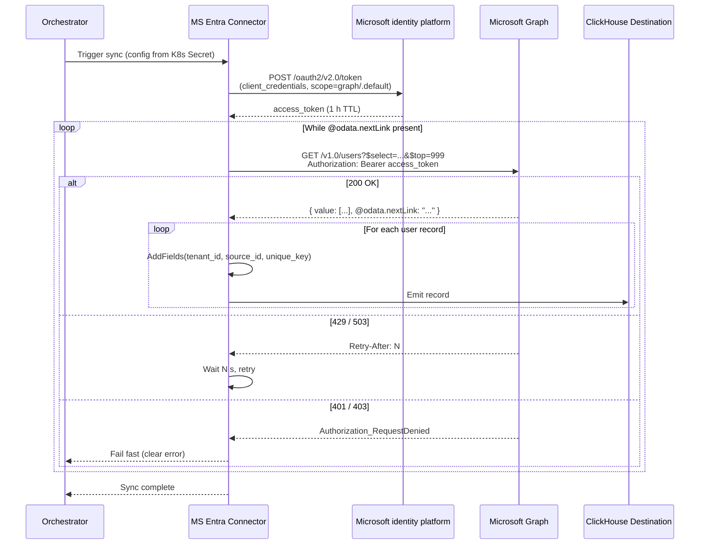

# DESIGN — MS Entra Connector

- [ ] `p1` - **ID**: `cpt-insightspec-design-msentra-connector`

> Version 1.0 — May 2026
> Based on: HR Directory domain (`docs/components/connectors/hr-directory/README.md`), [PRD.md](./PRD.md)

<!-- toc -->

- [1. Architecture Overview](#1-architecture-overview)
  - [1.1 Architectural Vision](#11-architectural-vision)
  - [1.2 Architecture Drivers](#12-architecture-drivers)
  - [1.3 Architecture Layers](#13-architecture-layers)
- [2. Principles & Constraints](#2-principles--constraints)
  - [2.1 Design Principles](#21-design-principles)
  - [2.2 Constraints](#22-constraints)
- [3. Technical Architecture](#3-technical-architecture)
  - [3.1 Domain Model](#31-domain-model)
  - [3.2 Component Model](#32-component-model)
  - [3.3 API Contracts](#33-api-contracts)
  - [3.4 Internal Dependencies](#34-internal-dependencies)
  - [3.5 External Dependencies](#35-external-dependencies)
  - [3.6 Interactions & Sequences](#36-interactions--sequences)
  - [3.7 Database schemas & tables](#37-database-schemas--tables)
  - [3.8 Deployment Topology](#38-deployment-topology)
- [4. Additional context](#4-additional-context)
  - [Identity Resolution Strategy](#identity-resolution-strategy)
  - [Silver / Gold Mappings](#silver--gold-mappings)
  - [Source-Specific Considerations](#source-specific-considerations)
- [5. Traceability](#5-traceability)
- [6. Non-Applicability Statements](#6-non-applicability-statements)

<!-- /toc -->

---

## 1. Architecture Overview

### 1.1 Architectural Vision

The MS Entra connector is an Airbyte declarative manifest (YAML, no custom Python) that extracts the user directory from Microsoft Entra ID via the Microsoft Graph REST API into the Insight platform's Bronze layer. It produces one Bronze stream:

1. **`users`** — user directory via `GET /v1.0/users` with an explicit `$select` allowlist limited to identity-resolution fields.

**Authentication**: OAuth2 client credentials (app-only flow). The connector exchanges the App Registration's client_id + client_secret for an access token at `https://login.microsoftonline.com/{tenant_id}/oauth2/v2.0/token`, then attaches it as `Authorization: Bearer {token}` on every Graph call. Tokens have a 1-hour TTL and are refreshed automatically by the declarative `SessionTokenAuthenticator`.

**Pagination**: `@odata.nextLink` cursor (declarative `DefaultPaginator` with `RequestPath` token option). Each response returns up to 999 users (the per-page maximum). The connector follows `nextLink` until exhausted.

**Sync mode**: Full refresh. Microsoft Graph's `/users/delta` endpoint supports change tracking via an opaque `$deltatoken`, but the declarative runtime cannot drive an opaque-token cursor without a custom Python component. The destination's `ReplacingMergeTree` engine makes re-emitting unchanged records idempotent.

**Privacy posture**: An explicit `$select` allowlist on every request ensures Microsoft Graph returns only the identity-resolution fields the connector declares. Personal-life fields permitted by `User.Read.All` (`birthday`, `aboutMe`, `interests`, `mobilePhone`, `streetAddress`, etc.) never enter Bronze.

**Downstream**: Bronze data feeds the Identity Manager (`oid → person_id` resolution via the `ms_entra__identity_inputs` model) and contributes a row per user to the canonical `class_people` registry alongside HR connectors (BambooHR, Workday).

### 1.2 Architecture Drivers

#### Functional Drivers

| Requirement | Design Response |
|-------------|-----------------|
| `cpt-insightspec-fr-msentra-collect-users` | Stream `users` → `GET /v1.0/users?$select={allowlist}&$top=999` |
| `cpt-insightspec-fr-msentra-pagination` | `DefaultPaginator` with `CursorPagination`; cursor value `response['@odata.nextLink']`, stop when absent |
| `cpt-insightspec-fr-msentra-deduplication` | Composite primary key `unique_key = {tenant_id}-{source_id}-{id}` injected via `AddFields` |
| `cpt-insightspec-fr-msentra-identity-key` | `id` field included in `$select`; `ms_entra__identity_inputs` exposes `mail`, `userPrincipalName`, `employeeId`, `displayName`, `onPremisesSamAccountName` to Identity Manager |
| `cpt-insightspec-fr-msentra-sync-mode` | Configured catalog: `sync_mode: full_refresh`, `destination_sync_mode: overwrite` |
| `cpt-insightspec-fr-msentra-fault-tolerance` | Declarative runtime's default error handler: retry with exponential backoff on 429/503/5xx, honour `Retry-After`, fail-fast on 401/403 |
| `cpt-insightspec-fr-msentra-collection-runs` | Airbyte framework emits collection metadata per sync; routed to `collection_runs` |
| `cpt-insightspec-fr-msentra-field-allowlist` | `$select` request parameter in `definitions.linked.HttpRequester.request_parameters` |

#### NFR Allocation

This table maps non-functional requirements from PRD to specific design/architecture responses, demonstrating how quality attributes are realized.

| NFR ID | NFR Summary | Allocated To | Design Response | Verification Approach |
|--------|-------------|--------------|-----------------|----------------------|
| `cpt-insightspec-nfr-msentra-auth-flexibility` | OAuth2 client credentials, configurable | `spec.connection_specification` | Three required fields: `azure_tenant_id`, `azure_client_id`, `azure_client_secret` (with `airbyte_secret: true`) | Verify config fields present in spec |
| `cpt-insightspec-nfr-msentra-rate-limit-compliance` | Honour Microsoft Graph rate limits | Declarative runtime error handler | Retry on 429/503 with exponential backoff; `WaitTimeFromHeader` on `Retry-After` | Simulate 429 with `Retry-After: 60`; verify connector waits ≥ 60s |
| `cpt-insightspec-nfr-msentra-schema-compliance` | Source-native field names at Bronze | `InlineSchemaLoader` | Schemas use Microsoft Graph camelCase; no `KeysToSnakeCase` transformation | Compare schema fields to Graph response keys |
| `cpt-insightspec-nfr-msentra-idempotent-writes` | Same source state → identical Bronze records | Primary key + RMT engine | `unique_key` PK at the destination; `ReplacingMergeTree(_version)` deduplicates re-emitted rows | Run twice on unchanged tenant; verify zero net new rows |
| `cpt-insightspec-nfr-msentra-privacy-by-default` | Explicit, auditable field allowlist | Manifest `$select` request parameter | Single allowlist string in `definitions.linked.HttpRequester.request_parameters.$select` | Code review: grep `$select` in `connector.yaml`; manifest is single audit point |

### 1.3 Architecture Layers

- [ ] `p3` - **ID**: `cpt-insightspec-tech-msentra-layers`

```text
Microsoft Entra ID
        │  (HTTPS, OAuth2 client_credentials)
        ▼
Microsoft Graph /v1.0/users  (paginated via @odata.nextLink, $select-restricted)
        │
        ▼
Airbyte declarative connector  (manifest YAML, AddFields injects tenant_id/source_id/unique_key)
        │
        ▼
ClickHouse destination       (writes to bronze_ms_entra.users; engine ReplacingMergeTree)
        │
        ▼
dbt pipeline                 (ms_entra__bronze_promoted → users_snapshot → users_fields_history → identity_inputs / to_class_people)
        │
        ▼
Silver layer                 (silver:identity_inputs feeds Identity Manager; silver:class_people via union_by_tag)
```

| Layer | Responsibility | Technology |
|-------|---------------|------------|
| Source API | Microsoft Graph v1.0 `/users` endpoint | REST / JSON |
| Authentication | OAuth2 client credentials → Bearer token | `SessionTokenAuthenticator` |
| Connector | Stream definition, pagination, error handling, AddFields | Airbyte declarative manifest (YAML) |
| Execution | Container runtime | Airbyte Declarative Connector framework (CDK v7.0+) |
| Bronze | Raw Microsoft Graph user records with source-native schema | ClickHouse `ReplacingMergeTree` |
| Silver | Identity-input feed and `class_people` row contribution | dbt-clickhouse with `union_by_tag` |

---

## 2. Principles & Constraints

### 2.1 Design Principles

#### One Stream per Endpoint

- [ ] `p1` - **ID**: `cpt-insightspec-principle-msentra-one-stream-per-endpoint`

The `users` stream maps to exactly one Microsoft Graph endpoint (`GET /v1.0/users`). Future streams (groups, memberships, managers) will each map to their own endpoint. This keeps the manifest debuggable and aligned with Airbyte's stream-per-resource model.

#### Source-Native Schema

- [ ] `p1` - **ID**: `cpt-insightspec-principle-msentra-source-native-schema`

Bronze tables preserve Microsoft Graph's native field names (camelCase: `userPrincipalName`, `accountEnabled`, `proxyAddresses`) and data types. No renaming, no type coercion. Schema transformations are the Silver layer's responsibility.

#### Explicit Field Allowlist

- [ ] `p1` - **ID**: `cpt-insightspec-principle-msentra-explicit-field-allowlist`

The connector requests an explicit `$select` allowlist on every Microsoft Graph call rather than relying on Graph's default response. This makes the surface area of collected data auditable in a single place (the manifest), prevents privacy regressions when Graph adds new fields, and reduces wire and storage cost.

#### `oid` as the Identity Key

- [ ] `p1` - **ID**: `cpt-insightspec-principle-msentra-oid-as-key`

The Entra Object ID (`id`, equal to JWT `oid` claim) is the cross-service identity key. The JWT `sub` claim is **not** used: it is a pairwise pseudonymous identifier unique per (user, application) within a tenant, so two Insight services authenticating the same person see different `sub` values. `oid` is the same across applications, immutable, and exposed by Microsoft Graph as the `id` field.

### 2.2 Constraints

#### No Delta-Token Cursor in Declarative Runtime

- [ ] `p1` - **ID**: `cpt-insightspec-constraint-msentra-no-delta-token`

Microsoft Graph supports change tracking via `/users/delta` with an opaque `$deltatoken`. The declarative Airbyte runtime cannot drive an opaque-token cursor without a custom Python component. The connector therefore uses full refresh; delta support is deferred to a future iteration that will either ship a CDK extension or use a manifest-side custom cursor.

#### App-Only (Application) Authentication

- [ ] `p1` - **ID**: `cpt-insightspec-constraint-msentra-app-only-auth`

The connector authenticates as the App Registration itself (OAuth2 client credentials), not on behalf of a signed-in user. This drives two consequences: (a) only Microsoft Graph permissions of type **Application** are honoured — Delegated permissions are silently ignored in the access token; (b) the App Registration must be granted **admin consent** in the Entra tenant for the role to appear in the `roles` claim of the token.

#### Required Application Permission

- [ ] `p1` - **ID**: `cpt-insightspec-constraint-msentra-application-permission`

The App Registration must hold `Microsoft Graph → User.Read.All` of type Application with admin consent granted. `User.ReadBasic.All` is insufficient — it excludes `proxyAddresses` and `employeeId`, both critical for identity matching. `Directory.Read.All` would also work but grants more than needed; `User.Read.All` is the principle-of-least-privilege choice.

---

## 3. Technical Architecture

### 3.1 Domain Model

**Technology**: YAML declarative manifest + Microsoft Graph user resource

**Location**: [`src/ingestion/connectors/hr-directory/ms-entra/connector.yaml`](../../../../../src/ingestion/connectors/hr-directory/ms-entra/connector.yaml)

**Core Entities**:

| Entity | API Source | Bronze Stream | Description |
|--------|-----------|--------------|-------------|
| User | `GET /v1.0/users` | `users` | Entra directory entry — identity, display, org context, account state |
| Collection Run | Airbyte framework | `collection_runs` | One row per sync attempt: timestamps, status, counts, errors |

**Relationships**:
- User `1:1` Collection Run (a sync produces records ↔ a run summarises them)
- User `1:many` (future) Group Memberships, Manager Relationships — out of scope in v1

### 3.2 Component Model

#### MS Entra Connector Manifest

- [ ] `p2` - **ID**: `cpt-insightspec-component-msentra-manifest`

##### Why this component exists

Defines the complete MS Entra connector as a YAML declarative manifest — the single artifact required to extract Entra directory data from Microsoft Graph into the Insight platform's Bronze layer.

##### Responsibility scope

Defines one stream (`users`) with: OAuth2 client-credentials authentication via `SessionTokenAuthenticator`, GET request to `https://graph.microsoft.com/v1.0/users` with explicit `$select` allowlist and `$top=999`, `@odata.nextLink` pagination via `DefaultPaginator` + `CursorPagination`, full-refresh sync, exponential-backoff retry on 429/503 with `Retry-After` honour, `AddFields` injection of `tenant_id`, `source_id`, and composite `unique_key`, and an inline JSON schema for the `users` stream.

##### Responsibility boundaries

Does not handle orchestration, scheduling, or state storage (managed by Airbyte / Argo). Does not perform Silver/Gold transformations. Does not implement identity resolution (handled by Identity Manager consuming `ms_entra__identity_inputs`). Does not write to Bronze tables (handled by the destination connector).

##### Related components (by ID)

- `cpt-insightspec-component-cn-airbyte-manifest` — instance of (Connector Framework's manifest component)
- `cpt-insightspec-component-cn-connector-package` — contained by (the on-disk connector package)

### 3.3 API Contracts

#### Microsoft Graph v1.0

- [ ] `p1` - **ID**: `cpt-insightspec-interface-msentra-graph-v1`

- **Contracts**: `cpt-insightspec-contract-msentra-graph-v1`
- **Technology**: REST / JSON over HTTPS
- **Location**: [Microsoft Graph user list](https://learn.microsoft.com/en-us/graph/api/user-list)

**Base URL**: `https://graph.microsoft.com/v1.0/`

**Authentication**: OAuth2 client credentials flow against `https://login.microsoftonline.com/{azure_tenant_id}/oauth2/v2.0/token` with `scope=https://graph.microsoft.com/.default`. The resulting access token is attached as `Authorization: Bearer {token}` on every Graph request. Tokens have a ~1-hour TTL; the declarative runtime refreshes them automatically.

**Required Application Permissions**: `User.Read.All` (Microsoft Graph) with tenant admin consent granted.

**Rate Limits**: Per-tenant, per-app, per-service buckets. Microsoft does not publish absolute numeric limits. `Retry-After` header is returned on 429 / 503; the connector honours it.

**Endpoints Overview**:

| Method | Path | Description | Stability |
|--------|------|-------------|-----------|
| `POST` | `https://login.microsoftonline.com/{tenant}/oauth2/v2.0/token` | Issue access token (client_credentials grant) | stable |
| `GET` | `https://graph.microsoft.com/v1.0/users` | List users with `$select` and `$top`; paginated via `@odata.nextLink` | stable |

---

##### Endpoint: GET /v1.0/users

| Aspect | Detail |
|--------|--------|
| Method | `GET` |
| Path | `/v1.0/users` |
| Query params | `$select` (comma-separated allowlist), `$top` (page size, max 999), `$format` (`application/json`) |
| Pagination | `@odata.nextLink` URL embedded in each response; absent on final page |
| Response | `{ "@odata.context": ..., "value": [{...}, ...], "@odata.nextLink": "..." }` |
| Record path | `value` |
| Auth | `Authorization: Bearer {access_token}` |

**`$select` allowlist** (all v1 fields collected):

```text
id,userPrincipalName,mail,proxyAddresses,otherMails,displayName,
givenName,surname,employeeId,department,jobTitle,accountEnabled,
onPremisesSamAccountName,createdDateTime,userType
```

---

#### Source Config Schema

```json
{
  "type": "object",
  "required": ["insight_tenant_id", "insight_source_id", "azure_tenant_id", "azure_client_id", "azure_client_secret"],
  "properties": {
    "insight_tenant_id": {
      "type": "string",
      "title": "Insight Tenant ID",
      "description": "Tenant isolation identifier"
    },
    "insight_source_id": {
      "type": "string",
      "title": "Insight Source ID",
      "description": "Insight source instance ID (e.g. ms-entra-main)"
    },
    "azure_tenant_id": {
      "type": "string",
      "title": "Azure Tenant ID",
      "description": "Microsoft Entra tenant (directory) ID"
    },
    "azure_client_id": {
      "type": "string",
      "title": "Azure Client ID",
      "description": "App Registration client ID (User.Read.All Application permission with admin consent)"
    },
    "azure_client_secret": {
      "type": "string",
      "title": "Azure Client Secret",
      "description": "App Registration client secret (the secret value, not the secret ID)",
      "airbyte_secret": true
    }
  },
  "additionalProperties": true
}
```

### 3.4 Internal Dependencies

| Dependency Module | Interface Used | Purpose |
|-------------------|---------------|---------|
| Identity Manager | Downstream consumer | Reads `ms_entra__identity_inputs` to maintain `oid → person_id` mapping |
| HR Silver Layer | Downstream consumer | Reads `to_class_people` (via `union_by_tag('silver:class_people')`) for the unified person registry |
| Connector Framework | Runtime contract | Hosts the declarative manifest (Airbyte CDK v7.0+) |

**Dependency Rules** (per project conventions):
- The connector emits records to the destination only; it does not read from any other Insight module.
- Identity Manager and HR Silver Layer consume Bronze and Silver tables — they do not call the connector at runtime.

### 3.5 External Dependencies

#### Microsoft Graph

| Dependency Module | Interface Used | Purpose |
|-------------------|---------------|---------|
| Microsoft Graph v1.0 | HTTPS / JSON REST | Source system for user directory extraction |
| Microsoft identity platform | OAuth2 token endpoint | Issues bearer tokens via client credentials |
| Airbyte Declarative Connector framework (CDK v7.0+) | Container runtime | Executes the YAML manifest |
| ClickHouse destination connector | Airbyte protocol | Writes extracted records to `bronze_ms_entra.users` |

**Dependency Rules**:
- Only the connector talks to Microsoft Graph; downstream Insight modules consume Bronze, never Graph directly.
- Credentials are sourced exclusively from K8s Secrets discovered by label `app.kubernetes.io/part-of=insight` — no inline fallback.

### 3.6 Interactions & Sequences

#### User Sync — Full Refresh

**ID**: `cpt-insightspec-seq-msentra-user-sync`

**Use cases**: `cpt-insightspec-usecase-msentra-initial-full-sync`, `cpt-insightspec-usecase-msentra-scheduled-sync`

**Actors**: `cpt-insightspec-actor-msentra-orchestrator`, `cpt-insightspec-actor-msentra-destination`



**Description**: The orchestrator triggers the connector with credentials sourced from a K8s Secret. The connector exchanges client credentials for an access token, then iterates `/v1.0/users` following `@odata.nextLink` until exhausted. Each record is enriched with `tenant_id`, `source_id`, and `unique_key` and emitted to the destination. Transient errors are retried with backoff; auth errors fail fast.

#### Identity Manager Feed

**ID**: `cpt-insightspec-seq-msentra-identity-feed`

**Use cases**: `cpt-insightspec-usecase-msentra-identity-feed`

**Actors**: `cpt-insightspec-actor-msentra-identity-manager`

```mermaid
sequenceDiagram
    participant DBT as dbt
    participant Bronze as bronze_ms_entra.users
    participant Snap as ms_entra__users_snapshot
    participant Hist as ms_entra__users_fields_history
    participant II as ms_entra__identity_inputs
    participant IM as Identity Manager

    DBT ->> Bronze: Promote to RMT
    DBT ->> Snap: Snapshot SCD2 from Bronze
    DBT ->> Hist: Derive field-level changes from Snapshot
    DBT ->> II: Emit per-field UPSERT/DELETE rows<br/>(value_type: id, email, employee_id, display_name, sam_account)
    II ->> IM: silver:identity_inputs (via union_by_tag)
    IM ->> IM: Resolve oid → person_id;<br/>propagate to all Silver streams
```

**Description**: After Bronze is populated, the dbt pipeline produces an SCD2 snapshot, derives a field-level history, and emits identity signals. The Identity Manager consumes these via `union_by_tag('silver:identity_inputs')` and updates the `oid → person_id` mapping. Deactivation events (`accountEnabled` flipping to `false`) emit DELETE rows so terminations propagate.

### 3.7 Database schemas & tables

- [ ] `p2` - **ID**: `cpt-insightspec-db-msentra-bronze`

#### Table: `bronze_ms_entra.users`

- [ ] `p1` - **ID**: `cpt-insightspec-dbtable-msentra-users`

| Column | Type | Description |
|--------|------|-------------|
| `tenant_id` | String | Insight tenant isolation identifier — injected by `AddFields` |
| `source_id` | String | Insight source instance identifier (e.g. `ms-entra-main`) — injected by `AddFields` |
| `unique_key` | String | PK: composite dedup key `{tenant_id}-{source_id}-{id}` — injected by `AddFields` |
| `id` | String | Entra Object ID (oid). Equals JWT `oid` claim. The cross-service identity join key. |
| `userPrincipalName` | Nullable(String) | UPN — typically the SSO login (`alice@contoso.com`) |
| `mail` | Nullable(String) | Primary SMTP address; null on some unlicensed/guest users |
| `proxyAddresses` | Array(Nullable(String)) | All SMTP addresses (`SMTP:` primary, `smtp:` secondary) — main fuzzy-match signal |
| `otherMails` | Array(Nullable(String)) | Additional emails (e.g. personal) — secondary match signal |
| `displayName` | Nullable(String) | Full display name |
| `givenName` | Nullable(String) | First name |
| `surname` | Nullable(String) | Last name |
| `employeeId` | Nullable(String) | Employee number (synced from HR if Entra Connect / HR provisioning is configured) |
| `department` | Nullable(String) | Department name |
| `jobTitle` | Nullable(String) | Job title |
| `accountEnabled` | Nullable(Boolean) | Account active flag — `false` for disabled / departed users |
| `onPremisesSamAccountName` | Nullable(String) | Legacy AD `sAMAccountName` — match for users synced from on-prem AD |
| `createdDateTime` | Nullable(String) | Account provisioning timestamp (ISO 8601) |
| `userType` | Nullable(String) | `Member` (internal) or `Guest` (B2B invitee) |
| `_airbyte_raw_id` | String | Airbyte-internal dedup id (auto) |
| `_airbyte_extracted_at` | DateTime64 | Extraction timestamp (auto) |

**PK**: `unique_key`

**Constraints**: `tenant_id` NOT NULL, `source_id` NOT NULL, `unique_key` NOT NULL, `id` NOT NULL.

**Additional info**: Engine `ReplacingMergeTree(_version)` for idempotent re-emission. Promoted to RMT by `ms_entra__bronze_promoted` if Airbyte writes plain MergeTree.

**Example**:

| `tenant_id` | `source_id` | `id` | `userPrincipalName` | `accountEnabled` |
|---|---|---|---|---|
| `example_tenant` | `ms-entra-main` | `d90fd30a-…` | `alice@contoso.com` | `true` |

---

#### Table: `bronze_ms_entra.collection_runs`

- [ ] `p2` - **ID**: `cpt-insightspec-dbtable-msentra-collection-runs`

| Column | Type | Description |
|--------|------|-------------|
| `run_id` | String | Unique run identifier (Airbyte attempt ID) |
| `tenant_id` | String | Insight tenant identifier |
| `source_id` | String | Insight source instance identifier |
| `started_at` | DateTime | Run start time |
| `completed_at` | Nullable(DateTime) | Run end time (null while running) |
| `status` | String | `running` / `completed` / `failed` |
| `users_collected` | Nullable(Int64) | Records collected for the `users` stream |
| `api_calls` | Nullable(Int64) | Microsoft Graph API calls made |
| `errors` | Nullable(Int64) | Errors encountered during the run |
| `settings` | Nullable(String) | JSON snapshot of the `$select` allowlist active for this run (audit trail for privacy) |

Monitoring table — not an analytics source. Not used by Silver / Gold.

### 3.8 Deployment Topology

- [ ] `p2` - **ID**: `cpt-insightspec-topology-msentra-deployment`

```text
Connection: ms-entra-{source-id}
├── Source image:  airbyte/source-declarative-manifest
├── Manifest:      src/ingestion/connectors/hr-directory/ms-entra/connector.yaml
├── Descriptor:    src/ingestion/connectors/hr-directory/ms-entra/descriptor.yaml
├── Source config (from K8s Secret insight-ms-entra-{source-id}):
│   ├── azure_tenant_id
│   ├── azure_client_id
│   ├── azure_client_secret  (airbyte_secret)
│   ├── insight_tenant_id    (injected from tenant.yaml)
│   └── insight_source_id    (injected from Secret annotation)
├── Configured catalog: 1 stream (users, full_refresh)
├── Destination image:  airbyte/destination-clickhouse  (shared)
├── Destination config: namespaceFormat = bronze_ms_entra
└── Schedule:           0 5 * * *  (cron, daily 05:00 UTC)
```

Multiple Entra tenants are supported by deploying multiple Secrets with distinct `insight.cyberfabric.com/source-id` annotations; each becomes a separate Airbyte source under the same connector definition.

---

## 4. Additional context

### Identity Resolution Strategy

`id` (Entra Object ID, equal to JWT `oid`) is the canonical cross-service identity key. The dbt model `ms_entra__identity_inputs` emits one row per (entity, field, change) for the following value_types, all anchored to `source_account_id = id`:

| `value_type` | Source field | Why |
|---|---|---|
| `id` | `id` | Canonical binding row required by ADR-0002 |
| `email` | `mail` | Primary email — joins to GitHub `email`, Slack `email`, Jira `emailAddress` |
| `email` | `userPrincipalName` | Fallback email signal — guest users often have null `mail` |
| `employee_id` | `employeeId` | Cross-check with BambooHR / Workday |
| `display_name` | `displayName` | Fuzzy name match for sources with no email coverage |
| `sam_account` | `onPremisesSamAccountName` | Legacy AD login — match against Bitbucket Server / GitLab self-hosted where SAM is the username |

The connector intentionally does **not** use the JWT `sub` claim as an identity key. `sub` is a pairwise pseudonymous identifier unique per (user, application) within a tenant — see Microsoft's [access-token-claims-reference](https://learn.microsoft.com/en-us/entra/identity-platform/access-token-claims-reference). `oid` is the same across applications and is exposed by Microsoft Graph as the `id` field.

### Silver / Gold Mappings

| Bronze table | Silver target | Status | Notes |
|-------------|--------------|--------|-------|
| `users` | Identity Manager (`oid → person_id`) | Direct feed via `ms_entra__identity_inputs` | UPSERT and DELETE rows; deactivation when `accountEnabled` flips to `false` |
| `users` | `silver.class_people` | Via `to_class_people` model + `union_by_tag('silver:class_people')` | Unified registry alongside BambooHR / Workday |
| `collection_runs` | Operational monitoring | Not an analytics source | Used for run health alerts only |

### Source-Specific Considerations

1. **Privacy by extraction-time allowlist** — the `$select` parameter is the single audit point for what data leaves Microsoft Graph. Adding a field requires a manifest change and code review. Personal-life fields (`birthday`, `aboutMe`, `interests`, `mobilePhone`, `streetAddress`, `schools`, `imAddresses`, `hireDate`, `ageGroup`, `legalAgeGroupClassification`, `consentProvidedForMinor`, `identities`) are out of scope and never enter Bronze.

2. **`mail` fallback to UPN** — guest and unlicensed users sometimes have null `mail` but always have `userPrincipalName`. The `to_class_people` model uses `coalesce(mail, userPrincipalName)` for the canonical email; identity resolution emits both as `value_type='email'` so either form matches.

3. **App-only authentication consequences** — only **Application** Microsoft Graph permissions are honoured. The JWT `roles` claim must contain `User.Read.All`; `scp` is always null. Delegated permissions are silently ignored. Without admin consent, the role is requested but inactive, and `/v1.0/users` returns `403 Authorization_RequestDenied`.

4. **Per-page maximum is 999** — Microsoft Graph caps `$top` at 999 for `/users`. Tenants with > 999 users require pagination; the connector follows `@odata.nextLink` automatically. A tenant with 50k users completes in ≈ 50 paginated calls, well within a typical run window.

5. **Group memberships and manager are deferred** — `/v1.0/groups`, `/v1.0/groups/{id}/transitiveMembers`, and `$expand=manager` provide org-graph data not in v1. Identity resolution is functional with `users` alone; group/manager are roadmap items.

6. **`userType` is part of the allowlist by design** — `userType` distinguishes `Member` (internal employee) from `Guest` (external collaborator invited via B2B). It is an identity-resolution signal, not a personal-life attribute: the Identity Manager and downstream org-aware aggregations need to differentiate internal headcount from external vendors / partners / customers (e.g. Slack channels often include guest accounts that should not be folded into internal team metrics). The field is enumerated, low-cardinality, and carries no PII beyond the binary internal/external classification — collecting it does not change the privacy posture established by the allowlist.

---

## 5. Traceability

- **PRD**: [PRD.md](./PRD.md)
- **Domain README**: [../../README.md](../../README.md) — HR Silver Layer design
- **Connector Framework DESIGN**: [../../../../domain/connector/specs/DESIGN.md](../../../../domain/connector/specs/DESIGN.md)
- **ADR directory**: [./ADR/](./ADR/)
- **Implementation**:
  - Connector package: [`src/ingestion/connectors/hr-directory/ms-entra/`](../../../../../src/ingestion/connectors/hr-directory/ms-entra/)
  - K8s Secret template: [`src/ingestion/secrets/connectors/ms-entra.yaml.example`](../../../../../src/ingestion/secrets/connectors/ms-entra.yaml.example)

---

## 6. Non-Applicability Statements

- **Custom Python components**: Not required. All MS Entra extraction patterns (OAuth2 client credentials, `@odata.nextLink` pagination, `$select` filtering, exponential-backoff retry, `AddFields` injection) are handled by declarative manifest components.
- **Delegated user authentication**: Not implemented. The connector is server-to-server only.
- **Pagination beyond `@odata.nextLink`**: Not applicable. Microsoft Graph uses opaque-cursor pagination for `/users`; offset/limit is not supported on this endpoint.
- **Webhooks / change notifications**: Not applicable in v1. Microsoft Graph supports change notifications via `/subscriptions`, but the platform's batch model makes scheduled full-refresh sufficient for directory-size data.
- **Write operations**: Not applicable. The connector is read-only.
- **Mailbox / calendar / files / Teams content**: Not applicable. Those require separate Graph permissions (`Mail.Read`, `Calendars.Read`, `Files.Read.All`, `Chat.Read.All`) that are not granted to this App Registration.
- **`signInActivity`**: Not applicable. Requires `AuditLog.Read.All` and an Entra ID P1/P2 licence; deferred to a future iteration if last-login telemetry becomes a requirement.
