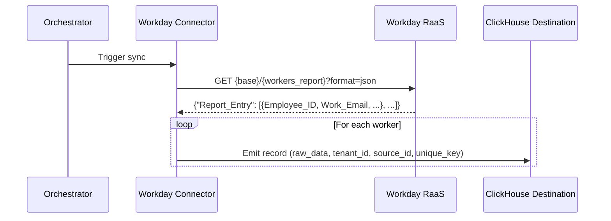
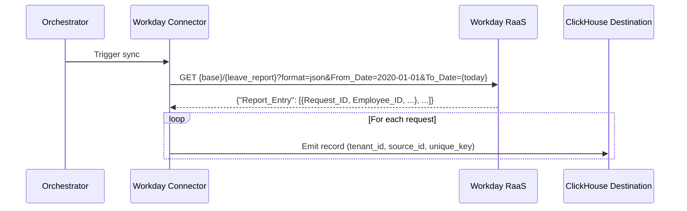

# DESIGN — Workday Connector

- [ ] `p1` - **ID**: `cpt-insightspec-design-wd-connector`

> Version 1.0 — June 2026
> Based on: HR Directory domain (`docs/components/connectors/hr-directory/README.md`), [PRD.md](./PRD.md)

<!-- toc -->

- [1. Architecture Overview](#1-architecture-overview)
  - [1.1 Architectural Vision](#11-architectural-vision)
  - [1.2 Architecture Drivers](#12-architecture-drivers)
  - [1.3 Architecture Layers](#13-architecture-layers)
- [2. Principles & Constraints](#2-principles--constraints)
  - [2.1 Design Principles](#21-design-principles)
  - [2.2 Constraints](#22-constraints)
- [3. Technical Architecture](#3-technical-architecture)
  - [3.1 Domain Model](#31-domain-model)
  - [3.2 Component Model](#32-component-model)
  - [3.3 API Contracts](#33-api-contracts)
  - [3.4 Internal Dependencies](#34-internal-dependencies)
  - [3.5 External Dependencies](#35-external-dependencies)
  - [3.6 Interactions & Sequences](#36-interactions--sequences)
  - [3.7 Database schemas & tables](#37-database-schemas--tables)
  - [3.8 Deployment Topology](#38-deployment-topology)
- [4. Additional context](#4-additional-context)
  - [Identity Resolution Strategy](#identity-resolution-strategy)
  - [Silver / Gold Mappings](#silver--gold-mappings)
  - [Source-Specific Considerations](#source-specific-considerations)
- [5. Traceability](#5-traceability)
- [6. Non-Applicability Statements](#6-non-applicability-statements)

<!-- /toc -->

---

## 1. Architecture Overview

### 1.1 Architectural Vision

The Workday connector is an Airbyte declarative manifest connector (YAML, no custom code) that extracts HR directory data from Workday RaaS (Reports-as-a-Service). It produces two Bronze streams:

1. **`workers`** — worker directory via a customer-built RaaS report following the Insight report contract.
2. **`leave_requests`** — time-off requests via a second RaaS report with `From_Date`/`To_Date` prompts.

**Authentication**: ISU (Integration System User) credentials via `BasicHttpAuthenticator`.

**Pagination**: None. RaaS executes the report and returns the full result set per request.

**Sync mode**: Full refresh on both streams. RaaS reports return current-state values — the BambooHR pattern. `Last_Functionally_Updated` is collected to enable future incremental extraction (PRD OQ-WD-1).

**Field-set ownership**: Unlike BambooHR (where the connector requests an explicit field list), the field set lives in the customer's report definition. The connector ships a **report contract** (column aliases + prompts); the customer's Workday administrator implements it. Extra columns flow into `raw_data`.

**Downstream**: Bronze data feeds the SCD2 chain (`workday__workers_snapshot` → `workday__workers_fields_history` → `workday__identity_inputs` → Identity Manager) and Silver staging (`class_people`, `class_hr_events`, `class_hr_working_hours`).

### 1.2 Architecture Drivers

#### Functional Drivers

| Requirement | Design Response |
|-------------|-----------------|
| `cpt-insightspec-fr-wd-collect-workers` | Stream `workers` → `GET {base_url}/{workers_report_path}?format=json` |
| `cpt-insightspec-fr-wd-collect-leave-requests` | Stream `leave_requests` → `GET {base_url}/{leave_report_path}?format=json&From_Date={start}&To_Date={today}` |
| `cpt-insightspec-fr-wd-custom-columns` | `AddFields` puts the full record into `raw_data`; dbt var `workday_custom_fields` tracks selected keys |
| `cpt-insightspec-fr-wd-report-contract` | `CheckStream` on `workers`; explicit alias table in README; dbt `not_null` tests as the second gate |
| `cpt-insightspec-fr-wd-deduplication` | `unique_key` = `{tenant}-{source}-{Employee_ID \| Request_ID}`; RMT dedup at destination |
| `cpt-insightspec-fr-wd-identity-key` | `Work_Email` is a mandatory contract column; identity_inputs emits `email` observations |
| `cpt-insightspec-fr-wd-full-refresh-sync` | No `DatetimeBasedCursor`; both streams full refresh |
| `cpt-insightspec-fr-wd-fault-tolerance` | Default CDK retry behaviour for 5XX; auth errors fail the sync immediately |

#### NFR Allocation

| NFR ID | NFR Summary | Allocated To | Design Response | Verification Approach |
|--------|-------------|-------------|-----------------|----------------------|
| `cpt-insightspec-nfr-wd-auth-isu-basic` | ISU Basic auth; all connection params required, no defaults | `spec.connection_specification` | `workday_base_url`, `workday_isu_username`, `workday_isu_password`, both report paths in `required` | Verify config fields present and required in spec |
| `cpt-insightspec-nfr-wd-schema-compliance` | Contract aliases as Bronze field names | `InlineSchemaLoader` | Schemas use contract `Snake_Case` aliases; no renaming transformations | Compare schema fields to contract alias table |
| `cpt-insightspec-nfr-wd-idempotent-writes` | Deterministic dedup | `unique_key` + RMT | Same report output produces same `unique_key` set | Run twice; verify no duplicate rows after RMT merge |

### 1.3 Architecture Layers

| Layer | Responsibility | Technology |
|-------|---------------|------------|
| Source API | Workday RaaS custom reports | REST / JSON (`customreport2`) |
| Authentication | ISU credentials | `BasicHttpAuthenticator` |
| Connector | Stream definitions, record enrichment | Airbyte declarative manifest (YAML) |
| Execution | Container runtime | Airbyte Declarative Connector framework (CDK v7.0+) |
| Bronze | Raw data storage with contract-native schema | Destination connector (ClickHouse) |
| Silver (shipped with connector) | RMT promotion, SCD2 snapshot, field history, identity inputs, class staging | dbt models in `dbt/` |

---

## 2. Principles & Constraints

### 2.1 Design Principles

#### Report Contract over API Contract

- [ ] `p1` - **ID**: `cpt-insightspec-principle-wd-report-contract`

Workday offers no fixed bulk endpoint, so the connector defines the contract instead: an exact column-alias table and prompt set the customer's reports must implement. The contract pins the response shape across tenants, making one manifest serve every customer.

#### Contract-Native Schema

- [ ] `p1` - **ID**: `cpt-insightspec-principle-wd-contract-native-schema`

Bronze tables preserve the contract's column aliases (`Snake_Case`) exactly as they appear in the RaaS JSON. No renaming, no type coercion, no enum normalisation. Schema transformations are the Silver layer's responsibility.

#### BambooHR Pipeline Parity

- [ ] `p1` - **ID**: `cpt-insightspec-principle-wd-bamboohr-parity`

The dbt chain mirrors BambooHR model-for-model (promotion, snapshot, fields_history, identity_inputs, class staging). Workday-specific logic is confined to column mapping and status/type normalisation. This keeps the HR-source pattern uniform and reuses proven macros unchanged.

### 2.2 Constraints

#### No Pagination Available

- [ ] `p1` - **ID**: `cpt-insightspec-constraint-wd-no-pagination`

RaaS executes the report and returns the complete result set. The connector uses `NoPagination` and relies on report execution staying within Workday's RaaS limits for the tenant's headcount.

#### Current-State Extraction in v1

- [ ] `p1` - **ID**: `cpt-insightspec-constraint-wd-current-state`

Although Workday data is natively effective-dated, a plain RaaS report returns as-of-today values. v1 extracts current state only; SCD2 history is constructed at the Silver layer by the snapshot chain. Native history extraction is a deliberate deferral (PRD OQ-WD-3).

#### Customer-Owned Report Definitions

- [ ] `p1` - **ID**: `cpt-insightspec-constraint-wd-customer-owned-reports`

The reports live in the customer's tenant and are maintained by their Workday administrator. The connector cannot create or modify them. Contract conformance is enforced socially (onboarding docs, naming convention `Insight_*`) and technically (`check`, dbt tests) — not by API introspection.

#### Silent Empty Fields on Missing Domains

- [ ] `p2` - **ID**: `cpt-insightspec-constraint-wd-domain-security`

If the ISU security group lacks a domain required by a report field, Workday returns the field empty rather than erroring. Completeness must be verified during onboarding (domain checklist + data review); the connector cannot distinguish "empty" from "forbidden".

---

## 3. Technical Architecture

### 3.1 Domain Model

**Core Entities**:

| Entity | API Source | Bronze Stream | Description |
|--------|-----------|--------------|-------------|
| Worker | workers RaaS report | `workers` | Current-state worker record with contract-defined HR attributes |
| Time-Off Request | leave RaaS report | `leave_requests` | Time-off request with dates, type, status, and quantity |

**Relationships**:
- Worker `1:N` Time-Off Request (via `Employee_ID`)
- Worker `N:1` Supervisory Organization (inline name; hierarchy via manager chain)

### 3.2 Component Model

#### Workday Connector Manifest

- [ ] `p1` - **ID**: `cpt-insightspec-component-wd-manifest`

##### Why this component exists

Defines the complete Workday connector as a YAML declarative manifest — the single artifact required to extract HR data from any contract-conformant Workday tenant into the Bronze layer.

##### Responsibility scope

Defines 2 streams with: ISU Basic auth, GET requests to config-driven report paths, `format=json` and date-prompt query parameters, `NoPagination`, full refresh sync, `AddFields` for `raw_data`, `tenant_id`, `source_id`, and `unique_key`, and inline JSON schemas matching the report contract.

##### Responsibility boundaries

Does not handle orchestration, scheduling, or state storage (managed by Airbyte/Orchestrator). Does not create or validate Workday report definitions beyond reachability (`check`). Does not perform Silver/Gold transformations (the dbt models shipped alongside do). Does not implement identity resolution.

##### Related components (by ID)

`cpt-insightspec-component-wd-dbt-chain` (downstream Bronze consumer).

#### Workday dbt Chain

- [ ] `p1` - **ID**: `cpt-insightspec-component-wd-dbt-chain`

##### Why this component exists

Turns current-state Bronze pulls into SCD2 history and identity observations — the part of the HR pipeline Workday's RaaS extraction (current-state only) cannot provide by itself.

##### Responsibility scope

`workday__bronze_promoted` (RMT promotion), `workday__workers_snapshot` (SCD2 via `snapshot` macro, tracked columns + `workday_custom_fields` from `raw_data`), `workday__workers_fields_history` (per-field change log via `fields_history` macro), `workday__identity_inputs` (UPSERT/DELETE observations via `identity_inputs_from_history` macro), plus staging views `workday__to_class_people`, `workday__hr_events`, `workday__working_hours`.

##### Responsibility boundaries

Does not deduplicate beyond RMT semantics; does not resolve `person_id` (Identity Manager's job); does not normalise customer-specific time-off types.

##### Related components (by ID)

`cpt-insightspec-component-wd-manifest` (upstream Bronze producer).

### 3.3 API Contracts

#### Workday RaaS (customreport2)

- [ ] `p1` - **ID**: `cpt-insightspec-interface-wd-raas`

**Base URL**: `{workday_base_url}` = `https://{host}/ccx/service/customreport2/{workday_tenant}` (config-provided, no trailing slash)

**Authentication**: ISU credentials via `BasicHttpAuthenticator` (`workday_isu_username` / `workday_isu_password`)

**Response wrapper**: every RaaS JSON response is `{"Report_Entry": [ {…}, … ]}` — the record selector extracts `Report_Entry`.

**Field names**: the XML aliases set on report columns. The contract requires explicit aliases (auto-generated aliases differ per tenant).

**Rate limits**: undocumented; report execution shares tenant compute. Transient 5XX retried with backoff.

---

##### Endpoint: GET {workers_report_path}

| Aspect | Detail |
|--------|--------|
| Method | `GET` |
| Path | `{workday_workers_report_path}` = `<report_owner>/<Report_Name>` |
| Query params | `format=json` |
| Response | `{"Report_Entry": [{Employee_ID, Display_Name, ...}, ...]}` |
| Record path | `Report_Entry` |
| Auth | HTTP Basic (ISU) |

**Contract columns** (exact aliases — see connector README for the Workday field mapping): `Employee_ID`, `Display_Name`, `First_Name`, `Last_Name`, `Work_Email`, `Business_Title`, `Job_Profile`, `Worker_Type`, `Worker_Status`, `Supervisory_Organization`, `Manager_Employee_ID`, `Manager_Work_Email`, `Location`, `Country`, `City`, `Hire_Date`, `Original_Hire_Date`, `Termination_Date`, `Last_Functionally_Updated`, `Scheduled_Weekly_Hours`. Extra columns allowed (land in `raw_data`).

---

##### Endpoint: GET {leave_report_path}

| Aspect | Detail |
|--------|--------|
| Method | `GET` |
| Path | `{workday_leave_report_path}` = `<report_owner>/<Report_Name>` |
| Query params | `format=json`, `From_Date={workday_start_date}`, `To_Date={today UTC}` |
| Response | `{"Report_Entry": [{Request_ID, Employee_ID, ...}, ...]}` |
| Record path | `Report_Entry` |
| Auth | HTTP Basic (ISU) |

**Contract columns**: `Request_ID`, `Employee_ID`, `Time_Off_Type`, `Start_Date`, `End_Date`, `Quantity`, `Unit`, `Status`, `Submitted_Moment`.

**Prompts**: the report MUST define `From_Date` and `To_Date` prompts enabled as web service parameters; a report without them rejects the query parameters and the sync fails loudly.

---

#### Source Config Schema

```json
{
  "type": "object",
  "required": [
    "insight_tenant_id", "insight_source_id",
    "workday_base_url", "workday_isu_username", "workday_isu_password",
    "workday_workers_report_path", "workday_leave_report_path"
  ],
  "properties": {
    "insight_tenant_id":           {"type": "string", "title": "Insight Tenant ID"},
    "insight_source_id":           {"type": "string", "title": "Insight Source ID"},
    "workday_base_url":            {"type": "string", "title": "Workday RaaS Base URL"},
    "workday_isu_username":        {"type": "string", "title": "ISU Username"},
    "workday_isu_password":        {"type": "string", "title": "ISU Password", "airbyte_secret": true},
    "workday_workers_report_path": {"type": "string", "title": "Workers Report Path"},
    "workday_leave_report_path":   {"type": "string", "title": "Leave Report Path"},
    "workday_start_date":          {"type": "string", "title": "Start Date", "default": "2020-01-01"}
  }
}
```

### 3.4 Internal Dependencies

| Dependency Module | Interface Used | Purpose |
|-------------------|---------------|---------|
| dbt macros (`snapshot`, `fields_history`, `identity_inputs_from_history`, `promote_bronze_to_rmt`) | dbt compilation | Silver SCD2 chain — reused unchanged from the shared macro library |
| Identity Manager | Downstream consumer | Reads `workday__identity_inputs` observations for person resolution |
| HR Silver layer | Downstream consumer | Reads `silver:class_*`-tagged staging views |

### 3.5 External Dependencies

| Dependency | Interface Used | Purpose |
|-----------|---------------|---------|
| Workday RaaS | HTTPS / JSON | Source system for worker and time-off extraction |
| Customer-built custom reports | Report contract | Extraction definition — owned by the customer's Workday administrator |
| Airbyte Declarative Connector framework (CDK v7.0+) | Container runtime | Executes the YAML manifest |
| ClickHouse destination connector | Airbyte protocol | Writes extracted records to Bronze tables |

### 3.6 Interactions & Sequences

#### Worker Collection — Full Refresh

**ID**: `cpt-insightspec-seq-wd-worker-sync`



#### Leave Collection — Full Refresh with Date Prompts

**ID**: `cpt-insightspec-seq-wd-leave-sync`



#### Silver Chain — Change Detection

**ID**: `cpt-insightspec-seq-wd-silver-chain`

```mermaid
sequenceDiagram
    participant Bronze as bronze_workday.workers (RMT)
    participant Snap as workday__workers_snapshot
    participant Hist as workday__workers_fields_history
    participant IdIn as workday__identity_inputs
    participant IM as Identity Manager

    Bronze ->> Snap: FINAL read; hash tracked columns
    Snap ->> Snap: append row when hash != latest version
    Snap ->> Hist: version pairs → per-field old/new rows
    Hist ->> IdIn: identity-relevant changes → UPSERT/DELETE observations
    IdIn ->> IM: email / employee_id / names / department / manager / status
```

### 3.7 Database schemas & tables

#### Table: `workers`

- [ ] `p1` - **ID**: `cpt-insightspec-dbtable-wd-workers`

| Column | Type | Description |
|--------|------|-------------|
| `tenant_id` | String | Tenant identifier — injected by connector |
| `source_id` | String | Source instance identifier (e.g. `workday-acme-prod`) — injected by connector |
| `unique_key` | String | PK: `{tenant}-{source}-{Employee_ID}` — injected by connector |
| `Employee_ID` | String | Workday Employee ID |
| `Display_Name` | String | Preferred name |
| `First_Name` | String | Legal first name |
| `Last_Name` | String | Legal last name |
| `Work_Email` | String | Primary work email — identity key; may be empty for contingent workers |
| `Business_Title` | String | Business title — role analytics |
| `Job_Profile` | String | Standardized job profile name |
| `Worker_Type` | String | `Employee` / `Contingent Worker` — workforce composition |
| `Worker_Status` | String | `Active` / `On Leave` / `Terminated` |
| `Supervisory_Organization` | String | Workday's standard org unit — org hierarchy dimension |
| `Manager_Employee_ID` | String | Manager's Employee ID (management chain) — org hierarchy |
| `Manager_Work_Email` | String | Manager's work email — org hierarchy + identity resolution |
| `Location` | String | Office location or remote designation |
| `Country` | String | Location address country |
| `City` | String | Location address city |
| `Hire_Date` | String | Employment start date — tenure analytics |
| `Original_Hire_Date` | String | Original hire date for rehires — tenure analytics |
| `Termination_Date` | String | Employment end date; empty if active — attrition analytics |
| `Last_Functionally_Updated` | String | Last modification entry moment — future incremental cursor |
| `Scheduled_Weekly_Hours` | String/Number | Scheduled weekly hours — FTE / working-hours calculation |
| `raw_data` | String (JSON) | Full report row incl. extra customer columns — custom-field passthrough |
| `_airbyte_extracted_at` | DateTime | Extraction timestamp (UTC) — auto-generated |

---

#### Table: `leave_requests`

- [ ] `p1` - **ID**: `cpt-insightspec-dbtable-wd-leave-requests`

| Column | Type | Description |
|--------|------|-------------|
| `tenant_id` | String | Tenant identifier — injected by connector |
| `source_id` | String | Source instance identifier — injected by connector |
| `unique_key` | String | PK: `{tenant}-{source}-{Request_ID}` — injected by connector |
| `Request_ID` | String | Workday time-off request ID |
| `Employee_ID` | String | Workday Employee ID — joins to `workers.Employee_ID` |
| `Time_Off_Type` | String | Time-off type name (policy-defined, client-specific) |
| `Start_Date` | String | Leave start date |
| `End_Date` | String | Leave end date |
| `Quantity` | String/Number | Units requested |
| `Unit` | String | `hours` / `days` |
| `Status` | String | Request status (`Approved`, `Submitted`, `Canceled`, …) |
| `Submitted_Moment` | String | When the request was submitted |
| `raw_data` | String (JSON) | Full report row incl. extra customer columns — custom-field passthrough |
| `_airbyte_extracted_at` | DateTime | Extraction timestamp (UTC) — auto-generated |

---

#### Staging tables (dbt)

`workday__workers_snapshot` (SCD2 append-only: bronze columns + `_row_hash`, `_tracked_at`), `workday__workers_fields_history` (`entity_id`, `tenant_id`, `source_id`, `field_name`, `old_value`, `new_value`, `updated_at`), `workday__identity_inputs` (shared `identity_inputs` schema). Column definitions follow the shared macros — see `src/ingestion/dbt/macros/`.

### 3.8 Deployment Topology

- [ ] `p1` - **ID**: `cpt-insightspec-topology-wd-deployment`

```text
Connection: workday-{source-id}
├── Source image: airbyte/source-declarative-manifest
├── Manifest: src/ingestion/connectors/hr-directory/workday/connector.yaml
├── Descriptor: src/ingestion/connectors/hr-directory/workday/descriptor.yaml
├── Source config (from K8s Secret insight-workday-{suffix}):
│   workday_base_url, workday_isu_username, workday_isu_password,
│   workday_workers_report_path, workday_leave_report_path, workday_start_date
├── Configured catalog: 2 streams (all full refresh)
│   ├── workers
│   └── leave_requests
├── Destination image: airbyte/destination-clickhouse (shared)
├── Bronze namespace: bronze_workday
└── dbt: tag:workday+ (promotion → snapshot → history → identity_inputs → class staging)
```

---

## 4. Additional context

### Identity Resolution Strategy

`Work_Email` from `workers` is the primary identity signal, flowing to the Identity Manager through the `fields_history` → `identity_inputs` chain (UPSERT on change, DELETE on `Worker_Status` → `Terminated`). `Manager_Work_Email` enables org hierarchy construction without requiring `person_id` resolution of managers first.

`Employee_ID` is the source-account binding (`value_type='id'` observation per ADR-0002) and the `employee_id` observation; it is Workday-internal and not used as a cross-system join key.

### Silver / Gold Mappings

| Bronze table | Silver target | Status |
|-------------|--------------|--------|
| `workers` | `identity_inputs` → Identity Manager | Via SCD2 chain (shipped) |
| `workers` | `class_people` | `workday__to_class_people` staging view (shipped) |
| `workers` | `class_hr_working_hours` | `workday__working_hours` staging view (shipped) |
| `leave_requests` | `class_hr_events` | `workday__hr_events` staging view (shipped) |

**Gold**: leave analytics (burnout risk, availability), headcount metrics, org composition over time (from SCD2 snapshot history; point-in-time accuracy bounded by sync cadence until PRD OQ-WD-3 lands).

### Source-Specific Considerations

1. **Report contract is the schema**: there is no API-side guarantee of any field — only the contract. Onboarding must verify column aliases and the ISU domain checklist; dbt `not_null` tests are the second line of defence.

2. **`Last_Functionally_Updated` excluded from snapshot tracking**: it changes on any worker update, including untracked fields, and would create spurious SCD2 versions. It is collected for future incremental extraction only.

3. **No department/division standard fields**: `Supervisory_Organization` maps to `department` uniformly in v1. Customer-specific org modelling is PRD OQ-WD-4.

4. **Flat report columns**: unlike BambooHR's nested JSON objects, RaaS report columns are flat strings — `workday__hr_events` needs no `JSONExtractString`.

5. **Status vocabularies are contract-normative**: Silver mappings switch on `Worker_Status` ∈ {`Active`, `On Leave`, `Terminated`} and `Worker_Type` ∈ {`Employee`, `Contingent Worker`}. If a tenant's report emits different vocabulary (e.g. localized values), the report must normalise it via a calculated field — part of the contract.

---

## 5. Traceability

- **PRD**: [PRD.md](./PRD.md)
- **Domain README**: [../../README.md](../../README.md) — HR Silver Layer design
- **Connector Framework DESIGN**: [../../../../domain/connector/specs/DESIGN.md](../../../../domain/connector/specs/DESIGN.md)
- **BambooHR counterpart**: [../../bamboohr/specs/DESIGN.md](../../bamboohr/specs/DESIGN.md) — the pattern this connector mirrors
- **ADR directory**: [./ADR/](./ADR/)

---

## 6. Non-Applicability Statements

- **Custom Python components**: Not required. All RaaS extraction patterns are handled by declarative manifest components.
- **OAuth 2.0**: Not implemented. ISU Basic auth is sufficient for RaaS read-only extraction.
- **Pagination**: Not applicable. RaaS returns complete report results.
- **Workday SOAP (WWS) / WQL**: Not used in v1 — RaaS only. SOAP transaction-log extraction is a candidate for native history backfill (PRD OQ-WD-3).
- **Webhook / real-time streaming**: Not applicable. Workday change notifications are not used.
- **Write operations**: Not applicable. The connector is read-only.
