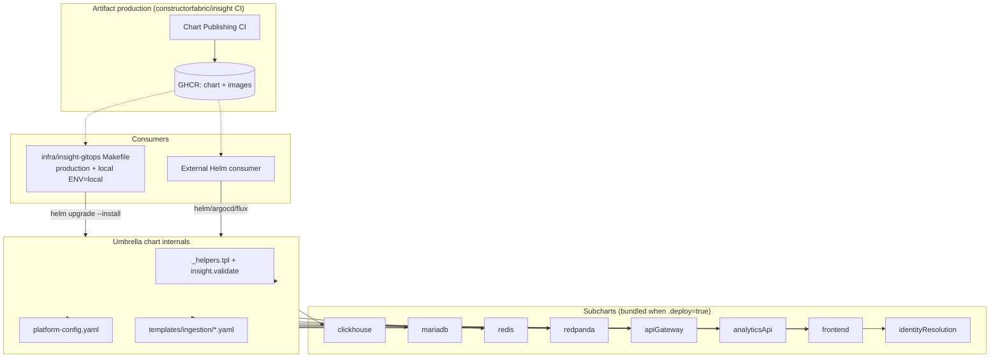
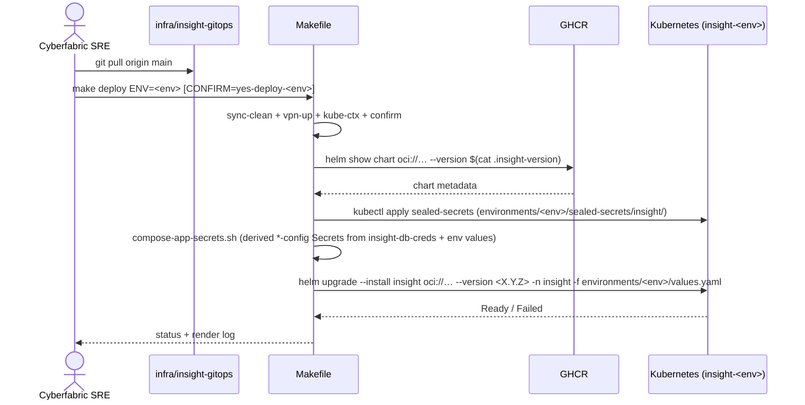
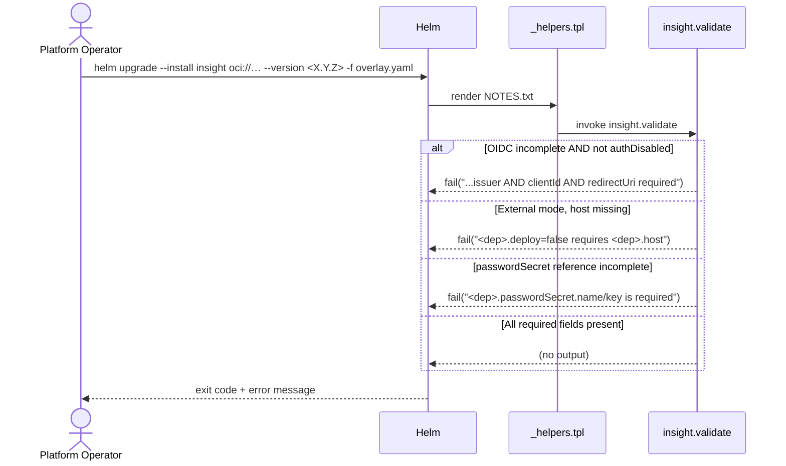

# Technical Design — Deployment

## Table of Contents

1. [1. Architecture Overview](#1-architecture-overview)
   - [1.1 Architectural Vision](#11-architectural-vision)
   - [1.2 Architecture Drivers](#12-architecture-drivers)
   - [1.3 Architecture Layers](#13-architecture-layers)
2. [2. Principles & Constraints](#2-principles--constraints)
   - [2.1 Design Principles](#21-design-principles)
   - [2.2 Constraints](#22-constraints)
3. [3. Technical Architecture](#3-technical-architecture)
   - [3.1 Domain Model](#31-domain-model)
   - [3.2 Component Model](#32-component-model)
   - [3.3 API Contracts](#33-api-contracts)
   - [3.4 Internal Dependencies](#34-internal-dependencies)
   - [3.5 External Dependencies](#35-external-dependencies)
   - [3.6 Interactions & Sequences](#36-interactions--sequences)
   - [3.7 Database schemas & tables](#37-database-schemas--tables)
4. [4. Additional context](#4-additional-context)
5. [5. Traceability](#5-traceability)

## 1. Architecture Overview

### 1.1 Architectural Vision

The Deployment subsystem is a **two-layer** distribution pipeline. Layer one is the artifact: a single Helm umbrella chart at `charts/insight/`, built and published per merge to `main` of `constructorfabric/insight` as `oci://ghcr.io/constructorfabric/charts/insight:<semver>` by the Chart Publishing CI workflow, alongside per-service application images at `ghcr.io/constructorfabric/insight-<service>:<buildtag>`. Layer two is the set of consumers: the private `infra/insight-gitops` repository (driving every Cyberfabric-operated cluster — internal `dev`/`test`/`stage` and each customer-named production cluster, and the same path run locally against a Kind/OrbStack cluster via `make deploy ENV=local`), and any external Helm consumer (Constructor Platform tenants, evaluators, partners) who pulls the chart and runs it with their own tooling. Day-to-day backend / frontend development uses a separate Docker Compose stack (`dev-compose.sh`) that does not consume the chart. The architectural rationale for publishing the chart this way is captured in [ADR-0001](./ADR/0001-chart-publishing-on-merge.md); the operational contract for the gitops consumer is captured in the [gitops SPEC](../gitops/README.md).

The artifact is deliberately thin: the umbrella owns the chart-shape contract but does not own controllers or CRDs. It orchestrates eight subcharts (four infra + four app services), emits one bridge object (`{release}-platform` ConfigMap), emits Argo `WorkflowTemplate` objects when gated, and runs a fail-fast `insight.validate` template at render time. Every infra subchart is pluggable via the `<svc>.deploy: true|false` toggle plus the same flat `<svc>.host` / `.port` / `.passwordSecret` shape — read identically whether the subchart is bundled or external. That dual-purpose toggle is what makes one chart serve two install shapes.

The chart serves two install shapes selected by the consumer:

- **Single-namespace fat install** (`<svc>.deploy: true` for every infra block). The umbrella renders MariaDB, ClickHouse, Redis, Redpanda **and** the app services into a single namespace. An external consumer who wants everything in one namespace flips the toggles `true`.
- **Layered app-only install** (`<svc>.deploy: false` for every infra block). The umbrella renders the app services only into the `insight` namespace; infra comes from L2 (gitops production: `insight-infra` namespace) or from managed external endpoints / a separate team's namespace (Constructor Platform, external customers). This shape is driven by the gitops Makefile per the [L0/L2/L3 model](../gitops/README.md#15-layer-model).

Tenant separation across customers is at the **cluster boundary** for gitops production — one Insight install per cluster, the customer's identity in the kube-context name (`insight-<env>`) and in the gitops repo's `environments/<env>/` directory, never in the namespace. The two well-known namespaces (`insight-infra`, `insight`) are the same on every cluster — including the local `ENV=local` cluster. Tenant separation on a shared cluster (Constructor Platform tenants) is at the namespace boundary, with `controller.instanceID` scoping Argo workflows.

### 1.2 Architecture Drivers

**ADRs**: [ADR-0001 — Publish the Umbrella Helm Chart per Merge to main](./ADR/0001-chart-publishing-on-merge.md) — `cpt-insightspec-adr-dep-chart-publishing-on-merge`.

#### Functional Drivers

| Requirement | Design Response |
|-------------|-----------------|
| `cpt-insightspec-fr-dep-umbrella-chart` | Umbrella chart `charts/insight/` with eight declared dependencies in `Chart.yaml` (four infra subcharts with `condition: <alias>.deploy` + four app-service subcharts, of which identity-resolution is the only one gated). One artifact, one consumer-facing reference: `oci://ghcr.io/constructorfabric/charts/insight`. |
| `cpt-insightspec-fr-dep-mandatory-apps` | API Gateway, Analytics API and Frontend are declared without a `condition:` in `Chart.yaml`; only Identity Resolution carries `condition: identityResolution.deploy`. |
| `cpt-insightspec-fr-dep-optional-identity-resolution` | `identityResolution.deploy: false` is the default in `values.yaml`; subchart renders only when explicitly enabled. |
| `cpt-insightspec-fr-dep-ingestion-templates` | `templates/ingestion/*.yaml` are first-class Helm templates that consume the umbrella's named helpers (`insight.clickhouse.fqdn`, `insight.airbyte.url`, …) directly. Argo expression syntax is escaped with backticks to survive Helm templating. Gated by `ingestion.templates.enabled`. |
| `cpt-insightspec-fr-dep-platform-configmap` | `templates/platform-config.yaml` emits a single ConfigMap named `{release}-platform`; every pod in the namespace can consume it via `envFrom`. |
| `cpt-insightspec-fr-dep-external-mode` | Each infra block in `values.yaml` has the SAME unified shape (`<dep>.deploy`, `<dep>.host`, `<dep>.port`, `<dep>.passwordSecret`); `<dep>.deploy: false` skips the bundled subchart but consumers still read the same fields. The `Chart.yaml` dependency carries `condition: <alias>.deploy`. |
| `cpt-insightspec-fr-dep-fail-fast-validation` | `insight.validate` template in `_helpers.tpl` — invoked from `NOTES.txt` on every install — calls `fail` on missing required fields across OIDC, external-mode infra, and bundled-infra passwords. |
| `cpt-insightspec-fr-dep-service-resolution-helpers` | Named helpers per dependency (`insight.clickhouse.host/port/fqdn/url`, `insight.mariadb.*`, `insight.redis.*`, `insight.redpanda.brokers`, `insight.airbyte.url`, app-service host helpers) return internal DNS when bundled, external host verbatim otherwise, without appending the cluster suffix to an external hostname. |
| `cpt-insightspec-fr-dep-chart-publishing` | `Chart Publishing CI` component (the `publish-chart` job in `.github/workflows/build-images.yml`) runs per merge to `main`: builds changed images, bumps affected subcharts' `appVersion`, patch-bumps the umbrella, packages, pushes to GHCR, auto-commits version bumps back. Sequence documented in §3.6 "Per-merge chart publishing". |
| `cpt-insightspec-fr-dep-oci-distribution` | Single artifact reference `oci://ghcr.io/constructorfabric/charts/insight:<semver>`; consumer-side pull is plain `helm pull` / `helm upgrade --install`. No canonical installer, no App-of-Apps shipped from `constructorfabric/insight`. |
| `cpt-insightspec-fr-dep-subchart-appversion-contract` | Each subchart's `values.yaml` defaults `image.tag = ""` and the templates resolve via `default .Chart.AppVersion`. The CI's per-rebuilt-service step bumps that subchart's `appVersion` to the build tag of its image. Per-service granularity is structural. |
| `cpt-insightspec-fr-dep-umbrella-versioning` | The CI patch-bumps the umbrella's `version` per publish and sets `appVersion` to the build tag. The gitops repo pins one umbrella semver per env in `.insight-version`. |
| `cpt-insightspec-fr-dep-dual-purpose-toggle` | `<svc>.deploy: true|false` toggles on the four infra subcharts. Same chart, two install shapes; cross-namespace wiring uses the same `<svc>.host` / `.port` shape as Constructor Platform external mode. Documented in the chart README and the gitops SPEC §1.5. |
| `cpt-insightspec-fr-dep-layered-architecture` | The gitops SPEC §1.5 layer model (L0 Bootstrap / L2 System / L3 App) is the consumer-side contract; this DESIGN documents how the chart's dual-purpose toggle makes the layered shape possible (app services in `insight`, infra elsewhere by L2 or managed). |
| `cpt-insightspec-fr-dep-customer-named-envs` | Implemented in the gitops Makefile (`PROTECTED_ENVS` + `CONFIRM=yes-deploy-<env>` token), documented in the [gitops SPEC §6.3](../gitops/README.md#63-pre-flight-safety-checks); the chart itself is environment-agnostic. |
| `cpt-insightspec-fr-dep-namespace-convention` | Chart assumes release name `insight`; cross-namespace helpers default L2 host to `<release>.insight-infra.svc.cluster.local` for the layered shape. The local gitops cluster (`ENV=local`) uses the same release name in the same `insight` namespace. |
| `cpt-insightspec-fr-dep-dev-wrapper` | The Docker Compose dev stack (`dev-compose.sh` + `docker-compose.yml`) builds the backend services and frontend from source in builder containers (or pulls published images), runs them with bundled MariaDB / ClickHouse / Redis / Redpanda containers, auto-reloads on rebuild, and auto-seeds a demo dataset. It does not consume the umbrella chart. |
| `cpt-insightspec-fr-dep-dev-namespace-param` | The compose stack's published host ports and frontend / backend image sources are overridable via `.env.compose`, so multiple stacks (or a stack pointed at external DBs) can coexist on one host. |
| `cpt-insightspec-fr-dep-tenant-isolation-boundary` | Cluster-per-customer for gitops production (kube-context `insight-<env>`); namespace-per-tenant on shared clusters with `controller.instanceID.explicitID=$RELEASE-$NAMESPACE` and `controller.workflowNamespaces[0]=$NAMESPACE`. No ClusterRole / ClusterRoleBinding from L3. |
| `cpt-insightspec-fr-dep-empty-credentials-default` | `charts/insight/values.yaml` ships no inline passwords. With `credentials.autoGenerate=true` (default) the umbrella creates `insight-db-creds` on first install via `lookup` + `randAlphaNum 24` and reuses it on every upgrade. BYO mode: an operator-supplied `insight-db-creds` is auto-detected via absence of the `app.kubernetes.io/managed-by=Helm` label, in which case the chart skips its own Secret-template emission so Helm does not attempt ownership transfer. With `autoGenerate=false` and no pre-existing Secret the install fails fast. OIDC fields are empty and the validator refuses any render that doesn't either set `apiGateway.oidc.existingSecret` or all three of `issuer`/`clientId`/`redirectUri`. |
| `cpt-insightspec-fr-dep-dev-overlay-isolation` | Eval credentials live only in local-only artifacts — `.env.compose` (compose, gitignored) or wizard-generated values (local gitops). Production credentials reach the cluster through sealed secrets (gitops Passbolt → SealedSecret) or operator-managed Secrets, never via committed values files. |

#### NFR Allocation

| NFR ID | NFR Summary | Allocated To | Design Response | Verification Approach |
|--------|-------------|--------------|-----------------|----------------------|
| `cpt-insightspec-nfr-dep-tenant-isolation` | Two namespaced installs do not observe each other. | Umbrella helpers + Argo subchart values | `controller.instanceID.explicitID=$RELEASE-$NAMESPACE`, `controller.workflowNamespaces[0]=$NAMESPACE` (applied by the Argo install layer, not by the umbrella); no ClusterRole / ClusterRoleBinding emitted by the umbrella; all Secrets, ConfigMaps and Workflow objects live in the release namespace only. | Integration test: install into two namespaces, create a Workflow in one, verify the other Argo controller does not execute it. |
| `cpt-insightspec-nfr-dep-fail-fast` | Render aborts with a readable message on missing required fields. | Umbrella `insight.validate` template + inline `required` helpers | `_helpers.tpl` defines `insight.validate` that calls `fail "…"` on each missing field class; helpers wrap host/port lookups in `{{ required "..." .Values... }}`. | Unit test: `helm template` with deliberately empty fields returns non-zero and the error message names the field. |
| `cpt-insightspec-nfr-dep-chart-publish-freshness` | New umbrella tag visible on GHCR ≤ 15 min after merge; gitops auto-env bump ≤ 60 min after publish. | Chart Publishing CI + gitops poller | The `publish-chart` job in `build-images.yml` runs after the image-build matrix and completes within the workflow timeout; the gitops poller cron is `0 * * * *` on a corporate-network runner. | Observed CI timing per merge; poller log shows commit lag ≤ 60 min for `auto_envs: [dev]`. |

### 1.3 Architecture Layers

```
                ┌──────────────────────────────────────────────┐
                │           Artifact layer (CI side)            │
                │                                              │
                │ constructorfabric/insight repo                     │
                │  └─ Chart Publishing CI (per merge to main)  │
                │     bumps subchart appVersion → builds       │
                │     images → packages umbrella → pushes      │
                │     oci://ghcr.io/constructorfabric/charts/insight │
                │     :<semver>                                │
                └────────────────────────┬─────────────────────┘
                                         │ pull oci://… by tag
              ┌──────────────────────────┴──────────────────────────┐
              │                                                     │
              ▼                                                     ▼
┌──────────────────────────────┐                      ┌──────────────────┐
│ gitops (Cyberfabric SRE +     │                      │ External chart   │
│ local dev `ENV=local`)        │                      │ consumer         │
│                               │                      │ (helm / ArgoCD / │
│  make deploy ENV=<env>        │                      │  Flux / …)       │
│  L0 / L2 / L3                 │                      │                  │
│  <svc>.deploy: false (layered)│                      │  Operator picks  │
│  insight-infra + insight ns   │                      │  own tooling     │
└────────────┬──────────────────┘                      └────────┬─────────┘
             │                                                  │
             ▼                                                  ▼
                  ┌─────────────────────────────────────────────────────┐
                  │ Insight umbrella chart                              │
                  │  - subcharts: clickhouse, mariadb, redis, redpanda  │
                  │              (gated by <svc>.deploy)                │
                  │              api-gateway, analytics-api, frontend   │
                  │              identity-resolution (opt)              │
                  │  - bridges:  {release}-platform ConfigMap           │
                  │              ingestion WorkflowTemplates            │
                  │  - guards:   insight.validate (fail-fast)           │
                  └─────────────────────────────────────────────────────┘
```

| Layer | Responsibility | Technology |
|-------|---------------|------------|
| Artifact (CI) | Build images, bump subchart `appVersion`s, patch-bump umbrella, package, push to GHCR, auto-commit version bumps. | GitHub Actions, Docker buildx, Helm 3.14+, GHCR. |
| Artifact (chart) | Aggregate subcharts, emit `{release}-platform` ConfigMap, emit Argo `WorkflowTemplate` objects, run fail-fast validation, bridge bundled/external mode via helpers. | Helm chart (apiVersion v2), Go-template helpers. |
| Consumer (gitops) | Pull chart from OCI pinned to `.insight-version`; drive L0 bootstrap + L2 system services + L3 app deploy per env via the Makefile — on production clusters and on a local Kind/OrbStack cluster (`make deploy ENV=local`). | Private `infra/insight-gitops` repo on GitLab; bash Makefile; Passbolt + sealed-secrets-controller. |
| Local development | Day-to-day backend / frontend work runs the Docker Compose stack (`dev-compose.sh`), which does **not** consume the chart; chart and ingestion validation runs the gitops path locally (`make deploy ENV=local`). | Docker Compose; Kind/OrbStack for the local gitops cluster. |
| Consumer (external) | Pull chart from OCI by tag, install with their own values + tooling (helm, ArgoCD, Flux, Terraform Helm provider, …). | Consumer's choice. |
| Subcharts | Ship the actual Kubernetes workloads (StatefulSets, Deployments, Services, HPAs). | Bitnami / Bitnamilegacy (MariaDB, Redis), upstream Redpanda, local wrapper for ClickHouse, in-repo charts for app services. |

## 2. Principles & Constraints

### 2.1 Design Principles

#### One releasable unit

- [ ] `p1` - **ID**: `cpt-insightspec-principle-dep-one-releasable-unit`

The product is the umbrella chart. Everything that ships together is declared as a dependency of that chart. The chart is published per merge as a single OCI artifact; pinning the umbrella semver pins both chart shape and per-subchart image tags atomically. No ad-hoc `kubectl apply` steps survive between the consumer and the cluster — if it has to exist, it goes into the chart.

**ADRs**: [ADR-0001](./ADR/0001-chart-publishing-on-merge.md).

#### Same chart, two install shapes

- [ ] `p1` - **ID**: `cpt-insightspec-principle-dep-dual-purpose-chart`

The chart's `<svc>.deploy: true|false` toggle selects the install shape. An external consumer who wants everything in one namespace flips it `true` for a single-namespace fat install; gitops (production and local) flips it `false` for an app-only layered install with infra in `insight-infra` (L2) or managed externally. Both shapes render through the same templates and the same helpers, so a bug in app rendering surfaces on a developer's local `make deploy ENV=local` cluster before it reaches a customer cluster.

**ADRs**: none.

#### Single source of truth for the artifact reference

- [ ] `p1` - **ID**: `cpt-insightspec-principle-dep-single-artifact-ref`

Every consumer addresses the chart by the same OCI URL (`oci://ghcr.io/constructorfabric/charts/insight`) and a semver tag. No sibling-checkout dependency, no curl-from-GitHub at deploy time, no per-consumer publishing flow. Cyberfabric SRE (production and local `ENV=local`), Constructor Platform tenants and external customers all pull from the same place.

**ADRs**: [ADR-0001](./ADR/0001-chart-publishing-on-merge.md).

#### Fail fast, never silently

- [ ] `p1` - **ID**: `cpt-insightspec-principle-dep-fail-fast`

No helper returns a silent default. Every required field surfaces either through `{{ required "..." }}` at call sites or through explicit `fail` checks in `insight.validate`. A misconfigured install must not reach the cluster.

**ADRs**: none.

#### Layer independence on the consumer side

- [ ] `p2` - **ID**: `cpt-insightspec-principle-dep-layer-independence`

For gitops production, L2 system services (stateful infra in `insight-infra`) and the L3 app (umbrella in `insight`) are independent Helm releases. An L3 upgrade never re-rolls a database; an L2 service upgrade never re-rolls api-gateway. The umbrella's helpers default L2 hosts to `<release>.insight-infra.svc.cluster.local` so a values file that only flips `<svc>.deploy: false` "just works" against a cluster that has L2 in place.

**ADRs**: none.

#### Customer-named env model

- [ ] `p2` - **ID**: `cpt-insightspec-principle-dep-customer-named-envs`

The gitops repo has no generic "prod". Internal envs (`dev`, `test`, `stage`) and customer-named envs (`acme`, `globex`, …) each get their own directory, their own `.insight-version` history (via merge requests for non-auto envs), and their own per-env `CONFIRM=yes-deploy-<env>` token. The chart itself is environment-agnostic; the env model lives in the gitops Makefile.

**ADRs**: none.

#### Convergent paths

- [ ] `p2` - **ID**: `cpt-insightspec-principle-dep-convergent-paths`

The local gitops path (`make deploy ENV=local`) and the gitops production path are the same Makefile and the same umbrella chart artifact — they differ only in the per-env values overlay (local: wizard-generated creds, dev-friendly toggles; production: sealed creds, ingress). A change that breaks production rendering surfaces in `helm template` on the local path first.

**ADRs**: none.

### 2.2 Constraints

#### Kubernetes 1.27+ target

- [ ] `p1` - **ID**: `cpt-insightspec-constraint-dep-k8s-version`

The umbrella chart declares `kubeVersion: ">=1.27.0-0"`. Consumers on older Kubernetes cannot use the chart without backporting Pod spec defaults. Below 1.27 the ClickHouse and Redpanda subcharts lose features the chart relies on.

**ADRs**: none.

#### Helm 3.14+ on every consumer

- [ ] `p1` - **ID**: `cpt-insightspec-constraint-dep-helm-version`

OCI chart pulls require Helm 3.14+. This applies to every chart consumer (gitops Makefile on production and local clusters, ArgoCD/Flux instances rendering the chart, customer-side helm installs).

**ADRs**: [ADR-0001](./ADR/0001-chart-publishing-on-merge.md).

#### Bitnami registry migration workaround

- [ ] `p2` - **ID**: `cpt-insightspec-constraint-dep-bitnami-legacy`

MariaDB and Redis subcharts point at `docker.io/bitnamilegacy/*` under `global.security.allowInsecureImages: true`, because Bitnami moved free images off `docker.io/bitnami/*` in 2025. This is a tactical workaround; enterprise customers are expected to mirror the images to their own registry.

**ADRs**: none.

#### Airbyte version policy

- [ ] `p2` - **ID**: `cpt-insightspec-constraint-dep-airbyte-version-policy`

Airbyte chart pinned to 1.8.5+ (app 1.8.5+) at the consumer side. Chart 1.9.x was intentionally skipped while its bundled app was 2.0.x-alpha. Version bumps happen in dedicated PRs with regression tests over ingestion workflows.

**ADRs**: none.

#### Frontend is linux/amd64 only (for now)

- [ ] `p3` - **ID**: `cpt-insightspec-constraint-dep-frontend-amd64`

The published `ghcr.io/constructorfabric/insight-front` image ships only a linux/amd64 manifest. The Docker Compose dev stack works around this on arm64 hosts by rebuilding from the sibling `insight-front` checkout (`FRONTEND_MODE=dev` / `built`); the default `ghcr` mode runs the amd64 image under QEMU. Production installs on amd64 clusters are unaffected; the publish workflow does not bump frontend image tags automatically (the frontend source lives in a separate repo).

**ADRs**: none.

#### Release name default is `insight`

- [ ] `p3` - **ID**: `cpt-insightspec-constraint-dep-release-name-default`

The canonical `values.yaml` hard-codes the `insight-` prefix in a handful of app-service inline URLs (for example `analyticsApi.database.url`). Installing under a non-default release name requires overriding those URLs in an overlay. The long-term migration to `envFrom: {release}-platform` removes this constraint; noted as an open item.

**ADRs**: none.

## 3. Technical Architecture

### 3.1 Domain Model

Deployment has no runtime domain model — it neither stores nor serves data. The artifacts it manipulates are Helm packaging and OCI registry resources, plus the Kubernetes resources rendered at consume time. The relevant entity set is:

- **Chart artifact**: a packaged Helm chart (`insight-<version>.tgz`) addressable by `(oci://ghcr.io/constructorfabric/charts/insight, version)`. One produced per merge to `main`. Immutable once published.
- **Service image**: a container image at `ghcr.io/constructorfabric/insight-<service>:<buildtag>`. Referenced by exactly one subchart's `appVersion`.
- **Subchart**: a Helm subchart aggregated under the umbrella, identified by `name`, optionally `alias`, `version`, `repository`, and (for infra) `condition: <alias>.deploy`.
- **Release**: a Helm release applied by a consumer (the L3 umbrella release, the L2 per-service releases in the gitops shape including Airbyte/Argo). Identified by `(namespace, release-name)`.
- **Values file**: a YAML file that parameterises a release. The chart's `values.yaml` is the canonical reference; consumer overlays compose on top.
- **Platform ConfigMap**: the single bridge object emitted by the umbrella. Maps resolved infra coordinates into environment variables for every pod in the namespace.
- **Infra contract**: a single flat `<dep>` block (`deploy`, `host`, `port`, `database`, `username`, `passwordSecret`) — same shape whether the umbrella runs the dep itself or consumes an externally-provided one.

Relationships:

- A **Chart Publishing CI** run produces one new **Chart artifact** version plus zero-or-more new **Service images**.
- A **Chart artifact** declares zero or more **Subcharts**; each rebuilt subchart's `appVersion` equals the **Service image** tag from that CI run.
- A **Release** is created by a consumer from one **Chart artifact** version plus one or more **Values files** (canonical + overlays, applied left-to-right).
- The **Platform ConfigMap** is owned by the umbrella **Release** and is mounted via `envFrom` by every pod in the namespace.
- An **External contract** is active when the matching `Subchart.condition` evaluates to false; the same values fields point at the externally-provided endpoint.

### 3.2 Component Model



#### Umbrella Chart

- [ ] `p1` - **ID**: `cpt-insightspec-component-dep-umbrella-chart`

##### Why this component exists

Every consumer of Insight — Cyberfabric SRE pinning one version per cluster, Constructor Platform integrating Insight as a tenant, an external evaluator running `helm install` — needs a single Helm artifact that represents "Insight, ready to install". Shipping seven independent subcharts forces the operator to understand chart versioning, order of installation and inter-chart value wiring — none of that is product value. The umbrella chart concentrates those concerns in one place so that consumers interact with one artifact and one values contract.

##### Responsibility scope

- Declares every subchart the platform requires as a dependency in `Chart.yaml`, with versions pinned for first-party charts (`0.1.x`) and bounded for third-party ones (`~20.0.0`, `~21.0.0`, `~5.0.0`).
- Renders the service-resolution helpers in `_helpers.tpl`, the fail-fast `insight.validate` template, the `{release}-platform` ConfigMap and the Argo `WorkflowTemplate` bridge.
- Exposes one top-level values contract covering global, infra, app-service and ingestion concerns.
- Supports two install shapes (single-namespace fat / app-only layered) via the `<svc>.deploy: true|false` toggles on the four infra subcharts.

##### Responsibility boundaries

- Does not ship CRDs or controllers.
- Does not install Airbyte or Argo Workflows — those are separate Helm releases driven by the consumer (`make system-airbyte` / `make system-argo` in the gitops repo, on production and local clusters; external consumers by their own means).
- Does not create ClusterRoles, ClusterRoleBindings or any cross-namespace resources.
- Does not own runtime behaviour of the subcharts; their configuration lives in their own values blocks exposed here.
- Is not tied to any one consumer; the chart is the same artifact in OCI whether pulled by the gitops Makefile, by ArgoCD/Flux, or by `helm install` directly.

##### Related components (by ID)

- `cpt-insightspec-component-dep-service-resolution-helpers` — delegates to for host/port/URL resolution.
- `cpt-insightspec-component-dep-platform-configmap` — owns and renders.
- `cpt-insightspec-component-dep-ingestion-templates` — owns and renders.
- `cpt-insightspec-component-dep-chart-publishing-ci` — produced by.

#### Chart Publishing CI

- [ ] `p1` - **ID**: `cpt-insightspec-component-dep-chart-publishing-ci`

##### Why this component exists

A Helm chart without a publishing pipeline is just source in a repo — operators can't pin a version, consumers can't pull a specific artifact, and chart shape inevitably drifts from image tags. The Chart Publishing CI workflow turns every merge into a versioned, immutable artifact, eliminating chart-vs-image drift structurally: the chart shape and the image tags it expects come from the same CI run on the same commit. The rationale and rejected alternatives are documented in [ADR-0001](./ADR/0001-chart-publishing-on-merge.md).

##### Responsibility scope

- Triggered on `push` to `main` of `constructorfabric/insight` (and on `workflow_dispatch` from `main`).
- Computes the build tag (`YYYY.MM.DD.HH.MM-<shortSHA>`, UTC).
- For each service whose source changed, builds and pushes the image to `ghcr.io/constructorfabric/insight-<service>:<buildtag>`.
- For each rebuilt service, bumps that subchart's `Chart.yaml` `appVersion` to the build tag (subchart `version` is bumped only by a manual PR change to that subchart's templates).
- Patch-bumps the umbrella's `Chart.yaml` `version`; sets the umbrella's `appVersion` to the build tag.
- Runs `helm dependency update charts/insight` (regenerates `Chart.lock` from `file://` subcharts).
- Packages the umbrella (`helm package charts/insight -d dist/`).
- Pushes to `oci://ghcr.io/constructorfabric/charts/insight:<version>`.
- Auto-commits the version bumps back to `main` with `[skip ci]` and a retry-once-on-non-fast-forward step.

##### Responsibility boundaries

- Does not deploy anything. The cluster never knows the CI exists.
- Does not bump the gitops `.insight-version` — that's the gitops poller's job (cron `0 * * * *` against GHCR's tag list).
- Does not bump the frontend image tag — frontend source lives in a separate repo; env overlays pin the frontend tag manually (tracked SPEC §8 follow-up).
- Does not sign images or charts — cosign signing is a tracked follow-up (see the [gitops SPEC §8 open items](../gitops/README.md#8-open-items)).

##### Related components (by ID)

- `cpt-insightspec-component-dep-umbrella-chart` — produces.

#### Service Resolution Helpers (`_helpers.tpl`)

- [ ] `p1` - **ID**: `cpt-insightspec-component-dep-service-resolution-helpers`

##### Why this component exists

Every piece of the stack that needs to reach ClickHouse / MariaDB / Redis / Redpanda / Airbyte needs the same answer to "what is the host, what is the port?". Left to subcharts, that answer drifts — one subchart hard-codes a DNS name while another reads from a different values field and a third accidentally double-appends `.svc.cluster.local`. Centralising the resolution makes "bundled or external?" (and, by extension, "single-namespace dev or cross-namespace layered prod?") a single decision with a single implementation.

##### Responsibility scope

- Defines named helpers per dependency: `insight.clickhouse.host`, `insight.clickhouse.port`, `insight.clickhouse.fqdn`, `insight.clickhouse.url`, `insight.clickhouse.database`, matching helpers for MariaDB / Redis / Redpanda, a single `insight.airbyte.url`, and per-app-service `insight.<app>.host` helpers for DRY.
- Defines `insight.fullname`, `insight.labels` and the `insight.validate` fail-fast check.
- Handles the bundled-vs-external branch inside each helper so callers are oblivious. For the layered gitops shape, helpers default the host to `<release>.insight-infra.svc.cluster.local` when no explicit `<svc>.host` is supplied — so a values file that only flips `<svc>.deploy: false` just works.

##### Responsibility boundaries

- Returns no silent defaults; every missing field fails rendering via `{{ required "..." }}` or `{{ fail "..." }}`.
- Does not resolve credentials (only coordinates); credentials are Secret references handled at the subchart level.
- Does not invent cross-namespace RBAC — it returns DNS names, the consumer must ensure NetworkPolicy / cross-namespace reach if required.

##### Related components (by ID)

- `cpt-insightspec-component-dep-umbrella-chart` — called by.
- `cpt-insightspec-component-dep-platform-configmap` — calls for all entries.
- `cpt-insightspec-component-dep-ingestion-templates` — calls helpers directly via `include`: `insight.clickhouse.fqdn`, `insight.clickhouse.port`, `insight.airbyte.url`.

#### Platform ConfigMap Bridge (`platform-config.yaml`)

- [ ] `p2` - **ID**: `cpt-insightspec-component-dep-platform-configmap`

##### Why this component exists

Every pod in the namespace needs the same set of resolved coordinates. Pushing those through each subchart's own values block duplicates state and creates drift between the infra subchart's DNS and what the consuming app service thinks is its DNS. A single ConfigMap owned by the umbrella is the cheapest bridge — and works identically whether the infra is bundled in the same namespace (dev), cross-namespace in `insight-infra` (gitops prod), or external (Constructor Platform).

##### Responsibility scope

- Emits one ConfigMap named `{release}-platform` with keys `CLICKHOUSE_HOST`, `CLICKHOUSE_PORT`, `CLICKHOUSE_URL`, `CLICKHOUSE_DATABASE`, `MARIADB_*`, `REDIS_*`, `REDPANDA_BROKERS`, `AIRBYTE_API_URL`, `AIRBYTE_JWT_SECRET_NAME`, `AIRBYTE_JWT_SECRET_KEY`, `INSIGHT_*_HOST`.
- Uses service-resolution helpers exclusively — no hardcoded strings.

##### Responsibility boundaries

- Does not store credentials. Passwords and tokens live in Secrets referenced by `<dep>.passwordSecret.name` (and key); the umbrella auto-generates `insight-db-creds` when `credentials.autoGenerate=true`.
- Does not mount itself; subcharts are responsible for adding `envFrom: configMapRef: name: {release}-platform`.

##### Related components (by ID)

- `cpt-insightspec-component-dep-service-resolution-helpers` — depends on.
- `cpt-insightspec-component-dep-umbrella-chart` — owned by.

#### Ingestion Templates (`templates/ingestion/*.yaml`)

- [ ] `p2` - **ID**: `cpt-insightspec-component-dep-ingestion-templates`

##### Why this component exists

`WorkflowTemplate` objects need the umbrella's resolved dependency URLs (ClickHouse FQDN, Airbyte API URL, default container images) at install time. Earlier iterations stored them as raw files under `files/ingestion/` and substituted `__SENTINEL__` placeholders via `.Files.Get` + `replace`; that approach was opaque, lint-unfriendly, and accumulated a bespoke escaping ritual. Reviewers asked for first-class Helm templating. So the files now live under `templates/ingestion/` and use the umbrella's named helpers directly.

##### Responsibility scope

- One file per Argo `WorkflowTemplate`, rendered as a normal Helm template.
- Calls helpers like `{{ include "insight.clickhouse.fqdn" . }}` and `{{ include "insight.airbyte.url" . }}` to embed resolved URLs.
- Escapes Argo's own `{{ }}` expressions with backtick raw-string literals (`{{ ` + "`" + `"{{inputs.parameters.foo}}"` + "`" + ` }}`) so they survive Helm's pipeline.
- Gates everything behind `ingestion.templates.enabled` so consumers without Argo CRDs present can render the rest of the umbrella.

##### Responsibility boundaries

- Does not define workflow business logic — Argo executes the steps once registered.
- Does not register the templates with the controller — that is Argo's concern once the CRDs are present.

##### Related components (by ID)

- `cpt-insightspec-component-dep-service-resolution-helpers` — depends on.
- `cpt-insightspec-component-dep-umbrella-chart` — owned by.

#### Docker Compose Dev Stack (`dev-compose.sh`)

- [ ] `p3` - **ID**: `cpt-insightspec-component-dep-dev-wrapper`

##### Why this component exists

Day-to-day backend / frontend work needs a fast loop with no Kubernetes overhead — no cluster bootstrap, no image registry, no chart rendering. The Docker Compose stack brings the application services up from source (or from published images) alongside their bundled databases on a developer laptop with only Docker installed. It deliberately does **not** consume the umbrella chart; chart-shape and ingestion validation is done on the local gitops cluster (`make deploy ENV=local`), which exercises the same artifact production consumes.

##### Responsibility scope

- Runs `docker-compose.yml`: api-gateway + analytics-api (Rust) + identity (.NET 9) + frontend, plus bundled MariaDB / ClickHouse / Redis / Redpanda containers.
- Builds the backend services and (optionally) the frontend in builder containers — no Rust / .NET / Node toolchain on the host. Per-service `<SVC>_IMAGE` overrides in `.env.compose` (or `--from-ghcr=<svc>`) pull a published image instead of building.
- Auto-reloads each backend service in ~1 second on rebuild via `watchexec` when `ENABLE_AUTO_RELOAD=true` (compose-only; never set in a Kubernetes manifest).
- Auto-seeds a demo dataset (identity + silver) on first `up`, tracked via `SEEDED_LOCAL_*` markers in `.env.compose`.
- A first-run wizard generates `.env.compose`, capturing local-vs-external MariaDB / ClickHouse, the dev-user email, the tenant id, and the frontend mode. Re-run by deleting `.env.compose` or `./dev-compose.sh prune`.
- Publishes the web services on configurable host ports (Frontend :3000, API Gateway :8080, Analytics API :8081, Identity :8082, ClickHouse :8123, MariaDB :3306, Redis :6379).

##### Responsibility boundaries

- Not for production use; explicitly local-only.
- Does not consume the umbrella chart and does not ship Airbyte or Argo Workflows — ingestion work that needs them runs on the local gitops cluster (`make deploy ENV=local`).
- Eval credentials live in `.env.compose` (gitignored); nothing leaks into the canonical chart values or any published artifact.

##### Related components (by ID)

- None — the compose stack is independent of the umbrella chart. Chart consumers are documented under `cpt-insightspec-component-dep-umbrella-chart`.

### 3.3 API Contracts

#### Umbrella values contract

- [ ] `p1` - **ID**: `cpt-insightspec-interface-dep-values-contract`

- **Contracts**: `cpt-insightspec-contract-dep-oci-registry`.
- **Technology**: YAML keys read by Helm; machine-validatable via `charts/insight/values.schema.json`.
- **Location**: [charts/insight/values.yaml](../../../../charts/insight/values.yaml), [charts/insight/values.schema.json](../../../../charts/insight/values.schema.json), and [charts/insight/README.md](../../../../charts/insight/README.md).

**Endpoints Overview**:

| Section | Key(s) | Description | Stability |
|---------|--------|-------------|-----------|
| global | `global.imagePullSecrets`, `global.storageClass`, `global.security.allowInsecureImages` | Cluster-wide knobs consumed by every subchart. | unstable |
| airbyte | `airbyte.releaseName`, `airbyte.apiUrl`, `airbyte.jwtSecret.{name,key}` | External coordinates for the separately-installed Airbyte release. | unstable |
| ingestion | `ingestion.templates.enabled` | Gate for emitting Argo WorkflowTemplates. | unstable |
| credentials | `credentials.autoGenerate` | Toggle umbrella-managed `insight-db-creds` (random passwords on first install, reused on upgrade via `lookup`). | unstable |
| clickhouse | `clickhouse.deploy`, `clickhouse.host`, `clickhouse.port`, `clickhouse.database`, `clickhouse.username`, `clickhouse.passwordSecret.{name,key}` | Unified shape — bundled when `deploy=true`, cross-namespace L2 or managed-external otherwise. | unstable |
| mariadb | `mariadb.deploy`, `mariadb.host`, `mariadb.port`, `mariadb.database`, `mariadb.username`, `mariadb.passwordSecret.{name,key}` | Unified shape. | unstable |
| redis | `redis.deploy`, `redis.host`, `redis.port`, `redis.passwordSecret.{name,key}` | Unified shape. | unstable |
| redpanda | `redpanda.deploy`, `redpanda.brokers`, `redpanda.tls.*`, `redpanda.auth.sasl.*` | Unified shape. | unstable |
| apiGateway | `apiGateway.replicaCount`, `apiGateway.image.*`, `apiGateway.oidc.*`, `apiGateway.authDisabled`, `apiGateway.ingress.*`, `apiGateway.proxy.routes` | Mandatory API Gateway service. | unstable |
| analyticsApi | `analyticsApi.replicaCount`, `analyticsApi.image.*` | Mandatory Analytics API service; reads DB/Redis/CH coordinates from auto-generated `insight-analytics-api-config` Secret. | unstable |
| identityResolution | `identityResolution.deploy`, `identityResolution.replicaCount`, `identityResolution.image.*` | Optional Identity Resolution stub (off by default). | unstable |
| frontend | `frontend.replicaCount`, `frontend.image.*`, `frontend.ingress.*`, `frontend.oidc.*` | Mandatory Frontend SPA. | unstable |

The dual-purpose intent of the four `<infra>.deploy` toggles is documented in [`charts/insight/README.md`](../../../../charts/insight/README.md) and the [gitops SPEC §1.5](../gitops/README.md#15-layer-model).

#### OCI artifact reference

- [ ] `p1` - **ID**: `cpt-insightspec-interface-dep-oci-endpoints`

- **Implements**: `cpt-insightspec-interface-dep-oci-artifact` (PRD §7.1).
- **Contracts**: `cpt-insightspec-contract-dep-oci-registry`.
- **Technology**: Helm OCI (`helm pull oci://…`, `helm upgrade --install oci://…`).
- **Location**: `oci://ghcr.io/constructorfabric/charts/insight`, tags = umbrella semver.

**Endpoints Overview**:

| Verb | URL | Effect | Stability |
|------|-----|--------|-----------|
| `helm pull` | `oci://ghcr.io/constructorfabric/charts/insight --version <X.Y.Z>` | Downloads the immutable chart tarball for that version. | stable |
| `helm show chart` | same | Returns the chart's metadata without downloading. Used by the gitops Makefile's `chart-present` preflight. | stable |
| `helm upgrade --install <release> oci://… --version <X.Y.Z>` | same | Renders and applies the chart to the cluster. | stable |

Per-tag artifacts are immutable; the Chart Publishing CI does not overwrite. GHCR retention may delete old tags — consumers pinning a specific version SHOULD mirror to their own registry for long-term reproducibility (tracked in the gitops SPEC §8 open items).

#### Compose dev stack settings contract

- [ ] `p2` - **ID**: `cpt-insightspec-interface-dep-dev-wrapper-env`

- **Technology**: dotenv settings read by `dev-compose.sh` and `docker-compose.yml`, generated by the first-run wizard.
- **Location**: [dev-compose.sh](../../../../dev-compose.sh), [docker-compose.yml](../../../../docker-compose.yml), [.env.compose.example](../../../../.env.compose.example).

**Endpoints Overview**:

| Variable | Description | Stability |
|----------|-------------|-----------|
| `ENABLE_AUTO_RELOAD` | Wraps each backend entrypoint in `watchexec --restart` for ~1s reload. Compose-only — never set in a Kubernetes manifest. | stable |
| `FRONTEND_MODE` | `ghcr` (published image, default), `dev` (Vite HMR from `INSIGHT_FRONT_PATH`), or `built` (host-built dist). | stable |
| `<SVC>_IMAGE` | Pull a published image for a backend service instead of building it (e.g. `API_GATEWAY_IMAGE`). | stable |
| `*_PORT` | Host port for each published service (Frontend :3000, gateway :8080, …); override on conflict. | stable |
| `MARIADB_EXTERNAL` / `_HOST` / `_INTERNAL_PORT`, ClickHouse equivalents | Point the stack at an external DB instead of the bundled container. | stable |
| `TENANT_DEFAULT_ID` | Tenant UUID used by the seed and the dev caller context. | stable |
| `SEEDED_LOCAL_MARIA` / `SEEDED_LOCAL_CH` | First-run seed bookkeeping; clear to force a re-seed on next `up`. | stable |

`.env.compose.example` documents the full settings contract. The stack is local-only; none of these settings reach the canonical chart values or any published artifact.

### 3.4 Internal Dependencies

| Dependency Module | Interface Used | Purpose |
|-------------------|----------------|---------|
| `src/backend/services/api-gateway/helm` | Helm subchart | Mandatory app service shipped under `apiGateway` alias. |
| `src/backend/services/analytics-api/helm` | Helm subchart | Mandatory app service shipped under `analyticsApi` alias. |
| `src/backend/services/identity/helm` | Helm subchart | Optional identity-resolution stub under `identityResolution` alias. |
| `src/frontend/helm` | Helm subchart | Mandatory SPA shipped under `frontend` alias. |
| `charts/insight/templates/ingestion/*.yaml` | First-class Helm templates | Ingestion WorkflowTemplate sources, gated by `ingestion.templates.enabled`; consume umbrella helpers directly via `include`. |
| `.github/workflows/build-images.yml` (`publish-chart` job) | GitHub Actions workflow | Chart Publishing CI — produces the published umbrella artifact per merge to `main`. |
| `src/ingestion/airbyte-toolkit/lib/env.sh` | Read `AIRBYTE_API_URL` from the platform ConfigMap | Ingestion scripts consume Airbyte coordinates from the ConfigMap rather than hard-coding. |

**Dependency Rules**:

- No cross-namespace resources emitted by the L3 umbrella — everything stays in the release namespace. Cross-namespace reach (to L2 services in `insight-infra` under the layered shape) is by Kubernetes DNS only.
- No subchart reaches outside its own values block to read another subchart's values; coordination goes through service-resolution helpers and the platform ConfigMap.
- App-service subcharts must not duplicate DNS resolution logic; the long-term migration is to read the platform ConfigMap via `envFrom`. In the interim, inline URLs in `values.yaml` are acknowledged as technical debt.

### 3.5 External Dependencies

#### Airbyte

| Dependency Module | Interface Used | Purpose |
|-------------------|----------------|---------|
| `airbyte/airbyte` chart 1.8.5+ | Helm release | Data extraction engine; installed as a separate L2 release in `insight-infra` by the gitops path, on production and local (`ENV=local`) clusters. |

#### Argo Workflows

| Dependency Module | Interface Used | Purpose |
|-------------------|----------------|---------|
| `argo/argo-workflows` chart 0.45.x | Helm release | Workflow engine for ingestion pipelines; installed as a separate L2 release in `insight-infra` by the gitops path, on production and local (`ENV=local`) clusters. |

#### Bitnami Helm charts (MariaDB, Redis)

| Dependency Module | Interface Used | Purpose |
|-------------------|----------------|---------|
| `oci://registry-1.docker.io/bitnamicharts/mariadb` ~20.0.0 | Helm subchart | Bundled operational DB. Images pulled from `bitnamilegacy`. |
| `oci://registry-1.docker.io/bitnamicharts/redis` ~21.0.0 | Helm subchart | Bundled cache. Images pulled from `bitnamilegacy`. |

#### Redpanda

| Dependency Module | Interface Used | Purpose |
|-------------------|----------------|---------|
| `redpanda` chart ~5.0.0 | Helm subchart | Kafka-compatible event bus. |

#### GHCR (OCI chart + image registry)

| Dependency Module | Interface Used | Purpose |
|-------------------|----------------|---------|
| `oci://ghcr.io/constructorfabric/charts/insight` | Helm OCI push (CI) and pull (consumers) | Published umbrella chart artifact. |
| `ghcr.io/constructorfabric/insight-<service>` | docker push (CI) and pull (cluster image-pull) | Application service images. |

**Dependency Rules**:

- Third-party chart versions are pinned; upgrades happen in dedicated PRs with regression tests.
- No third-party chart is allowed to create ClusterRole / ClusterRoleBinding owned by Insight — all RBAC is namespace-scoped.
- The `global.security.allowInsecureImages` flag is set true solely to work around the Bitnami registry migration; it is not a licence to pull arbitrary images.

### 3.6 Interactions & Sequences

#### Per-merge chart publishing

- [ ] `p1` - **ID**: `cpt-insightspec-seq-dep-chart-publishing`

**Requirements**: `cpt-insightspec-fr-dep-chart-publishing`, `cpt-insightspec-fr-dep-oci-distribution`, `cpt-insightspec-fr-dep-subchart-appversion-contract`, `cpt-insightspec-fr-dep-umbrella-versioning`.

**Actors**: `cpt-insightspec-actor-chart-publishing-ci`, `cpt-insightspec-actor-artifact-registry`.

```mermaid
sequenceDiagram
    actor Eng as Engineer (PR merged)
    participant GH as GitHub (constructorfabric/insight)
    participant CI as Chart Publishing CI
    participant GHCR as GHCR
    participant Repo as main branch

    Eng->>GH: merge PR to main
    GH->>CI: trigger build-images.yml (push: main)
    CI->>CI: compute build tag YYYY.MM.DD.HH.MM-<sha7>
    CI->>CI: build changed images (matrix per service)
    CI->>GHCR: push ghcr.io/constructorfabric/insight-<svc>:<buildtag>
    CI->>CI: bump rebuilt subcharts' appVersion → buildtag
    CI->>CI: patch-bump umbrella version; set appVersion = buildtag
    CI->>CI: helm dependency update charts/insight
    CI->>CI: helm package charts/insight -d dist/
    CI->>GHCR: helm registry login ghcr.io (GITHUB_TOKEN)
    CI->>GHCR: helm push dist/insight-<ver>.tgz oci://ghcr.io/constructorfabric/charts
    CI->>Repo: git commit -m "chore(release): umbrella <ver> [skip ci]"
    CI->>Repo: git push (with retry-once on non-fast-forward)
    Repo-->>CI: ack
```

**Description**: A single workflow per merge produces both image artifacts and a chart artifact, with the chart's per-subchart `appVersion` fields pointing at exactly the images that were just built. Auto-commit-back keeps the repo state in sync with what was published; `[skip ci]` and a retry-on-NFF prevent recursion and lost races against concurrent merges. Failure modes are tracked: the auto-commit can be rejected by branch protection if `GITHUB_TOKEN` lacks bypass — mitigated by a fine-grained PAT or a GitHub App, with a manual replay procedure for the gap.

#### Gitops deploy from OCI pin

- [ ] `p1` - **ID**: `cpt-insightspec-seq-dep-gitops-deploy`

**Requirements**: `cpt-insightspec-fr-dep-oci-distribution`, `cpt-insightspec-fr-dep-umbrella-versioning`, `cpt-insightspec-fr-dep-dual-purpose-toggle`, `cpt-insightspec-fr-dep-layered-architecture`, `cpt-insightspec-fr-dep-customer-named-envs`.

**Use cases**: `cpt-insightspec-usecase-dep-platform-tenant` (a similar shape applies for external consumers using their own tooling).

**Actors**: `cpt-insightspec-actor-cyberfabric-sre`, `cpt-insightspec-actor-helm`, `cpt-insightspec-actor-artifact-registry`, `cpt-insightspec-actor-kubernetes`.



**Description**: The gitops Makefile pulls the chart from OCI pinned to `.insight-version`, applies sealed L3 secrets, composes derived `*-config` Secrets from `insight-db-creds`, and helm-upgrades the umbrella into the `insight` namespace. The chart is *not* vendored in the gitops repo. L2 system services are assumed to be present in `insight-infra` (installed previously via `make system-<svc>`); cross-namespace wiring uses `<release>.insight-infra.svc.cluster.local` defaulted by the umbrella's helpers. The `CONFIRM=yes-deploy-<env>` token gate fires only for envs in `PROTECTED_ENVS` (every customer-named cluster).

#### Fail-fast validation path

- [ ] `p1` - **ID**: `cpt-insightspec-seq-dep-fail-fast-validation`

**Use cases**: `cpt-insightspec-usecase-dep-platform-tenant`.

**Actors**: `cpt-insightspec-actor-platform-operator`, `cpt-insightspec-actor-helm`.



**Description**: The `insight.validate` template runs on every render through `NOTES.txt`. It aborts rendering with a field-specific message before any manifest reaches the cluster. This covers three classes of misconfiguration: partial OIDC, incomplete external-mode contract, missing bundled-infra password.

#### Developer inner loop

- [ ] `p3` - **ID**: `cpt-insightspec-seq-dep-dev-inner-loop`

**Use cases**: `cpt-insightspec-usecase-dep-eval-install`, `cpt-insightspec-usecase-dep-dev-inner-loop`.

**Actors**: `cpt-insightspec-actor-platform-developer`.

```mermaid
sequenceDiagram
    actor Dev as Platform Developer
    participant CLI as dev-compose.sh
    participant Compose as Docker Compose
    participant Watch as watchexec (in container)

    Dev->>CLI: ./dev-compose.sh up
    Note over CLI: first run only — wizard generates .env.compose
    CLI->>CLI: build backend (+ frontend) in builder containers
    CLI->>Compose: docker compose up -d (backend + frontend + MariaDB/ClickHouse/Redis/Redpanda)
    Compose-->>CLI: containers healthy
    CLI->>CLI: auto-seed demo dataset (first run)
    CLI-->>Dev: ready; open http://localhost:3000
    Dev->>CLI: edit code; ./dev-compose.sh build <service>
    CLI->>Watch: bind-mounted binary changes
    Watch->>Compose: SIGTERM + respawn (~1s)
```

**Description**: The Docker Compose stack runs the application services and bundled databases as containers on the laptop — it does not consume the umbrella chart. After the first-run wizard generates `.env.compose`, `up` builds from source (or pulls published images), seeds a demo dataset, and exposes the frontend on :3000. The edit-build loop relies on `watchexec` restarting the bind-mounted binary in ~1 second. Chart-shape and ingestion validation against the real cluster topology is a separate flow — `make deploy ENV=local` — covered by the "Gitops deploy from OCI pin" sequence above.

### 3.7 Database schemas & tables

Not applicable. The Deployment subsystem stores no data; it produces a chart artifact and a Docker Compose dev stack. Runtime data stores (ClickHouse, MariaDB, Redpanda) are introduced by subcharts but their schemas are owned elsewhere (Backend DESIGN for MariaDB; Ingestion Layer DESIGN and Connector DESIGNs for ClickHouse).

## 4. Additional context

**Lessons that fed into the chart design.** Early end-to-end runs on a fresh Apple-Silicon laptop surfaced several issues that shaped the current chart and deploy model:

1. Airbyte auth was off in the curated values. Now `global.auth.enabled: true`; the Airbyte L2 release generates a random admin password on first install into `airbyte-auth-secrets/instance-admin-password`, which consumers read from that Secret.
2. DB passwords are not auto-generated for local use. Canonical `values.yaml` intentionally leaves infra credentials empty; local development supplies eval values out-of-band (`.env.compose` for the compose stack; wizard-generated values for a local gitops cluster). This is a deliberate choice over `randAlphaNum` hooks because reproducibility across local runs beats marginal "security" on a throwaway environment.
3. Frontend image is linux/amd64 only. The Docker Compose stack can build the frontend from the sibling `insight-front` checkout on arm64 hosts (`FRONTEND_MODE=dev` / `built`); the default `ghcr` mode runs the amd64 image under QEMU. Follow-up is to publish multi-arch images (infra team).
4. Argo's chart expects `controller.instanceID` as a sub-object (`enabled` + `explicitID`), not a plain string. The gitops Argo (L2) install uses the dotted-key form.
5. Argo's supplemental RBAC requires a namespace-scoped Role + Binding for the workflow service account. The gitops path ships `bootstrap/argo-rbac.yaml.tmpl` with `${NAMESPACE}` / `${WORKFLOW_SA}` placeholders substituted via `envsubst`.
6. The umbrella chart's internal DNS references are keyed off `.Release.Name`; a non-default release name breaks inline URLs in `values.yaml`. Acknowledged as tech debt; the planned follow-up migrates all app services to read the platform ConfigMap via `envFrom` so inline URLs disappear from values.

**Known gaps (post-consolidation)**:

- **Chart publishing auto-commit-back branch-protection token.** The default `GITHUB_TOKEN` cannot bypass branch protection on `main`; until a fine-grained PAT in `RELEASE_PUSH_PAT` or a GitHub App with bypass rights is configured, the version-bump auto-commit must be replayed manually after merge. Tracked.
- **Frontend image tag in publish CI.** The publish-chart workflow does not bump the frontend image tag because frontend source lives in the separate `constructorfabric/insight-front` repo. Env overlays pin frontend's tag manually. Fix: emit a workflow-dispatch hook in the publish-chart job that accepts a `frontend_tag` input. Tracked as a chart-side SPEC §8 follow-up.
- **`required` short-circuits subchart `image.tag` defaulting.** Despite the umbrella's design saying "image.tag empty → use chart appVersion", subchart deployment templates use `required` without `default`, so env overlays must pin `image.tag` explicitly for api-gateway / analytics-api / identity-resolution / frontend. Replace `required` with `default .Chart.AppVersion`. Tracked as a chart-side SPEC §8 follow-up.
- **Per-service DB provisioning Helm hook for layered mode.** The chart's `identity-db-init-job.yaml` runs only when `mariadb.deploy: true` (single-namespace fat mode). In the layered model (`mariadb.deploy: false` + external L2 MariaDB), engineers run a one-time `CREATE DATABASE identity` + `GRANT` against L2 mariadb. Fix: pre-install/pre-upgrade Helm hook that works for both bundled and external MariaDB, reading `mariadb-root-password` from `insight-db-creds`. Tracked as a chart-side SPEC §8 follow-up.
- **`insight-{analytics-api,identity-resolution}-config` composability.** The chart validator forbids `gitops + autoGenerate=true`, so the two composed Secrets are only emitted under `autoGenerate=true`. In gitops production, engineers run `scripts/compose-app-secrets.sh` (in the gitops repo) to derive them from `insight-db-creds` + env values. Fix: either (a) compose them in a separate Helm hook job that ALWAYS runs, reading the db-creds Secret; or (b) document the engineer-side composition as the supported path. Tracked.
- **Airbyte cross-namespace URL.** The chart's `insight.airbyte.url` helper currently uses `.Release.Namespace` (`insight`). In the layered model Airbyte runs in `insight-infra`, so analytics-api would 404 on real ingestion calls. Parameterise `airbyte.namespace` (or compute the FQDN from a values field). Tracked as a chart-side SPEC §8 follow-up.
- **Cross-namespace host defaults for L2 services.** When `<svc>.deploy: false`, the chart still `required`-s `<svc>.host`. Default it to `<release>.insight-infra.svc.cluster.local` (the layered-model convention) so env values stay minimal. Tracked.
- **Artifact signing (images + chart).** Neither images nor the chart are cosign-signed today. Plan: sign at publish time, `chart-present` verifies the chart signature before allowing deploy, image admission policy verifies signatures. See the [gitops SPEC §8 open items](../gitops/README.md#8-open-items).
- **GHCR retention for old umbrella tags.** Long-lived production pins (customer envs) should mirror to a self-hosted registry against GHCR retention deleting the tagged artifact. Documented in the gitops SPEC §8.
- **Migration to in-cluster ArgoCD.** The Makefile-driven manual deploy is an MVP shortcut for Cyberfabric SRE. The contract (one `values.yaml` per env, sealed secrets per namespace, `.insight-version` pin) is designed to survive a switch to an in-cluster ArgoCD picking up the same gitops repo; only the trigger mechanism changes from `make deploy` to ArgoCD reconciliation.

**Open questions**:

- Should the chart support an `--offline` / air-gapped install pattern that expects images + chart to be pre-loaded into a customer registry? The current contract assumes registry reach.
- Should the chart's helpers carry a built-in cross-namespace default for L2 services so gitops production env files can omit `<svc>.host` entirely? Currently optional, tracked.
- Should the gitops poller bump non-`dev` envs by opening an MR rather than committing directly? Captured in the gitops SPEC §8.

## 5. Traceability

- **PRD**: [PRD.md](./PRD.md)
- **ADRs**:
  - [ADR/0001-chart-publishing-on-merge.md](./ADR/0001-chart-publishing-on-merge.md) — the per-merge chart publishing decision and rejected alternatives.
- **Related specs / designs**:
  - [docs/components/deployment/gitops/README.md](../gitops/README.md) — the operational source of truth for the gitops consumer (L0/L2/L3 model, Makefile contract, repository layout, customer-named envs, sealed-secrets flow). Cross-referenced from §1.1, §1.3, §1.2 (driver mappings), §3.6 ("Gitops deploy from OCI pin") and §4 (open items).
  - [docs/components/backend/specs/DESIGN.md](../../backend/specs/DESIGN.md) — Backend architecture; consumes the platform ConfigMap and `credentialsSecret` references emitted by this subsystem.
  - [docs/domain/ingestion/specs/DESIGN.md](../../../domain/ingestion/specs/DESIGN.md) — Ingestion architecture; the `WorkflowTemplate` files under `charts/insight/templates/ingestion/` originate from the ingestion subsystem and are emitted by this subsystem's umbrella as first-class Helm templates.
  - [docs/components/airbyte-toolkit/specs/DESIGN.md](../../airbyte-toolkit/specs/DESIGN.md) — Toolkit that consumes `AIRBYTE_API_URL` and the JWT Secret from the platform ConfigMap.
  - [charts/insight/README.md](../../../../charts/insight/README.md) — the values contract that consumers integrate against; documents the dual-purpose `<svc>.deploy` toggle.
