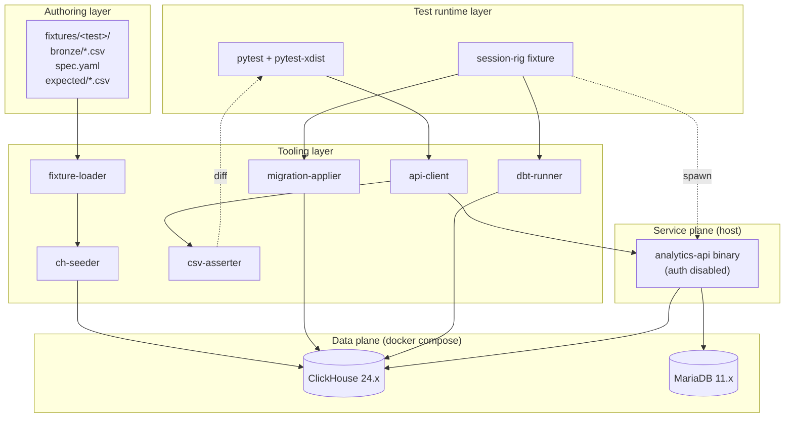
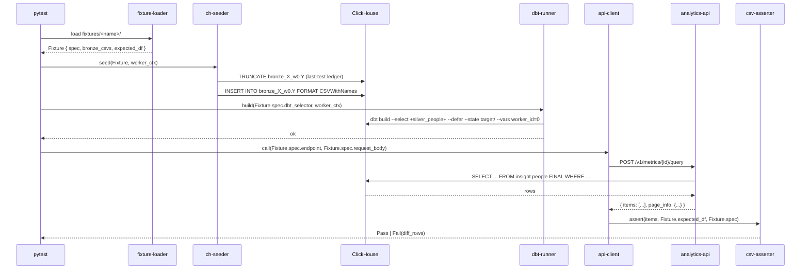
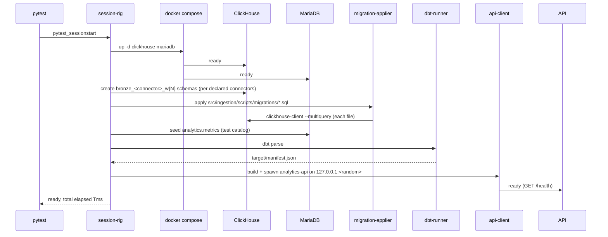

# Technical Design — Bronze-to-API E2E Test Framework

- [ ] `p3` - **ID**: `cpt-bronze-to-api-e2e-design-rig`

<!-- toc -->

- [Changelog](#changelog)
- [1. Architecture Overview](#1-architecture-overview)
  - [1.1 Architectural Vision](#11-architectural-vision)
  - [1.2 Architecture Drivers](#12-architecture-drivers)
  - [1.3 Architecture Layers](#13-architecture-layers)
- [2. Principles & Constraints](#2-principles--constraints)
  - [2.1 Design Principles](#21-design-principles)
  - [2.2 Constraints](#22-constraints)
- [3. Technical Architecture](#3-technical-architecture)
  - [3.1 Domain Model](#31-domain-model)
  - [3.2 Component Model](#32-component-model)
  - [3.3 API Contracts](#33-api-contracts)
  - [3.4 Internal Dependencies](#34-internal-dependencies)
  - [3.5 External Dependencies](#35-external-dependencies)
  - [3.6 Interactions & Sequences](#36-interactions--sequences)
  - [3.7 Database schemas & tables](#37-database-schemas--tables)
  - [3.8 Deployment Topology](#38-deployment-topology)
- [4. Additional context](#4-additional-context)
- [5. Traceability](#5-traceability)

<!-- /toc -->

## Changelog

- **v1.1** (current): Authoring format moves from per-folder CSV (`bronze/*.csv` + `spec.yaml` + `expected/response.csv`) to a single declarative `<name>.test.yaml` (see `cpt-bronze-to-api-e2e-feature-yaml-rig`). Adds three components — `ref-resolver` (composition via `$ref` + sibling overrides), `schema-validator` (per-table JSON schema, padding, validation), `expect-engine` (Mongo-style `find` + `equal` subset + CEL `assert` over the batch response) — and retires `csv-asserter`. `fixture-loader` is repurposed to load `*.test.yaml`. The API roundtrip targets the batch endpoint `POST /v1/metrics/queries`. The transformation path (bronze→silver→gold→API) is unchanged; only the authoring format and assertion engine change.
- **v1.0**: Initial design. Establishes 7 components (fixture-loader, ch-seeder, dbt-runner, migration-applier, api-client, csv-asserter, session-rig), the data plane (docker compose with ClickHouse + MariaDB), the service plane (`analytics-api` binary on host with `cargo build --release`), and the assertion plane (pandas). Vertically slices through the bronze→silver→gold→API path defined in `cpt-dataflow-design-pipeline`.

## 1. Architecture Overview

### 1.1 Architectural Vision

The Bronze-to-API E2E Test Framework wraps Constructor Insight's existing transformation stack — ClickHouse, dbt, the migration view set, the analytics-api binary, MariaDB — and drives it from a declarative fixture format. The defining property is **layer parity**: nothing under test is simulated. The test ClickHouse is the same image as production, the dbt models are the same files dbt runs in Argo, the gold views are applied by the same SQL that runs in deploy, and the `analytics-api` binary is the same compilation artifact the K8s deployment ships. Only Airbyte (data ingress) is bypassed — bronze is seeded by direct CSV INSERT, which is what we want to test against, not Airbyte's correctness.

The second defining property is **shared session, scoped work**: docker compose, ClickHouse migrations, the dbt manifest parse, and the analytics-api binary all happen once per pytest session and amortize across every test. Per-test work is narrow: TRUNCATE the touched bronze tables, INSERT this test's CSVs, run a dbt selector that touches only the slice this test needs (`--defer --state target/`), call the API, diff the response. The framework is designed so the wall-clock cost of "what changed for this test" stays near the cost of the work that actually changed, not the cost of the whole pipeline.

### 1.2 Architecture Drivers

**ADRs**: none in v1. If a non-trivial decision becomes contested (e.g. axum-router vs HTTP loopback, testcontainers vs raw compose) it lands in an ADR under `docs/domain/bronze-to-api-e2e/specs/ADR/`.

#### Functional Drivers

| Requirement | Design Response |
|-------------|------------------|
| `cpt-bronze-to-api-e2e-fr-bronze-seed-from-csv` | `ch-seeder` component reads each `bronze/<schema>.<table>.csv`, infers types via `system.columns`, batches rows into `INSERT INTO bronze_X.Y FORMAT CSVWithNames`. |
| `cpt-bronze-to-api-e2e-fr-bronze-truncate` | `ch-seeder` records touched tables and `TRUNCATE`s only those in test teardown. Bronze tables themselves are created once at session start by a connector-bootstrap step. |
| `cpt-bronze-to-api-e2e-fr-dbt-run-scoped` | `dbt-runner` parses the manifest once (`dbt parse` in session fixture) and shells out to `dbt build --select <spec.dbt_selector> --defer --state target/` per test. |
| `cpt-bronze-to-api-e2e-fr-gold-view-queried` | `migration-applier` shells out `clickhouse-client --multiquery < migrations/*.sql` once per session, in lexical order. Idempotent (`CREATE OR REPLACE VIEW`). |
| `cpt-bronze-to-api-e2e-fr-api-roundtrip` | `api-client` spawns `analytics-api` once per session, binds to `127.0.0.1:<random>`, drives requests via `requests`. Auth disabled via `--auth-disabled`. |
| `cpt-bronze-to-api-e2e-fr-csv-assert` | `csv-asserter` flattens response `items[]` into a `DataFrame`, sorts both sides by `key_columns`, runs `pandas.testing.assert_frame_equal` with the spec's `float_tolerance`. On failure, renders first 20 mismatched cells with row key + column. |
| `cpt-bronze-to-api-e2e-fr-test-isolation` | `session-rig` injects a `WORKER_ID` env var; `ch-seeder` and `dbt-runner` suffix every schema with `_w{N}`. |

#### NFR Allocation

| NFR ID | NFR Summary | Allocated To | Design Response | Verification Approach |
|--------|-------------|--------------|-----------------|----------------------|
| `cpt-bronze-to-api-e2e-nfr-cold-start` | Cold session ≤ 60 s warm cache | `session-rig` + `migration-applier` + `api-client` | docker compose pulls cached images; migrations idempotent; analytics-api built once with `cargo build --release` and cached in `target/`; dbt manifest parsed once | Session fixture wraps in `time.perf_counter()`; CI step fails if elapsed > 60 s on warm cache or > 180 s on cold cache |
| `cpt-bronze-to-api-e2e-nfr-per-test-latency` | p50 ≤ 5 s, p95 ≤ 15 s | `dbt-runner` + `ch-seeder` + `csv-asserter` | Selector-scoped dbt (only touched models); TRUNCATE-not-DROP between tests; pandas in-process diff | pytest-benchmark fixture records per-test wall clock; CI publishes p50/p95 and fails if budget exceeded over rolling 20-test window |
| `cpt-bronze-to-api-e2e-nfr-parallel-safe` | Zero cross-worker contamination | `session-rig` + `ch-seeder` + `dbt-runner` | Per-worker schema suffix (`_w0`, `_w1`, …); analytics-api binary is read-only against per-worker schemas | `tests/e2e/meta/test_parallel_isolation.py` runs 100 randomized parallel pairs; CI fails on any contamination |
| `cpt-bronze-to-api-e2e-nfr-diff-readability` | Cell-precise diff in pytest captured stdout | `csv-asserter` | Custom `assert_frame_equal` wrapper that catches the assertion, formats first 20 mismatches as `(key, column, expected, actual)` lines, raises a new `AssertionError` with that text — visible in pytest report | `tests/e2e/meta/test_diff_format.py` injects a known mismatch and asserts the captured stdout contains the expected (key, column) pairs |

### 1.3 Architecture Layers



| Layer | Responsibility | Technology |
|-------|---------------|------------|
| Authoring | Declarative fixture folders | CSV + YAML |
| Test Runtime | Discovery, parameterization, parallel orchestration, lifecycle | pytest ≥ 8, pytest-xdist |
| Data Plane | Persistent storage of bronze/staging/silver/gold rows + metric defs | docker compose: ClickHouse 24.x, MariaDB 11.x |
| Tooling | Per-test work: load, seed, run dbt, call API, assert | Python ≥ 3.12, clickhouse-driver, pandas |
| Service Plane | Service under test | `analytics-api` Rust/axum binary, built `--release`, run on host |

## 2. Principles & Constraints

### 2.1 Design Principles

#### No Airbyte coupling on the test path

- [ ] `p1` - **ID**: `cpt-bronze-to-api-e2e-principle-no-airbyte`

Bronze is seeded by direct CSV INSERT. Airbyte is intentionally out of the test path: any Airbyte bug shows up in staging tests or production observability, not here. This keeps the framework independent of Airbyte release cadence and connector image versions, and keeps per-test latency in the seconds range.

#### Shared session resources, narrow per-test work

- [ ] `p1` - **ID**: `cpt-bronze-to-api-e2e-principle-shared-session`

Expensive setup (docker compose, ClickHouse migrations, dbt manifest parse, analytics-api spawn) is paid once per pytest session. Per-test cleanup uses `TRUNCATE` on the touched bronze tables, never `DROP`. The lifecycle is `session > worker > test`; nothing more invasive runs between tests.

#### Fixtures are the source of truth, not snapshots

- [ ] `p2` - **ID**: `cpt-bronze-to-api-e2e-principle-fixtures-are-truth`

The test file is what the test asserts on. There is no "regenerate from current production" mode. Under the YAML rig (`feature-yaml-rig`) expectations are explicit `expect` rules; an author writes only the fields/conditions that matter, never a full response snapshot.

#### Records compose by reference, not repetition

- [ ] `p1` - **ID**: `cpt-bronze-to-api-e2e-principle-record-composition`

A bronze row (or a template) is a field map that may carry a `$ref: "<file>#/<json-pointer>"` to inherit from another record; sibling keys override the base (closest wins). Reusable people/source records live in `fixtures/templates/*.yaml`. A test spells out only the fields it exercises; everything else is inherited. This keeps a test small while the seeded row stays complete.

#### The table schema is the source of truth for a row's shape

- [ ] `p1` - **ID**: `cpt-bronze-to-api-e2e-principle-schema-is-truth`

Per-table JSON schemas live in `fixtures/schemas/<table>.yaml` and are resolved by table name (the `bronze` key IS the table). After `$ref` resolution a row is padded with every missing schema column as `null` and validated; `additionalProperties:false` catches a misspelled column. Base templates carry the full column set (including the non-nullable `_airbyte_*` CDK columns, which transforms such as `insight.people`'s `argMax(..., _airbyte_extracted_at)` depend on).

### 2.2 Constraints

#### ClickHouse and MariaDB pinned to production parity

- [ ] `p1` - **ID**: `cpt-bronze-to-api-e2e-constraint-version-parity`

The test docker compose pins ClickHouse and MariaDB to the same major (and where reasonable, minor) versions as the production Helm chart. A version drift would let a test pass on a newer engine while production fails on the older one.

#### Test path MUST NOT mutate gold-view DDL

- [ ] `p1` - **ID**: `cpt-bronze-to-api-e2e-constraint-no-ddl-mutation`

Tests inject data, not schemas. Migrations are applied once per session by `migration-applier`; no test, helper, or fixture is allowed to `CREATE`, `ALTER`, or `DROP` a view inside `insight.*`. (Per-worker namespacing applies to bronze/staging/silver tables only.)

#### Loopback only

- [ ] `p1` - **ID**: `cpt-bronze-to-api-e2e-constraint-loopback-only`

The spawned `analytics-api` binds to `127.0.0.1:<random>`. The compose stack publishes ClickHouse / MariaDB ports on loopback only. No port is exposed on `0.0.0.0`.

## 3. Technical Architecture

### 3.1 Domain Model

**Core Entities**:

| Entity | Description |
|--------|-------------|
| `Fixture` | A folder under `src/ingestion/tests/e2e/fixtures/<name>/` containing `bronze/*.csv` (one per bronze table), `spec.yaml`, and `expected/response.csv`. The unit a developer authors. |
| `SpecYaml` | Per-test config. Keys: `endpoint` (e.g. `/v1/metrics/{id}/query`), `method` (default `POST`), `metric_id` (UUID, optional — if absent, an inline metric definition is required), `request_body` (JSON-mappable), `dbt_selector` (string passed verbatim to `dbt build --select`), `key_columns` (list of column names used for diff sort), `float_tolerance` (default `1e-6`), `spec_version: 1`. |
| `ApiResponse` | The deserialized body of the API call. For metric queries: `{"items": [...], "page_info": {...}}`. |
| `AssertionResult` | A typed value: `Pass` or `Fail(diff_rows: list[(key, column, expected, actual)])`. Renders to the pytest captured stdout. |
| `WorkerContext` | The per-pytest-xdist-worker context: `worker_id: int`, `schema_suffix: str` (`""` for serial, `"_w0"` for worker 0, etc.). |

**Relationships**:

- `Fixture` → `SpecYaml`: one-to-one; the YAML is the imperative skin over the declarative CSV folder
- `Fixture` → `ApiResponse`: one-to-one per execution; the asserter consumes both `Fixture.expected` and the live `ApiResponse`
- `WorkerContext` → `Fixture`: many-to-one; multiple workers can run the same fixture concurrently and the worker context disambiguates schemas

### 3.2 Component Model

#### Fixture Loader

- [ ] `p1` - **ID**: `cpt-bronze-to-api-e2e-component-fixture-loader`

##### Why this component exists

Authors write tests as folders; the runtime needs a typed in-memory representation before it can do anything. Centralizing parsing and validation in one component means every other component sees a well-shaped `Fixture` and can fail fast on misshaped inputs.

##### Responsibility scope

Walks `fixtures/<name>/`, parses `spec.yaml` with a JSON Schema (`spec_version: 1`), enumerates `bronze/*.csv` files (matching the pattern `<schema>.<table>.csv`), loads `expected/response.csv` into a `DataFrame`, validates that `spec.yaml.key_columns` are present in `expected/response.csv`, and emits a `Fixture` value.

##### Responsibility boundaries

Does **NOT**: connect to ClickHouse; insert rows; run dbt; spawn anything; deserialize the CSV rows into typed column values (that's `ch-seeder`'s job, because typing requires `system.columns`).

##### Related components (by ID)

- `cpt-bronze-to-api-e2e-component-ch-seeder` — supplies the parsed `Fixture` for seeding
- `cpt-bronze-to-api-e2e-component-csv-asserter` — supplies the `expected/response.csv` DataFrame
- `cpt-bronze-to-api-e2e-component-session-rig` — invoked by the per-test pytest fixture

#### ClickHouse Seeder

- [ ] `p1` - **ID**: `cpt-bronze-to-api-e2e-component-ch-seeder`

##### Why this component exists

Bronze tables have non-trivial types (`Nullable(DateTime64(6))`, `Array(String)`, etc.). A naive CSV-to-string INSERT misses types. This component is the typed boundary between CSV-on-disk and bronze-in-CH.

##### Responsibility scope

For each `bronze/<schema>.<table>.csv` in a `Fixture`: read column types from `system.columns WHERE database='<schema>_w{N}' AND table='<table>'`, map the CSV cells through type-aware coercion (empty cell → SQL NULL; date strings → DateTime), batch into `INSERT INTO <schema>_w{N}.<table> FORMAT CSVWithNames`. Records touched (schema, table) tuples on a per-test ledger and exposes a `truncate_touched()` method for teardown.

##### Responsibility boundaries

Does **NOT**: create or drop tables; mutate gold views; perform any work in non-bronze schemas; deal with worker-ID resolution (receives the suffix from `session-rig`).

##### Related components (by ID)

- `cpt-bronze-to-api-e2e-component-fixture-loader` — supplies the typed `Fixture`
- `cpt-bronze-to-api-e2e-component-session-rig` — supplies `WorkerContext`

#### Dbt Runner

- [ ] `p1` - **ID**: `cpt-bronze-to-api-e2e-component-dbt-runner`

##### Why this component exists

Running `dbt build` without scoping rebuilds the whole graph and blows the per-test latency NFR. This component owns selector resolution, the deferred manifest pattern, and the per-worker schema indirection (via dbt vars).

##### Responsibility scope

Once per session: invokes `dbt parse --profiles-dir <local> --target test` to populate `target/manifest.json` and `target/run_results.json`. Per test: shells out `dbt build --select <spec.dbt_selector> --defer --state target/ --vars '{worker_id: {N}}'`. Parses dbt output; surfaces failed-model details into the pytest report.

##### Responsibility boundaries

Does **NOT**: insert into bronze; apply migrations; call the API; create or modify dbt models or `profiles.yml` (consumes the existing project under `src/ingestion/dbt/`).

##### Related components (by ID)

- `cpt-bronze-to-api-e2e-component-session-rig` — initiated by it; receives `WorkerContext`
- `cpt-bronze-to-api-e2e-component-ch-seeder` — implicit dependency (bronze must be seeded before dbt runs)

#### Migration Applier

- [ ] `p1` - **ID**: `cpt-bronze-to-api-e2e-component-migration-applier`

##### Why this component exists

Gold views live in SQL migrations, not in dbt. The framework MUST exercise the same SQL the deploy applies, and it MUST apply it once per session (per `cpt-bronze-to-api-e2e-constraint-no-ddl-mutation`).

##### Responsibility scope

Enumerates `src/ingestion/scripts/migrations/*.sql` in lexical order. For each file, shells out `clickhouse-client --multiquery --queries-file=<file>`. Runs once per session before any test executes. Idempotent: every migration uses `CREATE OR REPLACE VIEW` / `DROP VIEW IF EXISTS` patterns.

##### Responsibility boundaries

Does **NOT**: re-apply migrations between tests; modify migration files; create bronze or silver tables (those are created by dbt and connector-bootstrap).

##### Related components (by ID)

- `cpt-bronze-to-api-e2e-component-session-rig` — invoked exactly once during session setup

#### API Client

- [ ] `p1` - **ID**: `cpt-bronze-to-api-e2e-component-api-client`

##### Why this component exists

The contract under test is the HTTP boundary. Linking directly against the axum `Router` would miss serialization, middleware, and the OData filter parser. This component owns the binary spawn, port allocation, request building, and response deserialization.

##### Responsibility scope

Once per session: `cargo build --release -p analytics-api` (cached via `CARGO_TARGET_DIR`), spawn the binary with `INSIGHT_ANALYTICS_API_AUTH_DISABLED=true`, env vars pointing at the test ClickHouse and MariaDB, bind to `127.0.0.1:<random>`, wait for `/health` to return 200. Per test: build the request from `spec.yaml` (`endpoint`, `method`, `request_body`), POST/GET, deserialize, return an `ApiResponse`. On session teardown: SIGTERM, wait, SIGKILL on timeout.

##### Responsibility boundaries

Does **NOT**: assert response content (that's `csv-asserter`); insert MariaDB rows (that's a session-rig step before spawn, or a per-test step before the request); rebuild the binary mid-session.

##### Related components (by ID)

- `cpt-bronze-to-api-e2e-component-session-rig` — orchestrates spawn/teardown
- `cpt-bronze-to-api-e2e-component-csv-asserter` — receives the `ApiResponse`

#### Ref Resolver

- [ ] `p1` - **ID**: `cpt-bronze-to-api-e2e-component-ref-resolver`

##### Why this component exists

The readability of the YAML rig rests on `$ref` + sibling-override composition. Resolving that — across files, with cycle detection and base-in-its-own-file semantics — is a self-contained, pure transformation worth isolating and unit-testing in full (`cpt-bronze-to-api-e2e-dod-yaml-ref-resolution`, 12 invariants).

##### Responsibility scope

Implements `cpt-bronze-to-api-e2e-algo-yaml-resolve-refs`: walks a YAML node; on a `$ref` loads the target (cached), resolves the base in the target file's context, deep-merges sibling overrides on top; guards cycles. Pure — no I/O beyond reading referenced YAML files.

##### Responsibility boundaries

Does **NOT**: connect to ClickHouse; know about schemas (padding/validation is `schema-validator`); evaluate `cases`.

##### Related components (by ID)

- `cpt-bronze-to-api-e2e-component-fixture-loader` — calls the resolver on each record
- `cpt-bronze-to-api-e2e-component-schema-validator` — consumes resolved records

#### Schema Validator

- [ ] `p1` - **ID**: `cpt-bronze-to-api-e2e-component-schema-validator`

##### Why this component exists

A resolved bronze row must be a complete, well-typed table row. Centralizing schema lookup-by-table-name, null-padding, and JSON-schema validation makes "the row matches the table" a single, fail-fast checkpoint.

##### Responsibility scope

Loads `fixtures/schemas/<table>.yaml`; pads a resolved record with missing schema properties as `null`; validates against the JSON schema (`additionalProperties:false`). Implements the post-step of `cpt-bronze-to-api-e2e-algo-yaml-resolve-refs`.

##### Responsibility boundaries

Does **NOT**: coerce values to ClickHouse types (that's `ch-seeder` at INSERT time); resolve `$ref` (that's `ref-resolver`).

##### Related components (by ID)

- `cpt-bronze-to-api-e2e-component-ref-resolver` — supplies resolved records
- `cpt-bronze-to-api-e2e-component-ch-seeder` — consumes padded/validated records

#### Expect Engine

- [ ] `p1` - **ID**: `cpt-bronze-to-api-e2e-component-expect-engine`

##### Why this component exists

Replaces `csv-asserter`. Dashboard metrics return many rows over a batch of queries; an author asserts a few fields/conditions, not a whole CSV. This component owns selection (`in` + Mongo-style `find`) and verdict (`equal` subset or CEL `assert`).

##### Responsibility scope

Implements `cpt-bronze-to-api-e2e-algo-yaml-eval-expect`: selects a batch result by `id`; filters `result.items` by a Mongo-style selector to exactly one row; compares a subset of fields (`equal`, explicit `null`) or evaluates a CEL boolean (`assert`) with bindings `it`/`items`/`result`/`results`/`status`. Renders a precise failing-rule report.

##### Responsibility boundaries

Does **NOT**: call the API (consumes the deserialized `BatchResponse`); mutate state; support a snapshot-update mode (expectations are authored, per `cpt-bronze-to-api-e2e-principle-fixtures-are-truth`).

##### Related components (by ID)

- `cpt-bronze-to-api-e2e-component-api-client` — supplies the `BatchResponse`
- `cpt-bronze-to-api-e2e-component-fixture-loader` — supplies the `cases`

#### CSV Asserter (retired in v1.1)

- [ ] `p1` - **ID**: `cpt-bronze-to-api-e2e-component-csv-asserter`

> **Retired in v1.1** — superseded by `cpt-bronze-to-api-e2e-component-expect-engine`. Kept here for traceability from `feature-csv-rig`.

##### Why this component exists

`pandas.testing.assert_frame_equal` is close to what we want but its diff output is awkward inside a pytest report and it doesn't honor `key_columns` for stable row ordering. This component is a thin, opinionated wrapper that produces the cell-precise diff format required by `cpt-bronze-to-api-e2e-nfr-diff-readability`.

##### Responsibility scope

Flattens `ApiResponse.items[]` into a `DataFrame`; aligns columns with the expected DataFrame; sorts both by `spec.key_columns`; runs `assert_frame_equal` with `atol=spec.float_tolerance` for numeric columns; on failure, emits up to 20 mismatched cells as `(key, column, expected, actual)` tuples; raises `AssertionError` with that text. Supports `--update-snapshots` (writes `actual` back to `expected/response.csv` instead of asserting) — gated behind a separate FEATURE.

##### Responsibility boundaries

Does **NOT**: call the API; render to a frontend; persist anything except (in update mode) the expected CSV.

##### Related components (by ID)

- `cpt-bronze-to-api-e2e-component-api-client` — supplies `ApiResponse`
- `cpt-bronze-to-api-e2e-component-fixture-loader` — supplies expected DataFrame + `spec`

#### Session Rig

- [ ] `p1` - **ID**: `cpt-bronze-to-api-e2e-component-session-rig`

##### Why this component exists

The expensive setup must happen exactly once per pytest session and be observable by every test and every worker. The framework needs a single place that owns the lifecycle of compose, ClickHouse, MariaDB, the analytics-api binary, dbt manifest, and worker context.

##### Responsibility scope

Declares pytest fixtures with `scope="session"` for: (a) docker compose up + healthcheck wait; (b) ClickHouse bronze schema bootstrap (per-connector); (c) `migration-applier` once; (d) MariaDB metric-catalog seed; (e) `dbt parse` once; (f) `analytics-api` binary build + spawn. Declares a `scope="function"` fixture that injects `Fixture` + `WorkerContext` into each test. Owns the teardown order (reverse).

##### Responsibility boundaries

Does **NOT**: perform any per-test work directly (delegates to other components); modify state in any docker container or external system beyond start/stop and seed.

##### Related components (by ID)

- All other components — orchestrates them

### 3.3 API Contracts

The framework consumes the existing analytics-api HTTP surface. No new endpoints are introduced.

- [ ] `p2` - **ID**: `cpt-bronze-to-api-e2e-interface-pytest-entry` *(defined in PRD §7.1)*

- **Contracts**: `cpt-bronze-to-api-e2e-contract-api-response`
- **Technology**: HTTP/JSON over loopback

**Endpoints Overview** (consumed; service is `analytics-api`):

| Method | Path | Description | Stability |
|--------|------|-------------|-----------|
| `POST` | `/v1/metrics/queries` | Batch metric query — `{queries:[{id, metric_id, $filter,...}]}` → `{results:[{id, status, items|error}]}`. Primary roundtrip for the YAML rig. | stable |
| `POST` | `/v1/metrics/{id}/query` | Execute a single metric query (OData `$filter`, `$top`, `$orderby`, `$select`) | stable |
| `GET` | `/v1/metrics` | List metric definitions | stable |
| `GET` | `/v1/metrics/{id}` | Get one metric definition | stable |
| `GET` | `/v1/columns` | List column catalog | stable |
| `GET` | `/v1/columns/{table}` | List columns for a table | stable |
| `GET` | `/health` | Liveness probe (used by `api-client` startup wait) | stable |

### 3.4 Internal Dependencies

| Dependency Module | Interface Used | Purpose |
|-------------------|----------------|---------|
| `src/ingestion/dbt/` (dbt project) | dbt CLI (subprocess), `target/manifest.json` | Run staging/silver models with selectors |
| `src/ingestion/scripts/migrations/` | `clickhouse-client --multiquery` | Apply gold views |
| `src/backend/services/analytics-api/` | HTTP loopback against the built binary | Service under test |
| `src/ingestion/connectors/*/airbyte/connector.yaml` | Read-only — derives the bronze table list (used by session-rig connector bootstrap) | Knows which bronze schemas to create at session start |

**Dependency Rules**:

- No circular dependencies (the framework lives downstream of all the modules above)
- The framework MUST NOT modify any file under `src/ingestion/dbt/` or `src/ingestion/scripts/migrations/` at runtime
- The analytics-api binary is the only Rust artifact the framework consumes — it is built from source (no pre-built image dependency)

### 3.5 External Dependencies

#### ClickHouse 24.x

| Dependency | Interface | Purpose |
|------------|-----------|---------|
| `clickhouse/clickhouse-server:24.x` | HTTP 8123, native 9000, `clickhouse-client` CLI | Stores bronze / staging / silver / gold; receives CSV INSERTs and dbt SQL |

#### MariaDB 11.x

| Dependency | Interface | Purpose |
|------------|-----------|---------|
| `mariadb:11.x` | MySQL protocol 3306, `mariadb` CLI | Stores `analytics.metrics`, `analytics.thresholds`, `table_columns` — the catalog the analytics-api reads |

**Dependency Rules**:

- Both containers run on the docker compose private bridge network; ports are published on `127.0.0.1` only
- Credentials are generated at session start (random per-run) and injected into both containers and the spawned `analytics-api` via env vars
- No external network is required after image pull — the framework MUST work offline once images are cached

### 3.6 Interactions & Sequences

#### One test execution (after session warm-up)

**ID**: `cpt-bronze-to-api-e2e-seq-one-test-execution`

**Use cases**: `cpt-bronze-to-api-e2e-usecase-author-test`

**Actors**: `cpt-bronze-to-api-e2e-actor-test-author`, `cpt-bronze-to-api-e2e-actor-dbt-cli`, `cpt-bronze-to-api-e2e-actor-analytics-api`



#### Session startup

**ID**: `cpt-bronze-to-api-e2e-seq-session-startup`



### 3.7 Database schemas & tables

The framework consumes the existing schemas. The only DB writes that originate from the framework are:

- `INSERT INTO bronze_<connector>_w{N}.<entity>` — from per-test CSVs
- `INSERT INTO analytics.metrics` — from session-rig metric-catalog seed (one row per metric referenced by any fixture)

No new persistent tables are introduced. No DDL on `insight.*` (gold) is performed at any time after session start.

### 3.8 Deployment Topology

- [ ] `p3` - **ID**: `cpt-bronze-to-api-e2e-topology-localhost`

`docker compose` under `src/ingestion/tests/e2e/compose/`. Two services on a private bridge network; both publish on `127.0.0.1` only. analytics-api binary runs on the developer host (not in a container) to keep the cargo build cache hot across sessions. The host process talks to compose services via published loopback ports.

```text
┌─────────── developer host / CI runner ────────────┐
│                                                   │
│  pytest worker(s)  ──┐                            │
│                      │                            │
│  analytics-api ──────┼───► 127.0.0.1:<random-1>   │
│                      │                            │
│                      └───► 127.0.0.1:30123 ──► CH (compose)
│                          ► 127.0.0.1:30306 ──► MariaDB (compose)
│                                                   │
└───────────────────────────────────────────────────┘
```

## 4. Additional context

**Why not testcontainers-python in v1**: testcontainers-python is a fine library, but a hand-written docker compose is more transparent for debugging (developers already use `docker compose` directly) and avoids a dependency on a Python testcontainers version pin. If the rig grows ports / services and the compose file becomes unmanageable, switching is a single-component change inside `session-rig`.

**Why a host-side analytics-api binary, not a container**: cargo's incremental compile is the dominant cost in development. Running cargo against `/var/lib/docker/volumes/...` adds I/O latency and complicates cache reuse across branches. Building on the host keeps `target/` warm and fits the typical Rust developer workflow.

**Why not Rust-side `axum::Router::oneshot`**: the OData filter parser and auth middleware are wired in `router()` setup but the codepath that calls `axum::Router::oneshot` bypasses any TCP/serialization quirks that the actual deployment would exercise. The per-request HTTP cost (a few ms on loopback) is negligible compared to dbt/ClickHouse work, and the contract fidelity is worth it.

## 5. Traceability

- **PRD**: [PRD.md](./PRD.md)
- **ADRs**: none in v1 — create under `ADR/` if a contested decision arises (e.g. compose vs testcontainers, host vs containerized analytics-api)
- **Features**: enumerated in [DECOMPOSITION.md](./DECOMPOSITION.md)
