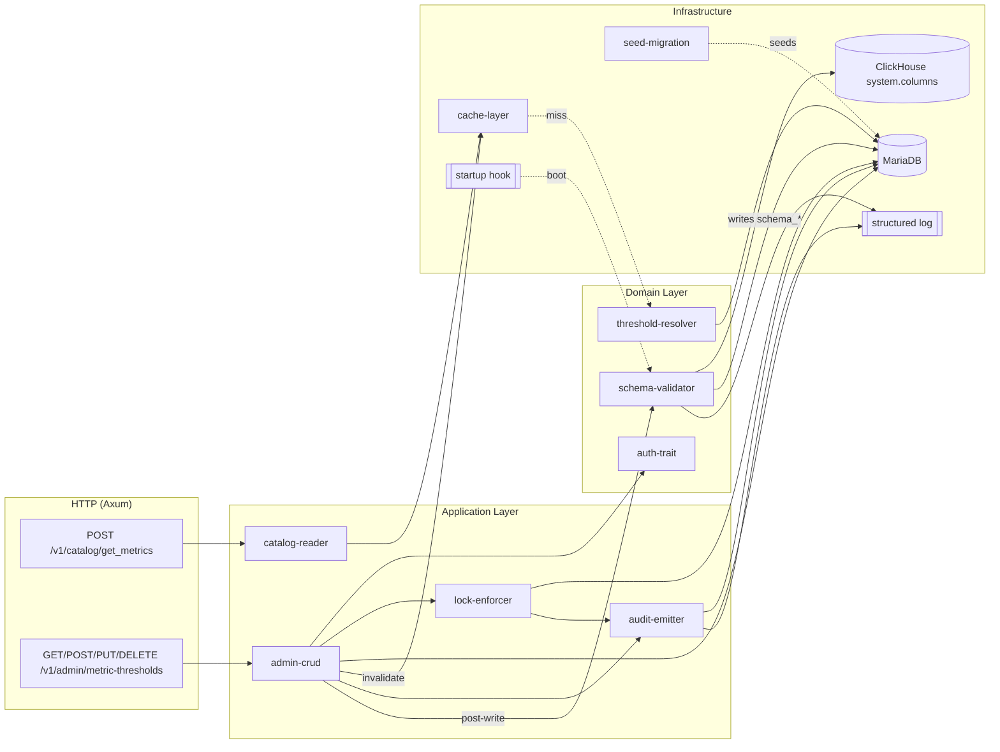
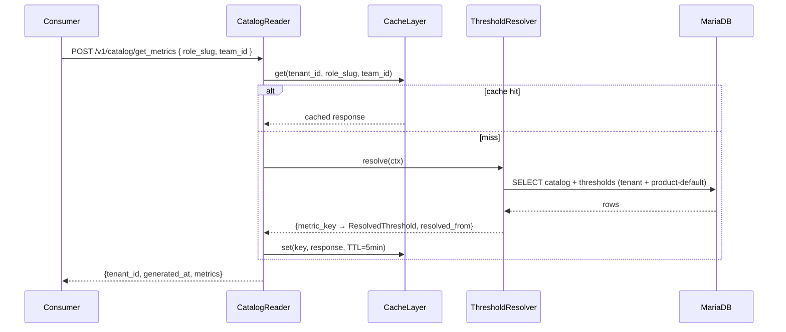
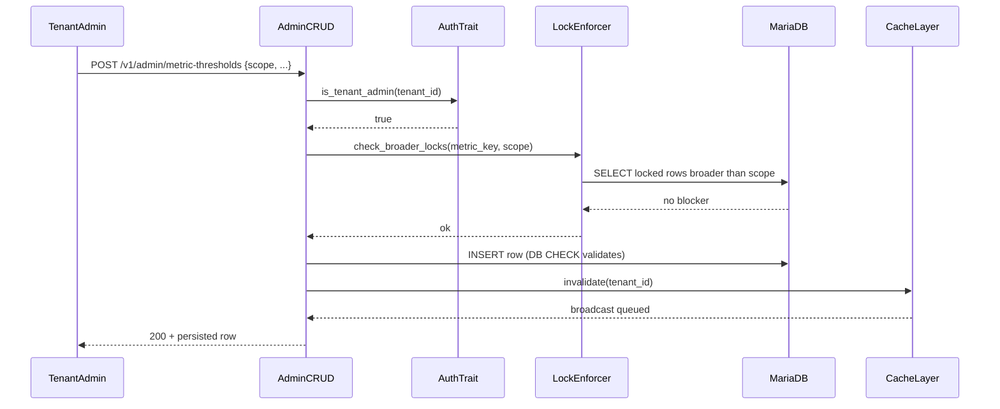
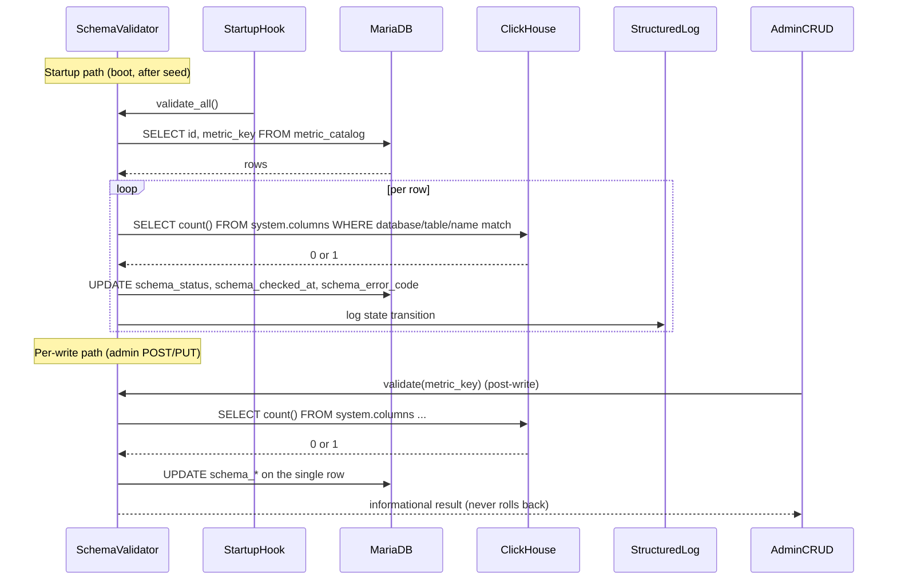

# Technical Design — Metric Catalog


<!-- toc -->

- [1. Architecture Overview](#1-architecture-overview)
  - [1.1 Architectural Vision](#11-architectural-vision)
  - [1.2 Architecture Drivers](#12-architecture-drivers)
  - [1.3 Architecture Layers](#13-architecture-layers)
- [2. Principles & Constraints](#2-principles--constraints)
  - [2.1 Design Principles](#21-design-principles)
  - [2.2 Constraints](#22-constraints)
- [3. Technical Architecture](#3-technical-architecture)
  - [3.1 Domain Model](#31-domain-model)
  - [3.2 Component Model](#32-component-model)
  - [3.3 API Contracts](#33-api-contracts)
  - [3.4 Internal Dependencies](#34-internal-dependencies)
  - [3.5 External Dependencies](#35-external-dependencies)
  - [3.6 Interactions & Sequences](#36-interactions--sequences)
  - [3.7 Database Schemas & Tables](#37-database-schemas--tables)
  - [3.8 Deployment Topology](#38-deployment-topology)
- [4. Additional Context](#4-additional-context)
- [5. Traceability](#5-traceability)

<!-- /toc -->

- [ ] `p3` - **ID**: `cpt-metric-cat-design-metric-catalog`

> Sourced from PRD v1.11. Companion: [`PRD.md`](./PRD.md), [`PRD_human_readable.md`](./PRD_human_readable.md).
## 1. Architecture Overview

### 1.1 Architectural Vision

Metric Catalog is a backend-owned registry over MariaDB that resolves two facts about every metric Insight surfaces to users: **what it means** (label, sublabel, description, unit, format, source connectors, enable flag) and **what "good" looks like for each tenant** (per-scope thresholds for bullet colors and alert evaluation). It replaces today's drift-prone split where metric metadata lives in a frontend TypeScript file (`thresholdConfig.ts`) while the metric query lives in the backend (`analytics.metrics.query_ref`). The catalog sits at the gold / consumer layer; it names metrics and carries display + threshold metadata, but it is **agnostic** to how a metric is computed — `analytics.metrics.query_ref` remains the authoritative source for that in v1 (see PRD §1.1 layer boundary).

The read path is a single `POST /v1/catalog/get_metrics` endpoint that returns, for the caller's `(tenant, role, team)` context, every enabled catalog row joined with its resolved threshold. The endpoint is POST (not GET) so request-context fields stay out of HTTP access logs; that choice forces caching to be **server-side** (Redis or pub-sub-coordinated in-process), which is also the only shape that satisfies the cross-replica invalidation NFR. The resolver executes a canonical most-specific-wins walk over scopes `product-default → tenant → role → team → team+role`, lock-bounded: a row with `is_locked = true` at any scope stops the walk and that row is returned. Resolution lives in the catalog so every consumer agrees on which row won; the read endpoint surfaces `resolved_from` per metric so admin tooling can explain the choice without a second request.

The write path is tenant-admin CRUD over `metric_threshold` (5 endpoints under `/v1/admin/metric-thresholds`). Catalog metadata is migration-only in v1 — there is no runtime endpoint to rename or relabel a product-owned metric, because metadata is product-level contract and per-tenant edits would shatter cross-tenant comparability. Locks turn the catalog from a config store into a compliance mechanism: tenant admins can pin a metric at `tenant` scope with a required `lock_reason`, and every lock-set, lock-clear, and lock-bypass attempt lands in a dedicated `threshold_lock_audit` MariaDB table plus the structured log stream — retention defined canonically on the table (§3.7). The product/tenant axis is symmetric to thresholds: product owns the global metadata baseline; tenants overlay thresholds; tenant-custom metrics land later via the same nullable-`tenant_id` slot that ships dead-with-CHECK in v1.

### 1.2 Architecture Drivers

**ADRs**: _no ADRs in v1; key decisions live in PRD §13 Open Questions and DESIGN §2_

#### Functional Drivers

| Requirement | Design Response |
|-------------|-----------------|
| `cpt-metric-cat-fr-catalog-storage` | `metric_catalog` table with nullable `tenant_id` (v1 CHECK = NULL); seeded via migration; reader serves rows directly. |
| `cpt-metric-cat-fr-enable-flag` | `is_enabled` column filtered server-side; disabled rows are absent from the response, never errors. |
| `cpt-metric-cat-fr-threshold-storage` | `metric_threshold` table with scope enum, unique on `(tenant_id, metric_key, scope, role_slug, team_id)`, lock + audit columns. CHECK constraints enforce v1 invariants. |
| `cpt-metric-cat-fr-tenant-thresholds` | `product-default` seeded per metric; resolver walk never returns null for an enabled metric. |
| `cpt-metric-cat-fr-scoped-thresholds` | ThresholdResolver — canonical in-memory walk after one bulk fetch per request; lock-bounded; surfaces `resolved_from`. |
| `cpt-metric-cat-fr-read-endpoint` | `POST /v1/catalog/get_metrics` with JSON body `{ role_slug?, team_id? }`; returns catalog + resolved thresholds + `resolved_from`. |
| `cpt-metric-cat-fr-cache` | Server-side cache (`CacheLayer` component); per-`(tenant, role, team)` key; 5-min default TTL; invalidated on admin write. |
| `cpt-metric-cat-fr-threshold-crud` | `AdminCRUD` component owns 5 admin endpoints; enforces auth + DB CHECK + app-layer scope/sanity validation. |
| `cpt-metric-cat-fr-threshold-lock` | `LockEnforcer` checks broader-scope locks on every write; emits a canonical `permission_denied` envelope (HTTP 403, `context.reason = "threshold_locked"`, `blocking_scope` / `blocking_row_id` / `locked_at`) per §3.3. |
| `cpt-metric-cat-fr-threshold-lock-bypass-audit` | `AuditEmitter` writes to `threshold_lock_audit` and structured log on every lock-set / lock-cleared / bypass-attempt. |
| `cpt-metric-cat-fr-metadata-writes` | No runtime metadata endpoint; metadata changes ship via sea-orm migration only. |
| `cpt-metric-cat-fr-seed-from-frontend` | `SeedMigration` imports `BULLET_DEFS`, `IC_KPI_DEFS`, `METRIC_KEYS` into `metric_catalog` + one `product-default` row per metric. |
| `cpt-metric-cat-fr-thresholds-table-resolution` | Same migration series drops legacy empty `analytics.thresholds` table. |
| `cpt-metric-cat-fr-integrity-check` | Periodic background job — out of v1; ships with the FK-add migration gated on `role_catalog` delivery. |

#### NFR Allocation

| NFR ID | NFR Summary | Allocated To | Design Response | Verification Approach |
|--------|-------------|--------------|------------------|------------------------|
| `cpt-metric-cat-nfr-read-latency` | p95 read ≤ 100 ms hit / 500 ms miss (≤ 200 metrics) | `cache-layer` + `threshold-resolver` | One bulk fetch + in-memory walk; cache hits short-circuit before any DB call. | Load test at 10× expected RPS; profile resolver under realistic catalog size. |
| `cpt-metric-cat-nfr-write-visibility` | Successful write visible within one cache TTL | `cache-layer` (invalidation) | `AdminCRUD` triggers cache invalidation immediately on successful write; next read repopulates. | Integration test: write → read on same replica → new value present. |
| `cpt-metric-cat-nfr-cross-replica-invalidation` | ≤ 2 s p99 cross-replica invalidation after commit | `cache-layer` (Redis preferred; pub-sub fallback) | Recommended: shared Redis namespace; pub-sub broadcast over in-process caches is the documented fallback. Concrete mechanism resolves the DESIGN OQ in §4. | Multi-replica integration test: write on A, read on B within 2 s sees the new value. |

### 1.3 Architecture Layers

- [ ] `p3` - **ID**: `cpt-metric-cat-tech-layers`

```
┌──────────────────────────────────────────────────────────────┐
│  HTTP API   POST /v1/catalog/get_metrics  /v1/admin/metric-thresholds │
├──────────────────────────────────────────────────────────────┤
│  Application   catalog-reader · admin-crud · lock-enforcer · audit-emitter │
├──────────────────────────────────────────────────────────────┤
│  Domain        Metric · Threshold · ResolvedThreshold · AuditEvent · threshold-resolver · auth-trait │
├──────────────────────────────────────────────────────────────┤
│  Infrastructure   MariaDB (SeaORM) · Cache (Redis or pub-sub) · seed-migration │
└──────────────────────────────────────────────────────────────┘
```

| Layer | Responsibility | Technology |
|-------|----------------|------------|
| Presentation / HTTP API | Endpoint routing, body parsing, error responses | Axum |
| Application / Service | Request handlers, CRUD orchestration, lock checks, audit emission | Rust |
| Domain | Entity types, threshold-resolution algorithm, auth trait | Rust (pure) |
| Infrastructure | Persistence, cache, seed migrations | MariaDB 10.3+, SeaORM, Redis or in-process + pub-sub |

## 2. Principles & Constraints

### 2.1 Design Principles

#### Single Source of Truth

- [ ] `p2` - **ID**: `cpt-metric-cat-principle-ssot`

The catalog is the authoritative store for every metric's display metadata and threshold values. Frontend and other consumers MUST hydrate from `POST /v1/catalog/get_metrics` and MUST NOT hardcode label, unit, or threshold values. Drift between frontend and backend metadata caused the original support pain; v1 deletes that drift surface entirely.

**ADRs**: _no ADRs in v1; rationale lives in PRD §1.2._

#### Product-Owned Baseline + Tenant-Additive Overlay

- [ ] `p2` - **ID**: `cpt-metric-cat-principle-overlay`

`metric_catalog` is global and product-owned: every v1 row has `tenant_id IS NULL` (enforced by CHECK). `metric_threshold` overlays per-tenant rows on top of the product-default floor. Tenants extend the catalog with their own metrics through the same nullable-`tenant_id` column when the follow-on lands — additively, never as edits to product-owned rows. The same shape applies one layer up (catalog) and one layer down (thresholds), giving callers a single mental model.

**ADRs**: _no ADRs in v1; rationale lives in PRD v1.10 changelog and §4.2._

#### Server-Side Coordinated Reads

- [ ] `p2` - **ID**: `cpt-metric-cat-principle-server-cache`

The cache is in-server only. The read endpoint uses POST for three reinforcing reasons: (1) request-context fields (`role_slug`, `team_id`) stay out of HTTP access logs, proxy logs, and third-party analytics; (2) POST is uncacheable by HTTP intermediaries by default, removing HTTP/CDN caching from scope entirely; and (3) a JSON body accommodates future fields (e.g., bulk filters) without re-shaping the URL surface. Server-side caching is also the only shape that satisfies `cpt-metric-cat-nfr-cross-replica-invalidation`: pure in-process per-replica LRUs cannot coordinate without a shared backend or broadcast channel.

**ADRs**: _no ADRs in v1; rationale lives in PRD v1.11 changelog._

#### Belt-and-Suspenders Validation

- [ ] `p2` - **ID**: `cpt-metric-cat-principle-dual-validate`

Every constraint is enforced at **both** the DB layer (CHECK in migration DDL) and the application layer (CRUD validator with structured error responses). DB is the backstop against writes that bypass the API (direct SQL, future migrations, legacy import paths); the app layer owns user-facing error messages and covers edge cases like older MariaDB versions silently dropping CHECKs or SeaORM bugs in CHECK emission. Ship both; never one or the other.

**ADRs**: _no ADRs in v1; rationale lives in PRD v1.8 changelog._

#### Auditable, Lock-Bounded Resolution

- [ ] `p2` - **ID**: `cpt-metric-cat-principle-lock-audit`

Locks bound the resolver walk (a locked broader-scope row stops the walk; narrower scopes are ignored). On the write side, `LockEnforcer` rejects attempts that would be shadowed by a broader lock with a canonical `permission_denied` envelope (HTTP 403, `context.reason = "threshold_locked"`, plus `blocking_scope` / `blocking_row_id` / `locked_at`) per §3.3. Every lock-set, lock-cleared, and bypass-attempt event lands in **both** the `threshold_lock_audit` table and the structured log stream — see `cpt-metric-cat-component-audit-emitter` for the dual-sink contract and `cpt-metric-cat-dbtable-threshold-lock-audit` for the canonical retention policy.

**ADRs**: _no ADRs in v1; rationale lives in PRD §5.4 and v1.8 changelog._

### 2.2 Constraints

#### MariaDB CHECK enforcement

- [ ] `p2` - **ID**: `cpt-metric-cat-constraint-mariadb-check`

Catalog migrations emit CHECK constraints (`tenant_id IS NULL`, `is_locked = false OR lock_reason IS NOT NULL`, scope-enum check, lock-scope check, `metric_key` shape check, `schema_status` enum check). Target deploys MUST run **MariaDB 10.3 or later** — MariaDB 10.2 parses CHECK constraints but enforcement is unreliable until 10.3 (and several `IS NULL`-predicate edge cases were not fully addressed until later 10.x point releases). A service-startup probe MUST query `INFORMATION_SCHEMA.CHECK_CONSTRAINTS` and refuse to start if any required CHECK is missing, so a downgrade or rollback cannot silently demote the design to app-layer-only validation. The app layer is a backstop, not a substitute, because direct-SQL or future-migration writes bypass it.

**ADRs**: _no ADRs in v1._

#### No FK on role_slug / team_id in v1

- [ ] `p2` - **ID**: `cpt-metric-cat-constraint-no-fk-v1`

`role_slug` and `team_id` ship as unconstrained VARCHARs in `metric_threshold`. The FK-adding migration onto Dashboard Configurator's `role_catalog` (and a future team-catalog) is a follow-on, gated on those tables existing. v1 explicitly accepts the dangling-reference window — admin discipline (runbook) is the v1 mitigation; the periodic `cpt-metric-cat-fr-integrity-check` ships together with the FK migration, not before.

**ADRs**: _no ADRs in v1; rationale lives in PRD v1.4 changelog and §12 risks #623, #624._

#### Auth dependency as trait + stub

- [ ] `p2` - **ID**: `cpt-metric-cat-constraint-auth-trait`

The catalog's admin write path depends on `is_tenant_admin(tenant_id)` and an `actor_subject` from the auth layer. To avoid blocking the catalog release on Auth delivery, the dependency is modeled as a Rust trait (`TenantAuthorization`). A configuration-driven stub powers staging and local-dev; production deployment gates on the real Auth implementation being wired. The catalog's release readiness is decoupled from Auth's.

**ADRs**: _no ADRs in v1; rationale lives in PRD §12 risk #625 and v1.8 changelog._

#### Single-tenant `tenantDefaultId` fallback

- [ ] `p2` - **ID**: `cpt-metric-cat-constraint-tenant-default`

For single-tenant installations (local dev, on-prem deployments with one tenant, the local gitops cluster) the operator MAY configure a `tenantDefaultId` (UUID) in the analytics-api Helm `values.yaml`; when a request does not carry a tenant context (no session-bound `tenant_id`, no upstream tenant header), `cpt-metric-cat-component-auth-trait` falls back to this configured default for both the read and admin paths. Multi-tenant installations leave `tenantDefaultId` unset — in that mode a tenant-less request is rejected with a canonical `invalid_argument` envelope (`field_violations` entry with `field = "tenant_id"`, `reason = "TENANT_UNRESOLVED"`) per §3.3. Mirrors the identity-resolution pattern (`IDENTITY__identity__tenant_default_id` → `ConfigTenantContext` in `src/backend/services/identity`), so operators see the same single-tenant ergonomic across Insight services.

**ADRs**: _no ADRs in v1._

#### Schema-link validation

- [ ] `p2` - **ID**: `cpt-metric-cat-constraint-schema-validation`

Every `metric_catalog.metric_key` (in `table_name.column_name` form) MUST resolve to a real column in the ClickHouse analytics warehouse. v1 enforces this through `cpt-metric-cat-component-schema-validator`, which runs at service startup (validates every row) and again on each admin write (validates the affected metric). The result lands in `metric_catalog.schema_status` / `schema_checked_at` / `schema_error_code` so the read endpoint never pays a ClickHouse round-trip per request. Validator failures NEVER block writes — `schema_status` is surfaced on the wire so the admin UI can mark broken metrics, but admins MUST still be able to mutate (including disable via `is_enabled = false`) a broken row without a migration. Every state transition lands in the structured log alongside the affected row.

**ADRs**: _no ADRs in v1._

#### Plain-English metadata only in v1

- [ ] `p2` - **ID**: `cpt-metric-cat-constraint-no-i18n-v1`

`label`, `sublabel`, `description` are English strings on the catalog row — no `_i18n_key` indirection, no i18n loader on either end. Internationalization is a follow-on that lands as a separate translation table keyed by `(metric_key, locale)`; the v1 `label` column becomes the default-locale source string without schema change. Shipping i18n-key references without an i18n loader on either end was the rejected alternative — it adds indirection without delivering localized copy.

**ADRs**: _no ADRs in v1; rationale lives in PRD v1.11 changelog._

## 3. Technical Architecture

### 3.1 Domain Model

**Technology**: Rust types (SeaORM-backed entities + pure-domain value objects).
**Location**: `src/backend/services/analytics-api/src/domain/` (entities) and `src/backend/services/analytics-api/src/services/metric_catalog/` (resolver-side value objects).

The catalog has four first-class types. Three are persisted (`Metric`, `Threshold`, `AuditEvent`); one is a read-side value object (`ResolvedThreshold`) constructed in memory and never written back. All v1 invariants are enforced at both DB layer (CHECK constraints in migrations) and application layer (CRUD validators) per `cpt-metric-cat-principle-dual-validate`.

#### Metric

- **Purpose**: Catalog row carrying the product-owned semantic metadata for one `metric_key` — what the metric means, how to render it, which connectors feed it, and whether it is visible.
- **Fields**:

| Column | Type | Notes |
|---|---|---|
| `id` | UUID (UUIDv7) | PK. Stable wire identifier surfaced to consumers; time-ordered for index locality. |
| `tenant_id` | UUID NULL | v1 CHECK enforces `IS NULL` (product-owned baseline). Nullable slot reserved for tenant-custom follow-on. |
| `metric_key` | VARCHAR | UNIQUE NOT NULL. Backend-internal canonical identifier in `table_name.column_name` form (e.g., `analytics_metrics.tasks_closed`) — pinpoints the source column. Not surfaced on the wire; consumers identify metrics by `id`. |
| `label` | VARCHAR | Plain-English display label — the field consumers render (v1: no i18n indirection — see `cpt-metric-cat-constraint-no-i18n-v1`). |
| `sublabel` | VARCHAR | Secondary display string. |
| `description` | TEXT | Long-form explanation surfaced in tooltips / docs. |
| `unit` | VARCHAR | Unit of measure (e.g., `count`, `percent`, `seconds`). |
| `format` | VARCHAR | Render-format hint for consumers (e.g., `integer`, `decimal-1`, `percent-0`). |
| `higher_is_better` | BOOL | Drives sanity-bound direction in CRUD validation and bullet coloring. |
| `is_member_scale` | BOOL | Marks per-member normalized metrics. |
| `source_tags` | JSON (string[]) | Connector / source identifiers; always an array, single-source returns one element. |
| `is_enabled` | BOOL | `false` rows are excluded from the read endpoint per `cpt-metric-cat-fr-enable-flag`. |
| `schema_status` | ENUM `{ ok, error, unchecked }` | NOT NULL. Result of the most recent `metric_key → ClickHouse table.column` reachability check; surfaced on the wire so consumers can mark broken metrics. |
| `schema_checked_at` | TIMESTAMP NULL | Server timestamp of the most recent validation. |
| `schema_error_code` | VARCHAR(32) NULL | Canonical error code (`table_not_found` / `column_not_found` / `clickhouse_unreachable` / `unknown`) when `schema_status = 'error'`. NULL otherwise. Raw ClickHouse error text NEVER lands here — it goes to the structured log only, so internal schema names never reach FE consumers. |
| `created_at`, `updated_at` | TIMESTAMP | Standard audit columns. |

- **Invariants**:
  - `id` is UUIDv7 (RFC 9562) — time-ordered, globally unique, tenant-portable.
  - v1 CHECK: `tenant_id IS NULL` (relaxed additively when tenant-custom lands).
  - `metric_key` UNIQUE NOT NULL in `table_name.column_name` form; enforced at the application layer and by a CHECK pattern in the migration.
  - `metric_key` is backend-internal — the wire never carries it; consumers look up metrics by `id` and render `label`.
  - `schema_status` is owned solely by `cpt-metric-cat-component-schema-validator`; no other writer mutates `schema_*` columns. Per `cpt-metric-cat-constraint-schema-validation` an `error` status NEVER blocks writes.
  - When `schema_status = 'error'`, `schema_error_code` is NOT NULL; when `schema_status = 'ok'`, `schema_error_code` is NULL.
  - No runtime write path for product-owned columns (per `cpt-metric-cat-fr-metadata-writes`) — only `cpt-metric-cat-component-seed-migration` mutates product metadata, and `cpt-metric-cat-component-schema-validator` mutates the `schema_*` columns. The validator MUST update `schema_*` without touching `updated_at`, so `updated_at` stays a meaningful product-metadata timestamp.
  - For every `is_enabled = true` row a `product-default` row in `metric_threshold` MUST exist (enforced by a startup invariant in `cpt-metric-cat-component-seed-migration`); the resolver relies on this to guarantee non-null resolution per `cpt-metric-cat-fr-tenant-thresholds`. Service refuses to start if the invariant is violated.
  - Loose pointer to `analytics.metrics.query_ref` is opacity-preserving: catalog never opens / parses the query ref (per PRD §1.1 layer boundary).

#### Threshold

- **Purpose**: One scoped threshold row in `metric_threshold`; lockable; per-tenant additive overlay on top of `product-default`.
- **Fields**:

| Column | Type | Notes |
|---|---|---|
| `id` | UUID | PK. |
| `tenant_id` | UUID NULL | NULL only when `scope = 'product-default'`. |
| `metric_key` | VARCHAR | References `metric_catalog.metric_key` by string match in `table_name.column_name` form (no FK; CRUD validates existence + `is_enabled = true`). |
| `scope` | ENUM | `{ product-default, tenant, role, team, team+role }`. |
| `role_slug` | VARCHAR NULL | Unconstrained string in v1 (no FK to `role_catalog`); required for `role` and `team+role`. |
| `team_id` | VARCHAR NULL | Unconstrained string in v1; required for `team` and `team+role`. |
| `good`, `warn` | NUMERIC | Bullet boundary values. |
| `alert_trigger`, `alert_bad` | NUMERIC NULL | Optional alert evaluation values. |
| `is_locked` | BOOL | Default `false`. v1: settable only when `scope ∈ { product-default, tenant }`. |
| `locked_by` | VARCHAR NULL | Actor identifier; populated together with `locked_at` / `lock_reason`. |
| `locked_at` | TIMESTAMP NULL | Server timestamp at lock-set. |
| `lock_reason` | VARCHAR NULL | Free-text justification; NOT NULL whenever `is_locked = true` (CHECK). |
| `created_at`, `updated_at` | TIMESTAMP | Standard audit columns. |

- **Invariants**:
  - Composite uniqueness on `(tenant_id, metric_key, scope, role_slug, team_id)` is enforced via a generated column `unique_key` (see §3.7) — `role_slug` / `team_id` use sentinel empty-string when the scope doesn't apply so SQL NULL semantics don't break uniqueness.
  - CHECK `(is_locked = false OR lock_reason IS NOT NULL)` (lock-reason mandatory at the DB layer).
  - CHECK `is_locked = false OR scope IN ('product-default', 'tenant')` (v1 lock-scope restriction).
  - CHECK scope-shape: `role_slug != ''` for `role` / `team+role`; `team_id != ''` for `team` / `team+role`; both `''` for `product-default` / `tenant`.
  - `scope`, `role_slug`, `team_id` are immutable after row creation; `cpt-metric-cat-component-admin-crud` rejects PUTs that change any of them (a re-scope is a DELETE+POST flow). Prevents lock-escalation via in-place scope mutation.
  - Mirrored at application layer for user-facing error messages per `cpt-metric-cat-principle-dual-validate`.
  - Temporal locks: `lock_expires_at` is intentionally NOT a v1 column — it lands additively in the temporal-lock follow-on migration.

#### ResolvedThreshold

- **Purpose**: Read-side value object returned per metric in `POST /v1/catalog/get_metrics`. Constructed by `cpt-metric-cat-component-threshold-resolver` from one or more `Threshold` rows; never persisted.
- **Fields**:

| Column | Type | Notes |
|---|---|---|
| `metric_key` | VARCHAR | Reference back to the parent metric. |
| `good`, `warn` | NUMERIC | Resolved values copied from the winning `Threshold` row. |
| `alert_trigger`, `alert_bad` | NUMERIC NULL | Resolved values copied from the winning `Threshold` row. |
| `resolved_from` | ENUM | Echoes the scope that won the walk: `"team+role" \| "team" \| "role" \| "tenant" \| "product-default"`. |
| `bounded_by_lock` | BOOL | True when the walk halted on a locked row before reaching the most specific candidate. (Internal — surfaced as part of `resolved_from` semantics.) |

- **Invariants**:
  - Constructed strictly from `Threshold` rows in a single request; never read from cache directly without re-running the resolver against the cached row set.
  - For every `is_enabled = true` `Metric`, the resolver MUST yield a non-null `ResolvedThreshold` (per `cpt-metric-cat-fr-tenant-thresholds`).
  - `resolved_from` always corresponds to the last (most-specific within the lock ceiling) row in the candidate walk per `cpt-metric-cat-fr-scoped-thresholds`.

#### AuditEvent

- **Purpose**: Append-only row in `threshold_lock_audit` capturing the full lock lifecycle (`lock_set`, `lock_cleared`) plus rejected `bypass_attempt` writes. Backstops the structured log stream for compliance retention.
- **Fields**:

| Column | Type | Notes |
|---|---|---|
| `id` | UUID | PK. |
| `event_type` | ENUM | `{ bypass_attempt, lock_set, lock_cleared }`. |
| `actor_subject` | VARCHAR(128) | Stable principal identifier for the authenticated caller — a user/service `sub` claim or UUID. Explicitly NOT a session token (sessions rotate; this audit row lives ≥ 1 year). Sourced via `cpt-metric-cat-component-auth-trait`. |
| `tenant_id` | UUID | Target tenant for the event. |
| `metric_key` | VARCHAR(128) | Metric subject of the lock or attempted write (`table_name.column_name` form, copied from `metric_catalog`). Stored explicitly so audit rows are human-readable without a join. Note: if the source table or column is later renamed in the warehouse, this audit value is intentionally NOT rewritten (append-only) and may diverge from the current `metric_catalog.metric_key`. |
| `attempted_scope` | VARCHAR NULL | Scope the actor tried to write (NULL for `lock_set` / `lock_cleared` of a single row). |
| `attempted_values` | JSON NULL | The `good` / `warn` / etc. payload the actor tried to set (NULL for non-`bypass_attempt`). |
| `blocking_scope` | VARCHAR NULL | Scope of the locked row that blocked the write (NULL outside `bypass_attempt`). |
| `blocking_row_id` | UUID NULL | UUID of the locked row that blocked the write. |
| `locked_by` | VARCHAR NULL | Actor who set the blocking / cleared lock. |
| `locked_at` | TIMESTAMP NULL | When the blocking / cleared lock was set. |
| `lock_reason` | VARCHAR NULL | Reason carried by the blocking / cleared lock. |
| `event_at` | TIMESTAMP NOT NULL | Server timestamp when the event was emitted. |
| `created_at` | TIMESTAMP NOT NULL | Row creation timestamp (== `event_at` in v1; kept separate for future deferred-write support). |

- **Invariants**:
  - Append-only — `cpt-metric-cat-component-audit-emitter` is the sole writer; no update or delete paths exist in v1.
  - Retention policy is defined once on `cpt-metric-cat-dbtable-threshold-lock-audit` (§3.7); not duplicated here.
  - Every emit goes to **both** sinks (structured log + table) per `cpt-metric-cat-principle-lock-audit`; partial-failure semantics are an §3.6 sequence concern.

**Relationships:**

- **Metric 1 — N Threshold** by `metric_key`. No FK in v1 (catalog ships ahead of FK constraints in the threshold migration series); CRUD validates that `metric_key` exists and is `is_enabled = true` before allowing a write per `cpt-metric-cat-fr-threshold-crud`.
- **Metric 1 — N AuditEvent** by `metric_key`. Loose pointer; same no-FK rationale; CRUD does not validate metric existence on audit emits (audit must succeed even if a metric is later disabled).
- **Threshold 0 — N AuditEvent** by `blocking_row_id` (`bypass_attempt`) and / or by the row whose lock toggled (`lock_set`, `lock_cleared`). Loose UUID reference — no FK; the audit row survives deletion of the threshold row.
- **Threshold 1 — 1 ResolvedThreshold** per (metric, request-context) walk. `ResolvedThreshold` is ephemeral, constructed from one or more `Threshold` candidate rows; never stored.
- **Metric ↔ `analytics.metrics.query_ref`** by `metric_key`. The string-level pointer is unchanged: catalog still never opens, parses, or stores `query_ref`, so opacity per PRD §1.1 layer boundary is preserved. A separate **referential** link exists via the `metric_query_catalog` junction table (§3.7) — it carries M:N FKs `(metrics.id, metric_catalog.id)` so the question "which catalog rows does this query emit" / "which queries back this catalog row" has a structurally enforced answer. The junction adds referential integrity only; neither side gains a column that reveals the other's payload.

### 3.2 Component Model

All components live within `analytics-api`. The diagram below shows logical structure; deployment is a single service per replica (see §3.8). Read and write paths share the `auth-trait` (writes) and `cache-layer` (reads only; writes invalidate it). `seed-migration` runs at service startup, not on the request path.



#### catalog-reader

- [ ] `p2` - **ID**: `cpt-metric-cat-component-catalog-reader`

##### Why this component exists

Owns the request-handler surface for `POST /v1/catalog/get_metrics` and the response-shape contract that consumers depend on. Satisfies `cpt-metric-cat-fr-read-endpoint`, applies `cpt-metric-cat-fr-enable-flag` filtering, and is the throughput-shaping entry point for `cpt-metric-cat-nfr-read-latency`.

##### Responsibility scope

- Parse the `{ role_slug?, team_id? }` request body and the authenticated `tenant_id` from the session.
- Look up `(tenant_id, role_slug, team_id)` in `cpt-metric-cat-component-cache-layer`; on hit, serialize and return.
- On miss, hand the request context to `cpt-metric-cat-component-threshold-resolver`, receive `(Metric, ResolvedThreshold)` pairs, populate the cache, and serialize.
- Filter `is_enabled = false` rows out of the response (the resolver receives all enabled rows; reader is the gate that enforces visibility on the wire).
- Echo `tenant_id` and `generated_at` for client-side cache reasoning.

##### Responsibility boundaries

- Does NOT compute the most-specific-wins resolution — delegates to `cpt-metric-cat-component-threshold-resolver`.
- Does NOT speak SQL — only talks to the resolver and the cache layer.
- Does NOT authorize tenant-admin writes — that is `cpt-metric-cat-component-admin-crud`'s job. Reader assumes the auth middleware has already supplied a tenant-scoped session.

##### Related components (by ID)

- `cpt-metric-cat-component-cache-layer` — calls (read-through lookup).
- `cpt-metric-cat-component-threshold-resolver` — calls on cache miss.

#### threshold-resolver

- [ ] `p2` - **ID**: `cpt-metric-cat-component-threshold-resolver`

##### Why this component exists

The canonical owner of the most-specific-wins, lock-bounded walk over `{ product-default, tenant, role, team, team+role }`. Lives in the catalog so every consumer agrees on which row wins per `cpt-metric-cat-fr-scoped-thresholds`. Allocated to `cpt-metric-cat-nfr-read-latency` (the in-memory walk on miss).

##### Responsibility scope

- Issue exactly one bulk fetch per request covering `metric_catalog` (enabled rows) and `metric_threshold` rows for the requested `(tenant, role_slug, team_id)` plus `product-default`.
- Group fetched threshold rows by `metric_key` and execute the per-metric walk per `cpt-metric-cat-fr-scoped-thresholds`.
- Construct one `ResolvedThreshold` per enabled metric, including `resolved_from`.
- Guarantee non-null resolution for every enabled metric per `cpt-metric-cat-fr-tenant-thresholds`.

##### Responsibility boundaries

- Does NOT consult or write the cache — the reader fronts it; the resolver is a pure function of fetched rows plus request context.
- Does NOT mutate thresholds — read-only against `metric_threshold`.
- Does NOT validate scope shape on writes — `cpt-metric-cat-component-admin-crud` owns write-side validation.
- Does NOT emit audit events — locks affect the walk's halt condition; logging the encounter is not its job.

##### Related components (by ID)

- `cpt-metric-cat-component-catalog-reader` — called by (on cache miss).
- `cpt-metric-cat-component-cache-layer` — depends on indirectly (the reader caches the resolver's output).

#### cache-layer

- [ ] `p2` - **ID**: `cpt-metric-cat-component-cache-layer`

##### Why this component exists

Server-side cache front for the read endpoint per `cpt-metric-cat-fr-cache`. Carries `cpt-metric-cat-nfr-read-latency` (hit path) and `cpt-metric-cat-nfr-write-visibility` / `cpt-metric-cat-nfr-cross-replica-invalidation` (invalidation contract). HTTP/CDN caching is intentionally out of scope per `cpt-metric-cat-principle-server-cache`.

##### Responsibility scope

- Provide get / put / invalidate operations keyed by the canonical string `cat:v1:{tenant_id}:{role_slug_or_empty}:{team_id_or_empty}`, where each segment is URL-safe-encoded (`%`-encode any non `[a-zA-Z0-9_-]` byte before joining). Empty-string sentinel is used when `role_slug` / `team_id` are absent — never NULL — so two distinct tenants cannot construct colliding keys through unconstrained `role_slug` content. Cached payloads also carry `tenant_id` and the cache layer re-asserts it on hydrate (defense in depth against a misconfigured backend).
- Apply a 5-minute default TTL.
- Define `invalidate(tenant_id)` as a tenant-prefix purge (Redis: `SCAN cat:v1:{tenant_id}:* + UNLINK`; in-process+pub-sub: broadcast a `drop_prefix` message). `flush_all()` (used by `cpt-metric-cat-component-seed-migration` on startup) is a `cat:v1:*` prefix purge — NEVER `FLUSHDB`, so other Redis namespaces are untouched.
- Accept invalidation pulses from `cpt-metric-cat-component-admin-crud` after successful writes; propagate across replicas within ≤ 2 s p99.
- For lock-set / lock-cleared writes (compliance-critical), force a synchronous resolver bypass for that tenant on the next read for `2 × cross_replica_invalidation_p99` seconds (≈ 5 s) after the invalidation pulse, so a stale-cached pre-lock policy is not served during the broadcast window.
- Expose its concrete mechanism (shared Redis namespace OR in-process LRU + pub-sub broadcast) behind a single trait so the choice is swappable; the v1 selection is tracked as `cpt-metric-cat-design-oq-cache-mechanism` in §4.

##### Responsibility boundaries

- Does NOT validate request bodies — `cpt-metric-cat-component-catalog-reader` parses and shapes the cache key.
- Does NOT compute resolution — caches the resolver's output verbatim; never reconciles rows itself.
- Does NOT serve as a write-through store — invalidation is the only write-side coupling; the next read repopulates.
- Does NOT cache admin endpoint responses — only the read path is cached.

##### Related components (by ID)

- `cpt-metric-cat-component-catalog-reader` — called by (read-through hits/misses).
- `cpt-metric-cat-component-admin-crud` — called by (post-write `invalidate(tenant_id)`).

#### admin-crud

- [ ] `p2` - **ID**: `cpt-metric-cat-component-admin-crud`

##### Why this component exists

Owns the 5 tenant-admin endpoints under `/v1/admin/metric-thresholds` and the validation gauntlet that protects `metric_threshold` from malformed writes per `cpt-metric-cat-fr-threshold-crud`. Triggers cache invalidation on every successful mutation, carrying `cpt-metric-cat-nfr-write-visibility`. Owns `cpt-metric-cat-fr-threshold-storage` from the write side.

##### Responsibility scope

- Route the 5 endpoints (list, get-by-id, create, update, delete).
- The list endpoint derives `tenant_id` strictly from the authenticated session; `tenant_id` is NOT an accepted filter parameter (cross-tenant disclosure surface). Allowed filters in v1: `metric_id`, `scope`, `role_slug`, `team_id`.
- Authorize the caller as tenant-admin for the target tenant via `cpt-metric-cat-component-auth-trait`.
- Validate referential integrity (`metric_key` exists in `metric_catalog`, `is_enabled = true`), scope-shape (right `role_slug` / `team_id` sentinel for declared `scope`), sanity bounds (e.g., `warn` not crossing `good` in the wrong direction relative to `higher_is_better`), and field-length caps (`lock_reason ≤ 512`).
- Reject PUTs that mutate `scope`, `role_slug`, or `team_id` with `400 failed_precondition` carrying a `precondition_violations` entry per offending field (`type: "immutable_field"`). Re-scoping is DELETE + POST. Closes the lock-escalation path where a `team` row is rewritten to `tenant` while flipping `is_locked = true`.
- Map every DB CHECK violation to the appropriate canonical category from the §3.3 error envelope: missing `lock_reason` → `failed_precondition` (type `lock_reason_required`); scope-shape / sanity-bound / `metric_key` unknown → `invalid_argument` with `field_violations`; v1 lock-scope CHECK → `failed_precondition` (type `lock_scope_invalid`). A bare SeaORM CHECK error MUST NOT surface as a 500 — every CHECK has a named mapper in admin-crud.
- Invoke `cpt-metric-cat-component-lock-enforcer` before any create/update/delete on `metric_threshold`.
- On success, write the row via SeaORM and then `cpt-metric-cat-component-cache-layer.invalidate(tenant_id)`.
- On a successful lock-set / lock-cleared transition, hand off to `cpt-metric-cat-component-audit-emitter`.
- After a successful 2xx response (POST / PUT), invoke `cpt-metric-cat-component-schema-validator.validate(metric_key)` so the affected metric's `schema_status` reflects the warehouse state. The validator de-bounces internally (skips the ClickHouse round-trip if `schema_checked_at` is within the last 60 s for that `metric_key`), so a bulk admin script cannot amplify catalog writes into a ClickHouse storm. Validator failures are informational only and do NOT roll back the threshold write (per `cpt-metric-cat-constraint-schema-validation`).

##### Responsibility boundaries

- Does NOT expose any endpoint that mutates `metric_catalog` metadata per `cpt-metric-cat-fr-metadata-writes`.
- Does NOT directly emit audit rows — delegates to `cpt-metric-cat-component-audit-emitter` to keep dual-sink semantics in one place.
- Does NOT make the lock-bypass decision itself — `cpt-metric-cat-component-lock-enforcer` is the single source of truth on that check, and is the one that flags an attempt as a `bypass_attempt` for audit.
- Does NOT cache reads — the read endpoint and its cache are a separate concern.

##### Related components (by ID)

- `cpt-metric-cat-component-auth-trait` — calls (authorize tenant admin).
- `cpt-metric-cat-component-lock-enforcer` — calls (pre-write lock check).
- `cpt-metric-cat-component-audit-emitter` — calls (lock-set / lock-cleared emit; bypass-attempt path is owned by `lock-enforcer`).
- `cpt-metric-cat-component-cache-layer` — calls (post-write invalidate).

#### lock-enforcer

- [ ] `p2` - **ID**: `cpt-metric-cat-component-lock-enforcer`

##### Why this component exists

Single point of decision for whether an admin write at scope `S` would be shadowed by a locked row at a broader scope per `cpt-metric-cat-fr-threshold-lock`. Rejects the request with a canonical `permission_denied` envelope (HTTP 403, `context.reason = "threshold_locked"`, plus `blocking_scope` / `blocking_row_id` / `locked_at`) per §3.3, and triggers the `bypass_attempt` audit so the rejection is recoverable for compliance review.

##### Responsibility scope

- On any pre-write check for a `(tenant, metric_key, scope, role_slug, team_id)` target, look up locked rows at broader scopes that would shadow the target during resolution.
- If a blocking lock exists and the caller lacks override authority, reject with a canonical `permission_denied` envelope per §3.3 — `context.reason = "threshold_locked"`, `blocking_scope`, `blocking_row_id`, `locked_at`.
- If a blocking lock exists, instruct `cpt-metric-cat-component-audit-emitter` to record a `bypass_attempt` with `actor_subject`, `attempted_scope`, `attempted_values`, and the blocking row's identifiers.
- Enforce v1 lock-scope restriction (`is_locked = true` only allowed on `product-default` / `tenant`); reject `role` / `team` / `team+role` lock attempts with `failed_precondition` (type `lock_scope_invalid`).
- Enforce `lock_reason` presence on lock-set; reject missing reasons with `failed_precondition` (type `lock_reason_required`).

##### Responsibility boundaries

- Does NOT write to `metric_threshold` — only inspects; `cpt-metric-cat-component-admin-crud` does the actual write after the check passes.
- Does NOT decide tenant-admin authorization — `cpt-metric-cat-component-auth-trait` does that earlier in the pipeline.
- Does NOT emit audit rows or log lines directly — delegates to `cpt-metric-cat-component-audit-emitter` for dual-sink consistency.
- Does NOT consult the cache.

##### Related components (by ID)

- `cpt-metric-cat-component-admin-crud` — called by (pre-write check).
- `cpt-metric-cat-component-audit-emitter` — calls (emit `bypass_attempt`).

#### audit-emitter

- [ ] `p2` - **ID**: `cpt-metric-cat-component-audit-emitter`

##### Why this component exists

Sole writer of `threshold_lock_audit` rows and the corresponding structured log lines per `cpt-metric-cat-fr-threshold-lock-bypass-audit`. Centralizing the dual-sink emit here keeps the consistency contract (both sinks, every event) in one component instead of duplicated at each caller per `cpt-metric-cat-principle-lock-audit`.

##### Responsibility scope

- Accept three event kinds: `lock_set`, `lock_cleared`, `bypass_attempt`.
- Treat the `threshold_lock_audit` row as the **primary sink**: it MUST commit before the caller's response (200 for lock-set/cleared; 403 for bypass-attempt) is returned. The structured log is a **derived async stream** with bounded retry + dead-letter; a log-sink failure is observable (metric + alarm) but does not roll back the row commit.
- For `lock_set` / `lock_cleared`, the audit-row INSERT happens inside admin-crud's threshold-write transaction — both commit atomically. For `bypass_attempt`, the audit-row INSERT is its own short transaction that MUST commit before the 403 response; if the INSERT fails, the caller receives a canonical `service_unavailable` envelope (HTTP 503, `context.reason = "audit_unavailable"`, `retry_after_seconds`) instead of a 403 with a missing audit trail. This closes the "audit gap = silent bypass" risk.
- Emit a metric (`audit.log_sink.failure_total`) on every structured-log emit failure so the operator sees degraded mode.

##### Responsibility boundaries

- Does NOT make policy decisions — it accepts events and emits them; the lock-bypass decision lives in `cpt-metric-cat-component-lock-enforcer`.
- Does NOT read or update older audit rows — `threshold_lock_audit` is append-only.
- Does NOT manage retention — lifecycle is external to the service.
- Does NOT validate event content beyond shape; callers are trusted within the analytics-api process.

##### Related components (by ID)

- `cpt-metric-cat-component-admin-crud` — called by (lock-set / lock-cleared emits).
- `cpt-metric-cat-component-lock-enforcer` — called by (bypass-attempt emit).

#### auth-trait

- [ ] `p2` - **ID**: `cpt-metric-cat-component-auth-trait`

##### Why this component exists

Models the auth dependency as a Rust trait (`TenantAuthorization`) per `cpt-metric-cat-constraint-auth-trait` and PRD §11 Assumption / §12 Risk #625, so the catalog's release readiness is not blocked on Auth team delivery. A configuration-driven stub powers staging / local-dev; production deployment gates on the real Auth implementation being wired into the trait.

##### Responsibility scope

- Provide `resolve_tenant(session) -> Option<TenantId>`, `is_tenant_admin(tenant_id, session) -> bool`, and `actor_subject(session) -> ActorId` to `cpt-metric-cat-component-admin-crud` and `cpt-metric-cat-component-catalog-reader`.
- `resolve_tenant` returns the session-bound tenant when present; otherwise falls back to the configured `tenant_default_id` (see `cpt-metric-cat-constraint-tenant-default`). If neither resolves, the caller surfaces a canonical `invalid_argument` envelope (§3.3) with `field_violations[{field: "tenant_id", reason: "TENANT_UNRESOLVED"}]`.
- Define the stable Rust signature consumed by the catalog regardless of the underlying Auth implementation.
- Carry the staging stub configuration so non-production environments can exercise the admin path end-to-end.

##### Responsibility boundaries

- Does NOT implement RBAC itself — this is the contract layer; the real implementation lives in the Auth service.
- Does NOT authenticate sessions — assumes the auth middleware has already validated and attached a session token upstream.
- Does NOT cache authorization decisions in v1.
- Does NOT define multi-tenant `tenant_default_id` semantics — the constraint is single-tenant only; if `tenant_default_id` is configured AND a session carries a *different* tenant, the session wins (configured default is a fallback, never an override).

##### Related components (by ID)

- `cpt-metric-cat-component-admin-crud` — called by (authorize each write).
- `cpt-metric-cat-component-audit-emitter` — called by indirectly via the `actor_subject` passed in event payloads.

#### schema-validator

- [ ] `p2` - **ID**: `cpt-metric-cat-component-schema-validator`

##### Why this component exists

Owns the contract that every `metric_key` (in `table_name.column_name` form) resolves to a real column in the ClickHouse analytics warehouse. Implements `cpt-metric-cat-constraint-schema-validation`. By persisting the result onto `metric_catalog.schema_status` / `schema_checked_at` / `schema_error_code`, the read endpoint surfaces validation state without paying a ClickHouse round-trip per request.

##### Responsibility scope

- At service startup (after `cpt-metric-cat-component-seed-migration` finishes), spawn a **background task** that walks every `metric_catalog` row, parses `metric_key` as `table.column`, and queries ClickHouse `system.columns` for existence. The task runs **post-readiness** — the analytics-api readiness probe MUST succeed without it, so a ClickHouse outage cannot block deploys or restart-storm the service.
- ClickHouse queries MUST use bound parameters: `SELECT count() FROM system.columns WHERE database = ? AND table = ? AND name = ?`. The `metric_key` is parsed in Rust and the two halves are passed as parameters; raw `metric_key` is NEVER string-interpolated into SQL even though the v1 CHECK regex constrains its shape (defense in depth).
- The ClickHouse principal used here MUST be a read-only role scoped to `system.columns` filtered to the analytics database — principle of least privilege.
- On ClickHouse unreachable, set `schema_status = 'unchecked'` and `schema_error_code = 'clickhouse_unreachable'`, then retry the affected row(s) with exponential backoff. Emit a metric so operators see degraded mode.
- On each successful `cpt-metric-cat-component-admin-crud` write (POST / PUT) re-validate the affected metric — debounce: skip the ClickHouse round-trip if `schema_checked_at` is within the last 60 s for that `metric_key`.
- Update `schema_status`, `schema_checked_at`, and `schema_error_code` accordingly; write a structured log line on every state transition (`unchecked → ok`, `ok → error`, `error → ok`, …). Raw ClickHouse error strings land in the log line ONLY — never in `schema_error_code`.
- Write the `schema_*` columns without touching `metric_catalog.updated_at` (a dedicated SeaORM update path with `updated_at` excluded), so `updated_at` remains a "product metadata last-changed" signal.
- NEVER block any write — the per-write invocation is informational; the admin layer surfaces the result but the threshold write proceeds regardless.

##### Responsibility boundaries

- Does NOT speak HTTP — invoked from the post-readiness startup hook and from `cpt-metric-cat-component-admin-crud`.
- Does NOT modify any column on `metric_catalog` other than `schema_status` / `schema_checked_at` / `schema_error_code` (and explicitly NOT `updated_at`).
- Does NOT re-validate on the read path — `cpt-metric-cat-component-catalog-reader` returns the cached status from the row.
- Does NOT block startup or readiness on ClickHouse availability.
- Does NOT delete or repair broken metrics — surfaces the status; humans handle the cleanup via `cpt-metric-cat-component-admin-crud` (typically by setting `is_enabled = false`).
- Does NOT cache its own results in-process — single source of truth is the row's `schema_status`.

##### Related components (by ID)

- `cpt-metric-cat-component-seed-migration` — depends on indirectly (startup runs this validator after the seed migration completes).
- `cpt-metric-cat-component-admin-crud` — called by (per-write revalidation hook).
- `cpt-metric-cat-component-catalog-reader` — depends on indirectly (reader returns `schema_status` from the row, populated by this component).

#### seed-migration

- [ ] `p2` - **ID**: `cpt-metric-cat-component-seed-migration`

##### Why this component exists

Owns the one-shot import of frontend-hardcoded metadata (`BULLET_DEFS`, `IC_KPI_DEFS`, `METRIC_KEYS`) into `metric_catalog` and the seeding of one `product-default` `metric_threshold` per metric per `cpt-metric-cat-fr-seed-from-frontend` and `cpt-metric-cat-fr-tenant-thresholds`. Also resolves the fate of the legacy empty `analytics.thresholds` table in the same series per `cpt-metric-cat-fr-thresholds-table-resolution`. Treated as a component (rather than a script) so traceability links FRs to the artifact that satisfies them, even though the artifact is a SeaORM migration.

##### Responsibility scope

- Author the SeaORM migrations that create `metric_catalog`, `metric_threshold`, and `threshold_lock_audit` with all v1 CHECK constraints.
- Insert one `metric_catalog` row per metric (`tenant_id IS NULL`) sourced from the frontend export.
- Insert one `metric_threshold` row per metric at `scope = 'product-default'` so the resolver chain is never empty.
- Drop the legacy `analytics.thresholds` table (Option (b) of PRD §5.5: drop + create fresh `metric_threshold`).
- Be the only write path against `metric_catalog` in v1 per `cpt-metric-cat-fr-metadata-writes`.

##### Responsibility boundaries

- Does NOT run on the request path — fires only at service startup as part of the migration runner.
- Does NOT expose an HTTP endpoint.
- Does NOT seed per-tenant overlay thresholds — only `product-default`; tenant rows are admin-driven via `cpt-metric-cat-component-admin-crud`.
- Does NOT touch `threshold_lock_audit` rows — it creates the table; audit emits flow through `cpt-metric-cat-component-audit-emitter` thereafter.

##### Related components (by ID)

- `cpt-metric-cat-component-admin-crud` — depends on indirectly (admin writes assume the schema and `product-default` rows exist).
- `cpt-metric-cat-component-threshold-resolver` — depends on indirectly (resolver assumes a `product-default` row per enabled metric).

### 3.3 API Contracts

#### Error Envelope (applies to every endpoint in §3.3)

Every 4xx / 5xx response across `POST /v1/catalog/get_metrics` and `/v1/admin/metric-thresholds/*` is an **RFC 9457 Problem Details** payload served with `Content-Type: application/problem+json`. The catalog follows the cyberfabric canonical error contract (DNA `REST/API.md §7` + `REST/STATUS_CODES.md`) implemented by the `modkit-canonical-errors` Rust crate. Per-handler error mapping uses the crate's `CanonicalError` enum and its `#[resource_error("gts.cf.insight.metric_catalog.<resource>.v1~")]` macro to scope context to the metric-catalog domain.

**Envelope shape**:

```json
{
  "type": "gts://gts.cf.core.errors.err.v1~cf.core.err.<category>.v1~",
  "title": "<canonical title>",
  "status": <http_status>,
  "detail": "<client-safe message>",
  "instance": "<optional request URI>",
  "trace_id": "<optional trace id>",
  "context": { /* category-specific structured details */ }
}
```

Fields `type`, `title`, `status`, `detail`, `context` are always present; `instance` and `trace_id` are optional and SHOULD be populated when available. **`detail` is client-safe text only** — internal exception messages, stack traces, raw SeaORM errors, and raw ClickHouse error text MUST be redacted out of `detail` (they go to the structured log instead).

**Canonical categories this DESIGN uses** (mappings from `modkit-canonical-errors::CanonicalError::status_code`):

| Category | HTTP | Context shape | Used by this DESIGN for … |
|---|---|---|---|
| `invalid_argument` | 400 | `{ field_violations: [{ field, description, reason }] }` | Scope-shape mismatch, sanity-bound violation, unknown / disabled `metric_key`, `lock_reason` length / format. |
| `failed_precondition` | 400 | `{ precondition_violations: [{ type, subject, description }] }` | `is_locked = true` without `lock_reason`; PUT mutating immutable fields (`scope` / `role_slug` / `team_id`). |
| `unauthenticated` | 401 | `{ reason }` | Missing / invalid bearer token. |
| `permission_denied` | 403 | `{ reason, ...additional }` | Tenant-admin authorization failure; threshold-locked rejection (with `blocking_scope`, `blocking_row_id`, `locked_at` added). |
| `not_found` | 404 | `{ resource_type, resource_name }` | Threshold row by `id` not found; `metric_key` not in catalog. |
| `service_unavailable` | 503 | `{ retry_after_seconds? }` | Audit-primary-sink commit failed before a `bypass_attempt` response could be returned. |
| `internal` | 500 | `{}` (no internals) | Unexpected fault; details stay in the log. |

**Resource GTS namespaces** introduced for the catalog (consumed by `#[resource_error]` in the crate, surfaced in `context.resource_type`):

- `gts.cf.insight.metric_catalog.metric.v1~` — a row in `metric_catalog`.
- `gts.cf.insight.metric_catalog.threshold.v1~` — a row in `metric_threshold`.
- `gts.cf.insight.metric_catalog.audit_event.v1~` — a row in `threshold_lock_audit`.

#### Catalog Read

- **References**: `cpt-metric-cat-interface-read` (defined in PRD §7.1)
- **Contracts**: `cpt-metric-cat-contract-consumer`
- **Technology**: REST / JSON over HTTPS
- **Location**: in this DESIGN — full FEATURE-level spec lands later
- **Stability**: stable

**Endpoints Overview**:

| Method | Path | Description | Stability |
|--------|------|-------------|-----------|
| POST | `/v1/catalog/get_metrics` | Returns every `is_enabled = true` catalog row for the caller's tenant, joined with its `ResolvedThreshold` per the canonical walk. | stable |

**Request body (model-level)**: `{ role_slug?: string, team_id?: string }`. Both fields are optional; empty `{}` resolves at the `tenant` / `product-default` chain only. The verb is POST (not GET) so request-context fields never appear in HTTP access logs, proxy logs, or third-party query-string captures — and so HTTP / CDN intermediaries cannot cache the response, which leaves the server-side `cpt-metric-cat-component-cache-layer` as the single canonical cache (per `cpt-metric-cat-principle-server-cache`).

**Tenant resolution**: `tenant_id` is NEVER accepted from the request body; it is resolved by `cpt-metric-cat-component-auth-trait` from the session, or — for single-tenant deployments — from the configured `tenantDefaultId` per `cpt-metric-cat-constraint-tenant-default`. If neither resolves, the endpoint returns `400 invalid_argument` (see error contract below).

**Response body (model-level)**: `{ tenant_id, generated_at, metrics: [{ id, metric_key, label, sublabel, description, unit, format, higher_is_better, is_member_scale, source_tags: [string], schema_status, schema_error_code?, thresholds: { good, warn, alert_trigger?, alert_bad?, resolved_from, bounded_by_lock } }], links: [{ query_id, catalog_metric_ids: [Uuid] }] }`. Each metric carries `id` (UUIDv7) as its **stable wire lookup identifier — consumers MUST key metadata lookups by `id`**. `metric_key` (`table_name.column_name`) is additionally surfaced per **ADR-002** as the FE-bridge identifier so the FE catalog-hydration migration (constructorfabric/insight-front#66) can align compile-in `BULLET_DEFS` constants to wire rows during the transitional release; consumers SHOULD NOT use `metric_key` as their primary lookup key — that contract belongs to `id`. The top-level `links` array surfaces the `metric_query_catalog` M:N mapping (junction introduced by ADR-001) per **ADR-003** so consumers cache the time/filter-invariant `(query_id → catalog_metric_ids)` map separately from per-request value time-series; `catalog_metric_ids` is sorted ascending for byte-stable wire output and only references ids present in `metrics[]` (disabled catalog rows are filtered out of both arrays consistently). `schema_status` is `"ok" | "error" | "unchecked"` — populated by `cpt-metric-cat-component-schema-validator` per `cpt-metric-cat-constraint-schema-validation` so consumers can mark broken metrics; `schema_error_code` (only present when status is `"error"`) is a canonical code from the set `{ table_not_found, column_not_found, clickhouse_unreachable, unknown }` — raw ClickHouse error text NEVER reaches consumers. `resolved_from` is one of `"team+role" | "team" | "role" | "tenant" | "product-default"` per `cpt-metric-cat-fr-scoped-thresholds`; `bounded_by_lock` is a boolean indicating whether the walk halted on a locked broader-scope row before reaching the most-specific candidate (separate signal from `resolved_from`, which always names the row that won).

#### Admin Threshold CRUD

- **References**: `cpt-metric-cat-interface-admin` (defined in PRD §7.1)
- **Contracts**: tenant-admin authorization MUST be enforced by `cpt-metric-cat-component-admin-crud` via `cpt-metric-cat-component-auth-trait` for every endpoint below
- **Technology**: REST / JSON over HTTPS
- **Location**: in this DESIGN — full FEATURE-level spec lands later
- **Stability**: stable

**Endpoints Overview**:

| Method | Path | Description | Stability |
|--------|------|-------------|-----------|
| GET    | `/v1/admin/metric-thresholds` | List threshold rows for the caller's tenant; filterable by `metric_id`, `scope`, `role_slug`, `team_id`. `tenant_id` is NOT a filter parameter — it is derived strictly from the session to prevent cross-tenant disclosure. | stable |
| GET    | `/v1/admin/metric-thresholds/:id` | Fetch one threshold row by UUID. | stable |
| POST   | `/v1/admin/metric-thresholds` | Create a new threshold row at the supplied `(scope, role_slug?, team_id?)`. | stable |
| PUT    | `/v1/admin/metric-thresholds/:id` | Update an existing threshold row, including `is_locked` / `lock_reason` transitions. | stable |
| DELETE | `/v1/admin/metric-thresholds/:id` | Delete a threshold row. | stable |

**Authorization**: caller MUST be a tenant admin for the target tenant (resolved through `cpt-metric-cat-component-auth-trait`). Cross-tenant writes are rejected before validation runs.

**Authentication / CSRF model**: admin endpoints accept **bearer tokens only** (`Authorization: Bearer …`); cookie-based auth is NOT honored on this surface. Combined with the `Content-Type: application/json` requirement (form encodings are rejected with 415), this eliminates the cross-site-request-forgery vector — no in-browser cross-origin form post can reach the admin write surface. The read endpoint (`POST /v1/catalog/get_metrics`) follows the same bearer-only convention.

**Error contract (model-level)** — all responses follow the canonical envelope defined at the top of §3.3. Status / category / context for each catalog-specific failure:

- **400 `invalid_argument`** — scope-shape mismatch (wrong `role_slug` / `team_id` sentinel for declared `scope`), sanity-bound violation (e.g., `warn` crossing `good` against `higher_is_better`), unknown / disabled `metric_key`, `lock_reason` length / format violation, **or tenant context missing in a multi-tenant install** (no session-bound `tenant_id` AND no `tenantDefaultId` configured — see `cpt-metric-cat-constraint-tenant-default`; surfaces as `field_violations[{field: "tenant_id", reason: "TENANT_UNRESOLVED"}]`). `context.field_violations` carries one entry per violation, e.g.
  ```json
  { "context": { "resource_type": "gts.cf.insight.metric_catalog.threshold.v1~",
                 "field_violations": [
                   { "field": "lock_reason", "description": "must be ≤ 512 chars", "reason": "OUT_OF_RANGE" }
                 ] } }
  ```
  The admin UI MUST forbid free-form secrets / PII in `lock_reason`; the recommended convention is a ticket-ID prefix (e.g., `TICKET-7421: compliance pin`) since `lock_reason` lands in three sinks (row + audit table + log stream) with ≥ 1y retention.
- **400 `failed_precondition`** — `is_locked = true` submitted without `lock_reason`, OR PUT attempted to mutate immutable fields (`scope`, `role_slug`, `team_id`). `context.precondition_violations` carries one entry per blocker, e.g.
  ```json
  { "context": { "resource_type": "gts.cf.insight.metric_catalog.threshold.v1~",
                 "precondition_violations": [
                   { "type": "lock_reason_required", "subject": "lock_reason",
                     "description": "lock_reason must be set when is_locked = true" }
                 ] } }
  ```
  For an immutable-field PUT the `type` is `immutable_field` and `subject` is the offending column. Re-scoping requires DELETE + POST.
- **401 `unauthenticated`** — missing / invalid bearer token (no auth header, expired token, or wrong audience).
- **403 `permission_denied`** — two sub-cases differentiated by `context.reason`:
  1. `reason = "not_tenant_admin"` — caller is authenticated but lacks tenant-admin authorization for the target tenant (returned by `cpt-metric-cat-component-auth-trait`). Cross-tenant write attempts also resolve here.
  2. `reason = "threshold_locked"` — write would be shadowed by a broader-scope locked row per `cpt-metric-cat-fr-threshold-lock`. `context` adds `blocking_scope`, `blocking_row_id` (UUID), and `locked_at`. The same rejection emits a `bypass_attempt` audit event via `cpt-metric-cat-component-audit-emitter`. Example:
  ```json
  { "type": "gts://gts.cf.core.errors.err.v1~cf.core.err.permission_denied.v1~",
    "status": 403, "title": "Permission Denied",
    "detail": "Threshold is locked by a broader scope.",
    "context": { "resource_type": "gts.cf.insight.metric_catalog.threshold.v1~",
                 "reason": "threshold_locked",
                 "blocking_scope": "tenant",
                 "blocking_row_id": "0190abe0-...",
                 "locked_at": "2026-05-12T14:02:11Z" } }
  ```
- **404 `not_found`** — threshold row by `id` not found, or `metric_key` resolves to no `metric_catalog` row. `context = { resource_type, resource_name }`.
- **503 `service_unavailable`** — the audit-primary-sink (`threshold_lock_audit`) INSERT failed before a `bypass_attempt` response could be returned (see §3.6 lock-bypass sequence). Returned in place of the 403 so the caller retries and the audit eventually lands; `context = { reason: "audit_unavailable", retry_after_seconds }`.

**Cache invalidation**: every successful 2xx response from POST / PUT / DELETE triggers `cpt-metric-cat-component-cache-layer.invalidate(tenant_id)` so the next read on any replica reflects the change within `cpt-metric-cat-nfr-write-visibility` and `cpt-metric-cat-nfr-cross-replica-invalidation`.

**Schema status surface**: every list / get response under `/v1/admin/metric-thresholds` joins the `metric_catalog` row and returns the metric's `schema_status` (and `schema_error_code` when status is `"error"`) so the admin UI can mark broken metrics *before* the operator submits a POST / PUT. Per `cpt-metric-cat-constraint-schema-validation`, `schema_status = "error"` is informational — POST / PUT requests against an errored metric still succeed (e.g., to disable it with `is_enabled = false`); after a successful write, `cpt-metric-cat-component-admin-crud` invokes the schema-validator so the next read reflects the up-to-date status.

#### Catalog Consumer Contract

- **References**: `cpt-metric-cat-contract-consumer` (defined in PRD §7.2)
- **Direction**: provided by `analytics-api`
- **Technology**: REST / JSON over HTTPS (mirrors `cpt-metric-cat-interface-read`)
- **Location**: in this DESIGN — full FEATURE-level spec lands later
- **Stability**: stable

Consumers (frontend dashboards, downstream services, the future admin UI) MUST hydrate the catalog by calling `POST /v1/catalog/get_metrics` once per session — or once per cache-TTL window (default 5 minutes) — and key all metric-metadata lookups by the `id` (UUIDv7) returned per row. Consumers MUST render the `label` field for display. Per **ADR-002**, the response additionally surfaces `metric_key` (`<table_name>.<column_name>`) as the FE-bridge identifier for the catalog-hydration transitional release (constructorfabric/insight-front#66) and as a human-meaningful debug join key — but consumers SHOULD NOT use it as their primary lookup key, because `id` is the stable wire-identifier contract. Per **ADR-003**, the top-level `links: [{ query_id, catalog_metric_ids: [Uuid] }]` array exposes the time/filter-invariant `metric_query_catalog` mapping (ADR-001 junction); consumers cache this Layer-2 map for the same TTL as the catalog itself rather than re-deriving it per value request. Consumers MUST degrade gracefully when a previously-seen `id` is absent from a later response (a disabled metric resolves as missing metadata, never as an error).

Consumers handle `schema_status` as follows: `"ok"` → render normally; `"error"` → render with a "broken metric" indicator (still show the label so admins can identify it; suppress threshold-based coloring); `"unchecked"` → render normally as if `"ok"` (the validator simply hasn't run yet — typically right after deploy). The same rule applies on admin endpoints, where `schema_status` is also surfaced before the operator submits POST / PUT.

Consumers MUST NOT hardcode any catalog-provided field (label, sublabel, description, unit, format, `higher_is_better`, `is_member_scale`, `source_tags`, or any threshold value); the original drift between frontend `thresholdConfig.ts` and backend metadata is the support pain this contract exists to eliminate per `cpt-metric-cat-principle-ssot`. Additive response fields (e.g., a future `owner: "product" | "tenant"`) are non-breaking; field removal or rename requires a major version bump and a two-minor-version deprecation window.

### 3.4 Internal Dependencies

All nine components live inside the `analytics-api` crate; the catalog has no inbound dependencies from other Insight services. The only internal dependencies that cross a service boundary are the Auth contract (a Rust trait) and the existing analytics-api structured logging stream.

| Dependency Module | Interface Used | Purpose |
|-------------------|----------------|----------|
| analytics-api Auth | `TenantAuthorization` trait (`cpt-metric-cat-component-auth-trait`) | Provides `actor_subject`, `tenant_id`, and `is_tenant_admin(tenant_id)` to `cpt-metric-cat-component-admin-crud` and `cpt-metric-cat-component-lock-enforcer`; bound by `cpt-metric-cat-constraint-auth-trait`. |
| analytics-api structured logging | Structured-log stream (existing Loki / ELK sink) | Receives the real-time half of every audit event emitted by `cpt-metric-cat-component-audit-emitter` (dual sink alongside `threshold_lock_audit`) and every schema-validation state transition emitted by `cpt-metric-cat-component-schema-validator`. |

**Dependency Rules** (per project conventions):

- No circular dependencies — the read-side chain (`catalog-reader → cache-layer → threshold-resolver → MariaDB`) and the write-side chain (`admin-crud → { auth-trait, lock-enforcer, audit-emitter, cache-layer }`) form a DAG.
- Inter-component calls cross Rust traits, not concrete types — `TenantAuthorization` is the load-bearing example (`cpt-metric-cat-constraint-auth-trait`).
- Only `cpt-metric-cat-component-cache-layer` and `cpt-metric-cat-component-audit-emitter` talk to off-process sinks; every other component is MariaDB-only via SeaORM.
- Tenant context (`tenant_id`, `actor_subject`) is propagated through every call — never re-derived locally.

### 3.5 External Dependencies

| Dependency | Interface | Purpose |
|------------|-----------|---------|
| MariaDB (10.3+) | SeaORM (migrations + entities) | Persistence for `metric_catalog`, `metric_threshold`, and `threshold_lock_audit`; 10.3+ is required for reliable CHECK enforcement (`cpt-metric-cat-constraint-mariadb-check`) — a startup probe asserts the CHECKs exist via `INFORMATION_SCHEMA.CHECK_CONSTRAINTS`. |
| Cache backend (Redis OR in-process LRU + pub-sub) | `CacheLayer` trait (`cpt-metric-cat-component-cache-layer`) | Server-side cache for `POST /v1/catalog/get_metrics` and the carrier of cross-replica invalidation; concrete mechanism is `cpt-metric-cat-design-oq-cache-mechanism`. |
| `analytics.metrics` table | Read-only (string pointer) + M:N referential link | Holds the existing `query_ref` rows; `metric_catalog.metric_key` aligns by string with the metric keys each query emits. A separate `metric_query_catalog` junction table (§3.7) carries M:N FKs `(metrics.id, metric_catalog.id)` to make "which catalog rows does this query emit" structurally enforced. Catalog still never opens `query_ref`; opacity per PRD §1.1 layer boundary is preserved (the junction carries only IDs, not the SQL payload). |
| ClickHouse `system.columns` | Read-only schema introspection | Used by `cpt-metric-cat-component-schema-validator` to confirm each metric's `table.column` reference exists; result is cached on `metric_catalog.schema_status` so reads never hit ClickHouse on the request path. |
| `modkit-canonical-errors` (cyberfabric-core Rust crate) | `CanonicalError` enum + RFC 9457 `Problem` serializer + `#[resource_error]` macro | Every 4xx / 5xx response across catalog endpoints is constructed through this crate per the §3.3 error envelope. Aligns the catalog's wire shape with DNA `REST/API.md §7` and other cyberfabric services so a shared client error handler works across the platform. |
| analytics-api Helm chart (`src/backend/services/analytics-api/helm/values.yaml`) | `tenantDefaultId` (UUID, optional) → env var `ANALYTICS__metric_catalog__tenant_default_id` → Rust config `metric_catalog.tenant_default_id` | Single-tenant fallback consumed by `cpt-metric-cat-component-auth-trait.resolve_tenant` per `cpt-metric-cat-constraint-tenant-default`. Multi-tenant installs leave it unset. Mirrors `IDENTITY__identity__tenant_default_id` in the identity service. |

**Dependency Rules** (per project conventions):

- No circular dependencies — analytics-api is the sole writer to its MariaDB schema and the only consumer of the cache; `analytics.metrics` and ClickHouse `system.columns` are read-only here.
- All inter-system traffic crosses versioned contracts (SeaORM entities, `CacheLayer` trait); the catalog never opens or parses external opaque payloads (e.g., `query_ref`).
- Only `cpt-metric-cat-component-cache-layer` talks to the cache backend; only `cpt-metric-cat-component-seed-migration` and `cpt-metric-cat-component-admin-crud` write to MariaDB tables owned by the catalog.
- Tenant context is propagated across every external call — cache keys are tenant-prefixed; MariaDB writes carry `tenant_id` even when v1 CHECK constrains it to NULL.

### 3.6 Interactions & Sequences

The four sequences below cover the catalog's hot paths: the cached read, the standard admin write, the lock-bypass rejection path, and the seed-migration startup flow. Participant names match the component IDs in §3.2.

#### Catalog Read — Cache Hit / Miss

**ID**: `cpt-metric-cat-seq-catalog-read`

**Use cases**: `cpt-metric-cat-usecase-consumer-hydrate`

**Actors**: `cpt-metric-cat-actor-consumer`, `cpt-metric-cat-actor-analytics-api`, `cpt-metric-cat-actor-mariadb`



**Description**: One bulk fetch + in-memory most-specific-wins walk on miss; the cache short-circuits the DB call on hit. The response includes `resolved_from` per metric so admin tooling can explain the chosen scope without a follow-up request.

#### Admin Threshold Write — Cache Invalidation

**ID**: `cpt-metric-cat-seq-admin-write`

**Use cases**: `cpt-metric-cat-usecase-tune-threshold`

**Actors**: `cpt-metric-cat-actor-tenant-admin`, `cpt-metric-cat-actor-analytics-api`, `cpt-metric-cat-actor-mariadb`



**Description**: Auth → lock check → write → invalidate. The cache layer fans the invalidation pulse out to peer replicas within the `cpt-metric-cat-nfr-cross-replica-invalidation` budget; `audit-emitter` is not on this happy path because the write did not toggle a lock.

#### Lock-Bypass Attempt — Audit + 403

**ID**: `cpt-metric-cat-seq-lock-bypass-attempt`

**Use cases**: `cpt-metric-cat-usecase-tune-threshold` (alternative flow — write blocked by broader lock)

**Actors**: `cpt-metric-cat-actor-tenant-admin`, `cpt-metric-cat-actor-analytics-api`, `cpt-metric-cat-actor-mariadb`

```mermaid
sequenceDiagram
    TenantAdmin ->> AdminCRUD: POST narrower-scope threshold
    AdminCRUD ->> AuthTrait: is_tenant_admin(tenant_id)
    AuthTrait -->> AdminCRUD: true
    AdminCRUD ->> LockEnforcer: check_broader_locks
    LockEnforcer ->> MariaDB: SELECT locked rows broader than scope
    MariaDB -->> LockEnforcer: blocking row exists
    LockEnforcer ->> AuditEmitter: emit(bypass_attempt, blocking_scope, blocking_row_id, ...)
    AuditEmitter ->> MariaDB: INSERT threshold_lock_audit (primary sink, MUST commit)
    alt audit INSERT fails
        AuditEmitter -->> LockEnforcer: error
        LockEnforcer -->> AdminCRUD: service_unavailable
        AdminCRUD -->> TenantAdmin: 503 service_unavailable {reason: "audit_unavailable", retry_after_seconds} (Problem+JSON)
    else audit INSERT succeeds
        AuditEmitter -)>> StructuredLog: async event (best-effort; on failure → metric + dead-letter)
        LockEnforcer -->> AdminCRUD: blocked
        AdminCRUD -->> TenantAdmin: 403 permission_denied {reason: "threshold_locked", blocking_scope, blocking_row_id, locked_at} (Problem+JSON)
    end
```

**Description**: The narrower-scope write is rejected before any state mutates. The `threshold_lock_audit` row is the **primary sink** and MUST commit before the 403 is returned — if the INSERT fails, the caller gets a canonical `service_unavailable` envelope and retries (no silent bypass). The structured log emit is an async derived stream; a log-sink failure observably degrades (metric + dead-letter) but does not roll back the 403. Both responses follow the §3.3 RFC 9457 envelope with category-specific `context`. Together these satisfy `cpt-metric-cat-principle-lock-audit` without the "transactional dual sink" handwave.

#### Seed Migration — New Metric Lands

**ID**: `cpt-metric-cat-seq-seed-migration`

**Use cases**: `cpt-metric-cat-usecase-new-metric`

**Actors**: `cpt-metric-cat-actor-product-team`, `cpt-metric-cat-actor-mariadb`, `cpt-metric-cat-actor-consumer`

```mermaid
sequenceDiagram
    ProductEngineer ->> SeedMigration: ships migration in PR
    SeedMigration ->> MariaDB: CREATE/ALTER metric_catalog, metric_threshold; INSERT seed rows
    SeedMigration ->> CacheLayer: flush_all() (prefix purge: cat:v1:*)
    CacheLayer -->> SeedMigration: ack
    Note over SeedMigration: Legacy analytics.thresholds DROP ships in a follow-on migration ≥1 release later
    Consumer ->> CatalogReader: POST /v1/catalog/get_metrics (next request)
    CatalogReader -->> Consumer: catalog with new metric
```

**Description**: The migration ships in the same PR as the consuming code and runs at service startup. It flushes the catalog cache via a `cat:v1:*` prefix purge (never `FLUSHDB`, so unrelated Redis namespaces are untouched) so the new metric is visible on the next read without a TTL wait. The legacy `analytics.thresholds` DROP (`cpt-metric-cat-fr-thresholds-table-resolution`) ships as a **separate follow-on migration at least one release later**, so a failed seed migration can roll back without taking the legacy table down too.

#### Schema Validation — Startup + Per-Write

**ID**: `cpt-metric-cat-seq-schema-validation`

**Use cases**: `cpt-metric-cat-usecase-new-metric` (startup batch), `cpt-metric-cat-usecase-tune-threshold` (per-write refresh)

**Actors**: `cpt-metric-cat-actor-analytics-api`, `cpt-metric-cat-actor-mariadb`



**Description**: The validator runs at startup over the whole catalog and again per affected row on each admin write. Per `cpt-metric-cat-constraint-schema-validation` the result is persisted to the metric's `schema_*` columns so the read path never queries ClickHouse, and validator outcomes are informational — admin writes are never rolled back. The admin UI uses `schema_status` from the catalog row to mark broken metrics on GET and to warn before POST / PUT.

### 3.7 Database Schemas & Tables

The catalog owns three MariaDB tables. v1 invariants are enforced at both the DB layer (CHECK constraints below) and the application layer per `cpt-metric-cat-principle-dual-validate`. Schemas below are markdown-level summaries; raw DDL lives in the SeaORM migrations authored by `cpt-metric-cat-component-seed-migration`.

#### Table: metric_catalog

**ID**: `cpt-metric-cat-dbtable-metric-catalog`

**Schema**:

| Column | Type | Description |
|--------|------|-------------|
| `id` | UUID BINARY(16) (UUIDv7) | PK. UUIDv7 stored as BINARY(16) to keep the index compact. Stable wire identifier surfaced to consumers; time-ordered for index locality. |
| `tenant_id` | UUID NULL | v1 CHECK enforces `IS NULL`; reserves the tenant-custom follow-on slot. |
| `metric_key` | VARCHAR(128) | UNIQUE NOT NULL. Backend-internal identifier in `table_name.column_name` form (e.g., `analytics_metrics.tasks_closed`); not surfaced on the wire. |
| `label` | VARCHAR(128) | Plain-English display label (the field consumers render; no i18n indirection in v1). |
| `sublabel` | VARCHAR(128) | Secondary display string. |
| `description` | VARCHAR(2048) | Long-form explanation surfaced in tooltips / docs. |
| `unit` | VARCHAR(32) | Unit of measure (e.g., `count`, `percent`, `seconds`). |
| `format` | VARCHAR(32) | Render-format hint (`integer`, `decimal-1`, `percent-0`). |
| `higher_is_better` | BOOL | Drives sanity-bound direction in CRUD validation and bullet coloring. |
| `is_member_scale` | BOOL | Marks per-member normalized metrics. |
| `source_tags` | JSON | Array of connector / source identifiers; always an array, ≤ 32 elements, each ≤ 64 chars. |
| `is_enabled` | BOOL | `false` rows are filtered out of the read endpoint. |
| `schema_status` | ENUM | NOT NULL DEFAULT `'unchecked'`. Result of last `metric_key → ClickHouse table.column` check (`ok`, `error`, `unchecked`). Surfaced on the wire so the FE can mark broken metrics. |
| `schema_checked_at` | TIMESTAMP NULL | Server timestamp of the most recent validation run. |
| `schema_error_code` | VARCHAR(32) NULL | Canonical error code when `schema_status = 'error'` — one of `table_not_found`, `column_not_found`, `clickhouse_unreachable`, `unknown`. NULL otherwise. Raw ClickHouse error text NEVER lands here; it stays in the structured log only. |
| `created_at` | TIMESTAMP | Row creation timestamp. |
| `updated_at` | TIMESTAMP | Row mutation timestamp for product columns ONLY. Schema-validator's writes to `schema_*` columns do NOT update this — the timestamp remains a meaningful "product metadata last-changed" signal. |

**PK**: `id` (UUIDv7, BINARY(16)) — resolves `cpt-metric-cat-design-oq-pk-strategy` to option γ; see §4.

**Constraints**:

- UNIQUE NOT NULL on `metric_key`.
- CHECK on `metric_key` shape: matches `^[a-z][a-z0-9_]*\.[a-z][a-z0-9_]*$` (one `table_name.column_name` pair, lowercase snake_case on either side).
- CHECK `tenant_id IS NULL` (v1; lifted additively when tenant-custom ships, at which point `UNIQUE(metric_key)` relaxes to `UNIQUE(tenant_id, metric_key)` — note this is an online UNIQUE swap (gh-ost / pt-osc class), not a free no-op).
- CHECK `schema_status IN ('ok','error','unchecked')`.
- CHECK `(schema_status = 'error') = (schema_error_code IS NOT NULL)` — code present iff status is `error`.
- CHECK `schema_error_code IS NULL OR schema_error_code IN ('table_not_found','column_not_found','clickhouse_unreachable','unknown')`.
- Mirrored at the application layer: `cpt-metric-cat-component-seed-migration` is the sole writer for product columns; `cpt-metric-cat-component-schema-validator` is the sole writer for `schema_*` columns (and explicitly does NOT touch `updated_at`); `cpt-metric-cat-component-admin-crud` validates `metric_key` existence + `is_enabled = true` before any threshold write.
- No FK from `metric_key` to `analytics.metrics.query_ref` — opacity preserved per PRD §1.1.

**Indexes**:

- Primary index on `id`.
- UNIQUE index on `metric_key` doubles as the resolver's lookup index (resolver joins `metric_threshold` by `metric_key`).
- No further secondary indexes in v1 — catalog is bounded to ≤ 200 metrics per PRD §6, so a partial index on `schema_status = 'error'` is unnecessary (full-table scan over ≤ 200 rows is cheaper than maintaining the partial).

**Owned by**: `cpt-metric-cat-component-seed-migration` (writes — product columns); `cpt-metric-cat-component-schema-validator` (writes — `schema_*` columns only); `cpt-metric-cat-component-catalog-reader` and `cpt-metric-cat-component-threshold-resolver` (reads); `cpt-metric-cat-component-admin-crud` (reads for write-side validation).

**Example**:

| id | metric_key | label | unit | format | higher_is_better | source_tags | is_enabled | schema_status | schema_checked_at | schema_error_code |
|----|------------|-------|------|--------|------------------|-------------|------------|---------------|-------------------|--------------|
| `0190abcd-7d2f-7c41-9b85-...` | `analytics_metrics.tasks_closed` | Tasks Closed | count | integer | true | `["jira"]` | true | ok | 2026-05-21 10:14:02Z | NULL |
| `0190abce-114a-7e22-8f70-...` | `analytics_metrics.pr_review_latency_hours` | PR Review Latency | hours | decimal-1 | false | `["github","gitlab"]` | true | error | 2026-05-21 10:14:02Z | `column_not_found` |

#### Table: metric_threshold

**ID**: `cpt-metric-cat-dbtable-metric-threshold`

**Schema**:

| Column | Type | Description |
|--------|------|-------------|
| `id` | UUID BINARY(16) (UUIDv7) | PK. UUIDv7 stored as BINARY(16) to keep the index compact (~4× smaller than CHAR(36)). |
| `tenant_id` | UUID NULL | NULL only when `scope = 'product-default'`. |
| `metric_key` | VARCHAR(128) | References `metric_catalog.metric_key` by string match (no FK in v1; CRUD validates). Same `table_name.column_name` shape. |
| `scope` | ENUM | `{ product-default, tenant, role, team, team+role }`. Immutable after row creation. |
| `role_slug` | VARCHAR(64) NOT NULL DEFAULT '' | Empty-string sentinel when `scope IN ('product-default','tenant')`; non-empty for `role` / `team+role`. Immutable after row creation. |
| `team_id` | VARCHAR(64) NOT NULL DEFAULT '' | Empty-string sentinel when `scope IN ('product-default','tenant','role')`; non-empty for `team` / `team+role`. Immutable after row creation. |
| `good` | NUMERIC | Bullet boundary value (good / warn cutoff). |
| `warn` | NUMERIC | Bullet boundary value (warn / alert cutoff). |
| `alert_trigger` | NUMERIC NULL | Optional alert evaluation trigger value. |
| `alert_bad` | NUMERIC NULL | Optional alert evaluation bad-value cap. |
| `is_locked` | BOOL | Default `false`; v1: settable only when `scope IN ('product-default','tenant')`. |
| `locked_by` | VARCHAR(128) NULL | Actor subject; co-required with `locked_at` and `lock_reason`. |
| `locked_at` | TIMESTAMP NULL | Server timestamp at lock-set. |
| `lock_reason` | VARCHAR(512) NULL | Justification; NOT NULL whenever `is_locked = true`. Capped at 512 chars. Admin UI MUST disallow secrets / PII; the recommended convention is a ticket-ID prefix (e.g., `TICKET-123: compliance pin`). |
| `is_locked_persisted` | BOOL GENERATED ALWAYS AS (`is_locked`) STORED | Generated mirror of `is_locked`, used as the partial-index discriminator (MariaDB lacks native partial indexes; the generated-column + index pattern is the supported workaround). |
| `created_at` | TIMESTAMP | Row creation timestamp. |
| `updated_at` | TIMESTAMP | Row mutation timestamp. |

**PK**: `id`.

**Constraints**:

- UNIQUE `(tenant_id, metric_key, scope, role_slug, team_id)` — one row per scoped target. Because `role_slug` / `team_id` use NOT NULL DEFAULT `''` (sentinel) rather than NULL, SQL's "NULLs are distinct" rule cannot collapse uniqueness for `product-default` / `tenant` rows.
- CHECK `is_locked = false OR lock_reason IS NOT NULL` — lock-reason mandatory at the DB layer.
- CHECK `is_locked = false OR scope IN ('product-default','tenant')` — v1 lock-scope restriction.
- CHECK `length(lock_reason) <= 512`.
- CHECK scope-shape: `role_slug != ''` for `role` / `team+role`, otherwise `= ''`; `team_id != ''` for `team` / `team+role`, otherwise `= ''`.
- `scope`, `role_slug`, `team_id` are immutable post-create: `cpt-metric-cat-component-admin-crud` rejects PUTs that change them with a canonical `failed_precondition` envelope (HTTP 400, `precondition_violations` entry per offending field with `type = "immutable_field"`) per §3.3. A re-scope requires DELETE + POST. Prevents the lock-escalation path where a narrow row is rewritten to a broader scope.
- Mirrored at the application layer (`cpt-metric-cat-component-admin-crud`) with structured error mapping per CHECK — each CHECK has a named app-layer error code so a CHECK violation never surfaces as a generic 500.

**Indexes**:

- Primary index on `id`.
- UNIQUE composite on `(tenant_id, metric_key, scope, role_slug, team_id)` doubles as the resolver lookup index.
- Index on `(tenant_id, metric_key, scope, is_locked_persisted)` — backs the lock-enforcer's hot-path "find broader-scope locked row" query without a partial-index dependency. v1 commits to this index in the seed migration (not deferred to operator).

**Owned by**: `cpt-metric-cat-component-admin-crud` (runtime writes); `cpt-metric-cat-component-seed-migration` (`product-default` row seeding only); `cpt-metric-cat-component-threshold-resolver` and `cpt-metric-cat-component-lock-enforcer` (reads).

**Example**:

| id | tenant_id | metric_key | scope | role_slug | team_id | good | warn | is_locked | lock_reason |
|----|-----------|------------|-------|-----------|---------|------|------|-----------|-------------|
| `0190abdf-...` | NULL | `analytics_metrics.tasks_closed` | product-default | `` | `` | 20 | 10 | false | NULL |
| `0190abe0-...` | `t-acme` | `analytics_metrics.tasks_closed` | tenant | `` | `` | 25 | 12 | true | "TICKET-7421: HR SLA pin" |

#### Table: threshold_lock_audit

**ID**: `cpt-metric-cat-dbtable-threshold-lock-audit`

**Schema**:

| Column | Type | Description |
|--------|------|-------------|
| `id` | UUID BINARY(16) | PK. |
| `event_type` | ENUM | `{ bypass_attempt, lock_set, lock_cleared }`. |
| `actor_subject` | VARCHAR(128) | Stable principal identifier (NOT a session token) from `cpt-metric-cat-component-auth-trait`. |
| `tenant_id` | UUID | Target tenant for the event. |
| `metric_key` | VARCHAR(128) | Metric subject of the lock or attempted write (`table_name.column_name` form, copied from `metric_catalog`). Stored explicitly so audit rows are human-readable without a join. Not rewritten if the source schema is later renamed (append-only). |
| `attempted_scope` | VARCHAR(32) NULL | Scope the actor tried to write (NULL for `lock_set` / `lock_cleared`). |
| `attempted_values` | JSON NULL | The `good` / `warn` / etc. payload the actor tried to set (NULL for non-`bypass_attempt`). Capped at 4 KB. |
| `blocking_scope` | VARCHAR(32) NULL | Scope of the locked row that blocked the write (NULL outside `bypass_attempt`). |
| `blocking_row_id` | UUID BINARY(16) NULL | UUID of the locked row that blocked the write. |
| `locked_by` | VARCHAR(128) NULL | `actor_subject` of whoever set the blocking / cleared lock. |
| `locked_at` | TIMESTAMP NULL | When the blocking / cleared lock was set. |
| `lock_reason` | VARCHAR(512) NULL | Reason carried by the blocking / cleared lock. Capped at 512 chars; admin UI MUST forbid secrets / PII (ticket-ID prefix recommended). |
| `event_at` | TIMESTAMP NOT NULL | Server timestamp when the event was emitted. |
| `created_at` | TIMESTAMP NOT NULL | Row creation timestamp (== `event_at` in v1). |

**PK**: `id`.

**Constraints**:

- Append-only — no UPDATE or DELETE path in application code; `cpt-metric-cat-component-audit-emitter` is the sole writer.
- `event_at` NOT NULL; `created_at` NOT NULL.
- Retention: canonical policy is ≥ 1 year for the `threshold_lock_audit` table; structured-log retention MUST be ≤ table retention (so the table is always the more conservative source of truth for compliance queries). Per-tenant retention overrides are a PRD §13 OQ, out of v1 scope. Lifecycle (partition pruning / scheduled job) is operator-managed.

**Indexes**:

- Primary index on `id`.
- Composite `(tenant_id, event_at)` — audit queries scoped per tenant.
- Composite `(metric_key, event_at)` — audit queries scoped per metric.

**Owned by**: `cpt-metric-cat-component-audit-emitter` (append-only writes); admin-diagnostics consumer (reads — out of v1 scope; the table is queryable for export but no read path is wired in v1).

**Example**:

| id | event_type | actor_subject | tenant_id | metric_key | attempted_scope | blocking_scope | blocking_row_id | event_at |
|----|------------|----------|-----------|------------|-----------------|----------------|-----------------|----------|
| `a1...` | `lock_set` | `u-alice` | `t-acme` | `tasks_closed` | NULL | NULL | NULL | 2026-05-12 14:02:11Z |
| `b2...` | `bypass_attempt` | `u-bob` | `t-acme` | `tasks_closed` | role | tenant | `7af...` | 2026-05-13 09:18:33Z |

#### Table: metric_query_catalog

- **Purpose**: Junction table that records the M:N referential link between `metrics` rows (each one a single ClickHouse `query_ref`) and the `metric_catalog` rows whose `metric_key` values that query emits. Answers two structurally otherwise-unanswerable questions: "given a query, which catalog rows does it emit?" and "given a catalog row, which query backs it?". Adds referential integrity only — neither side gains a column that reveals the other's payload, so PRD §1.1 layer-boundary opacity is preserved (the catalog still never opens `query_ref`).

| Column | Type | Notes |
|--------|------|-------|
| `id` | BINARY(16) PK | UUIDv7 generated in Rust at backfill time. Stable identity for the junction row itself. |
| `metrics_id` | BINARY(16) NOT NULL | FK → `metrics(id)` ON DELETE CASCADE. Removal of a query row tears down its junction rows; the surviving catalog rows are unaffected. |
| `metric_catalog_id` | BINARY(16) NOT NULL | FK → `metric_catalog(id)` ON DELETE CASCADE. Removal of a catalog row tears down its junction rows; the surviving query rows are unaffected (their `query_ref` may still emit the same `metric_key` — the next catalog re-seed re-establishes the link). |
| `created_at` | TIMESTAMP NOT NULL DEFAULT CURRENT_TIMESTAMP | Backfill / re-seed audit. Never mutated (no ON UPDATE). |

**Constraints**:
- UNIQUE composite on `(metrics_id, metric_catalog_id)` — a pair appears at most once. Doubles as the supporting index for "given a query, list its catalog rows" (leftmost-prefix).
- No CHECK constraints in v1 (the FKs carry the referential-integrity invariant). Listed in `REQUIRED_CHECKS_BY_TABLE` as an empty slice so the startup-probe-coverage test in `migration/mod.rs` doesn't grow a special case.

**Indexes**:
- Primary index on `id`.
- UNIQUE `(metrics_id, metric_catalog_id)` (above).
- Index on `metric_catalog_id` — supports the reverse direction ("given a catalog row, list backing queries") and lets the FK constraint check on `metric_catalog` deletes avoid a full junction scan.

**Owned by**: `cpt-metric-cat-component-seed-migration` (backfill in `m20260529_000001_metric_query_catalog_link`); catalog-reader (future read path — out of v1 scope; the table is queryable for diagnostics but no read endpoint is wired in v1).

**Example**:

| id | metrics_id | metric_catalog_id | created_at |
|----|------------|-------------------|------------|
| `c3...` | `…0003` (Team Bullet Task Delivery) | `…tasks_completed` | 2026-05-29 11:00:00Z |
| `c4...` | `…0011` (IC Bullet Task Delivery)   | `…tasks_completed` | 2026-05-29 11:00:00Z |

Both rows point at the same catalog row because both queries pivot the same `task_delivery_bullet_rows` storage table.

### 3.8 Deployment Topology

- [ ] `p3` - **ID**: `cpt-metric-cat-topology-analytics-api`

The catalog ships entirely inside the existing `analytics-api` service; v1 introduces **no new deployment unit**. Every analytics-api replica carries the nine components from §3.2 and, at startup, runs the SeaORM migration runner (`cpt-metric-cat-component-seed-migration`) followed by the schema-validation pass (`cpt-metric-cat-component-schema-validator`). The cache backend (Redis OR pub-sub channel), MariaDB, and the ClickHouse warehouse (queried read-only via `system.columns`) are shared across replicas. Cross-replica invalidation MUST observe `cpt-metric-cat-nfr-cross-replica-invalidation` (≤ 2 s p99) — that bound is the load-bearing reason this layer is not purely in-process.

**Tenancy mode**: a deployment is **single-tenant** when the analytics-api Helm values `tenantDefaultId` is set to a UUID (the auth-trait falls back to it on every tenant-less request) and **multi-tenant** when `tenantDefaultId` is unset (tenant-less requests are rejected per `cpt-metric-cat-constraint-tenant-default`). The catalog itself is identical in both modes — only the auth-trait resolution shape differs.

```
                  ┌─────────────────────────┐
                  │   Consumers             │
                  │   (frontend, services)  │
                  └──────────┬──────────────┘
                             │ HTTPS
                             ▼
   ┌───────────────────────────────────────────────────┐
   │   analytics-api replicas (N, behind LB)           │
   │   ┌────────┐  ┌────────┐   ...   ┌────────┐       │
   │   │ rep-1  │  │ rep-2  │         │ rep-N  │       │
   │   └───┬────┘  └───┬────┘         └───┬────┘       │
   └───────┼───────────┼──────────────────┼────────────┘
           │           │                  │
       cache get/put + invalidation broadcast
           │           │                  │
           ▼           ▼                  ▼
   ┌─────────────────────────────────────────────────┐
   │  Cache backend (Redis OR pub-sub channel)       │
   │  — mechanism is `cpt-metric-cat-design-oq-      │
   │     cache-mechanism`, see §4                    │
   └─────────────────────────────────────────────────┘
           │           │                  │
           ▼           ▼                  ▼
            ┌────────────────────────────────┐
            │           MariaDB              │
            │   metric_catalog               │
            │   metric_threshold             │
            │   threshold_lock_audit         │
            └────────────────────────────────┘
                          ▲
            schema-validator reads (boot + per-write)
                          │
            ┌────────────────────────────────┐
            │   ClickHouse system.columns    │
            │   (read-only schema introspect)│
            └────────────────────────────────┘
                          ▲
                          │ structured log (audit
                          │ events + schema state
                          │ transitions)
                          │
            ┌────────────────────────────────┐
            │   Loki / ELK sink              │
            └────────────────────────────────┘
```

## 4. Additional Context

Three DESIGN-phase Open Questions carry forward from PRD §13. Each is sized to be resolved within DESIGN review without blocking implementation; the schema and component model are deliberately compatible with all candidate resolutions.

#### Cache invalidation mechanism

- [ ] `p2` - **ID**: `cpt-metric-cat-design-oq-cache-mechanism`

**Context**: `cpt-metric-cat-component-cache-layer` must satisfy `cpt-metric-cat-nfr-cross-replica-invalidation` (≤ 2 s p99). Pure per-replica in-process caches cannot coordinate; v1 picks between two viable shapes. Mirrors PRD §13 OQ on cache invalidation mechanism.

**Options**:

- **Redis shared cache** with a tenant-keyed namespace — writes invalidate the shared key; reads on any replica see the change on next fetch. Adds Redis as a runtime dependency for analytics-api.
- **Pub-sub broadcast on top of in-process LRU** — each replica keeps an in-process cache; admin-write triggers a pub-sub message that peers consume to drop their keys. Keeps the hit path purely in-process (lowest latency) but doubles cache reasoning (in-process state + broadcast bus).

**Recommendation**: Redis with a tenant-keyed namespace — operationally simpler, and analytics-api already runs alongside other Redis-using services in the cluster. The pub-sub variant only wins if Redis is judged too heavy or unavailable in the target environment.

**Resolution-Target**: DESIGN review (before implementation kicks off). The `CacheLayer` trait hides the choice from every other component, so resolution is a single-component swap.

#### `metric_catalog` PK evolution strategy

- [x] `p2` - **ID**: `cpt-metric-cat-design-oq-pk-strategy`

**Context**: v1 observable behavior is "one row per `metric_key`, all global (`tenant_id IS NULL`)". When tenant-custom ships, the key model needs to admit `(tenant_id, metric_key)` distinct rows. Mirrors PRD §13 OQ on PK evolution.

**Options**:

- **α — `PK = metric_key`** in v1; PK is rebuilt to `(tenant_id, metric_key)` when the tenant-custom CHECK lifts. Simpler v1 schema; one-time PK rebuild later. Also forces the natural key onto the wire, leaking source-schema names to consumers.
- **β — `PK = id BIGINT AUTO_INCREMENT`** + `UNIQUE(tenant_id, metric_key)` from v1. No PK rebuild in the follow-on, but sequenced integers leak insertion ordering and require coordination on multi-writer setups.
- **γ — `PK = id UUIDv7`** + `UNIQUE(metric_key)` in v1; the UNIQUE swaps to `UNIQUE(tenant_id, metric_key)` when tenant-custom lands. The swap is a **DROP + CREATE INDEX** that requires an online schema-change tool (gh-ost / pt-osc) on a non-trivial catalog — not free, but the PK itself is not rebuilt, which is the dominant cost. `metric_key` adopts a `table_name.column_name` shape that pinpoints the source column unambiguously and stays backend-internal — consumers identify metrics by `id` and render `label`.

**Resolution** — chosen: **γ** (UUIDv7 PK + UNIQUE `metric_key` in `table_name.column_name` form). UUIDv7 is time-ordered (RFC 9562), preserves index locality, is globally unique without coordination, and works for both global and tenant-custom rows without a future PK rebuild. The renamed `metric_key` makes source provenance explicit for backend / migration code while the `id` on the wire prevents consumers from coupling to internal schema. The follow-on UNIQUE swap is acknowledged as an online-migration operation, not a free no-op. Rejected α because the PK rebuild AND the schema-name leak are both avoidable; rejected β because integer sequencing leaks insertion order across tenants and complicates multi-region writes.

**Resolution-Target**: ~~DESIGN review (before the first SeaORM migration lands)~~ — closed 2026-05-21.

#### Multi-source storage shape

- [ ] `p2` - **ID**: `cpt-metric-cat-design-oq-source-storage`

**Context**: The API contract is fixed: `source_tags: string[]` per metric (PRD v1.7). Storage shape on `metric_catalog` is open and does not affect callers. Mirrors PRD §13 OQ on multi-source storage.

**Options**:

- **(a) JSON column on `metric_catalog`** — simple, no joins, but no referential integrity and awkward indexing.
- **(b) Dedicated join table `metric_source(metric_key, source_tag)`** — normalized, supports queries like "all metrics depending on Cursor", adds one join to every read.
- **(c) Hybrid** — JSON column for the read path, join table maintained alongside for diagnostics queries.

**Recommendation**: (a) — JSON column for v1. Promote to (b) or (c) only when a concrete "all metrics depending on connector X" use case lands; the migration is additive (`metric_source` can be populated from the JSON without touching the API contract).

**Resolution-Target**: DESIGN review (before the first SeaORM migration lands).

## 5. Traceability

- **PRD**: [PRD.md](./PRD.md) (v1.11)
- **ADRs**: _no ADRs in v1; key decisions live in PRD §13 Open Questions and DESIGN §2_
- **Features**: _to be added via DECOMPOSITION_
