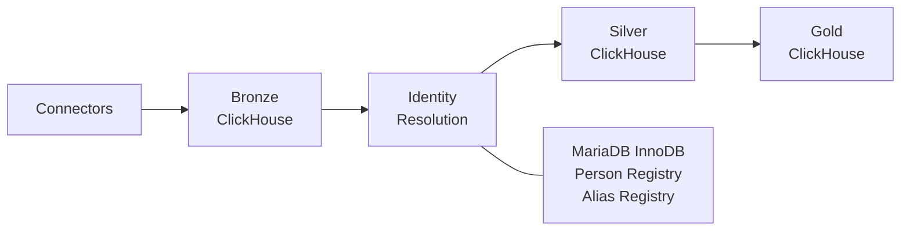
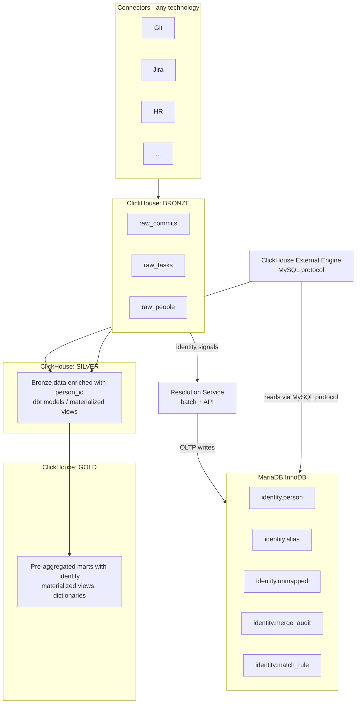
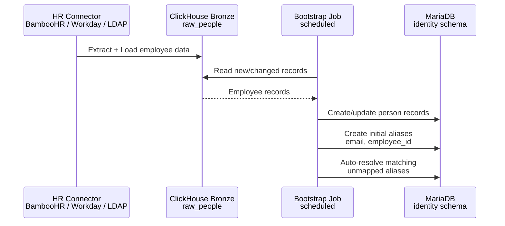
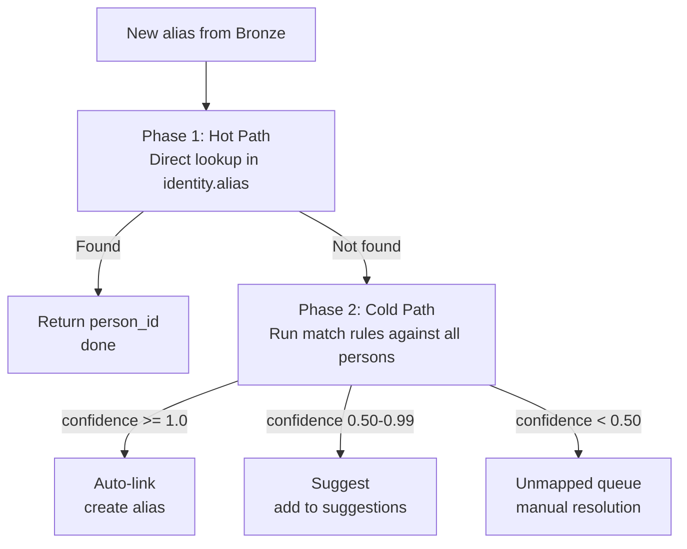
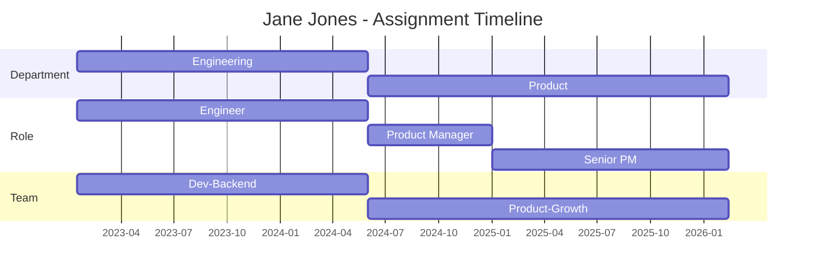
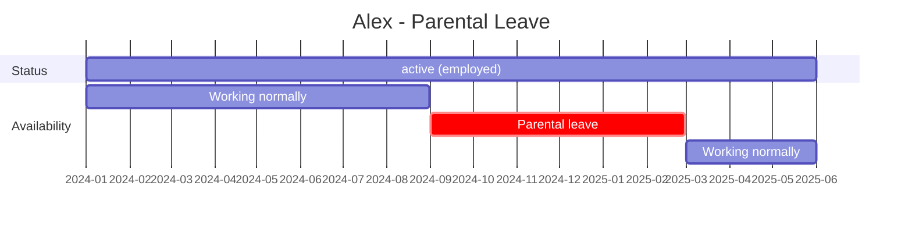

# Identity Resolution for Metrics Layer

> Conceptual architecture for resolving and unifying person identities across data sources within the Layer 1 Metrics Layer.

**Parent document:** [LAYER1_ARCHITECTURE.md](./LAYER1_ARCHITECTURE.md) (Section 7)
**Replaces:** [IDENTITY_RESOLUTION_ARCHITECTURE.md](./IDENTITY_RESOLUTION_ARCHITECTURE.md) (v0.4)

---

## 1. Overview

Identity Resolution is the bridge between the Bronze and Silver tiers in the Layer 1 data pipeline. It accepts raw identity signals from Bronze tables (emails, usernames, HR IDs) and enriches data with a canonical `person_id` for Silver and Gold tiers.

**Position in Layer 1 Architecture:**



**Scope:**

- Resolve identity signals from any connector class into canonical person records
- Maintain a Person Registry and Alias Registry (MariaDB)
- Expose resolved identities to ClickHouse via external engine for analytical JOINs
- Provide merge/split operations with full audit trail
- Manage an unmapped queue for aliases that cannot be auto-resolved

**Out of scope:**

- Metric storage and aggregation (ClickHouse Bronze/Silver/Gold)
- Organizational structure and team membership (future: People Metadata document)
- Authentication and authorization (Identity Provider adapters in connector subsystem)
- Connector orchestration (consumer-provided, per LAYER1_ARCHITECTURE.md Section 3)

---

## 2. Design Principles

1. **System-agnostic** -- no dependency on any specific HR system as source of truth. Any connector that writes to the `raw_people` Bronze table can seed the Person Registry.

2. **Immutable history** -- all changes are versioned. Merges are reversible via audit snapshots.

3. **Explicit ownership** -- every alias belongs to exactly one person in one source system. No ambiguous many-to-many mappings.

4. **Fail-safe defaults** -- unknown identities are quarantined in the unmapped queue, never auto-linked below the confidence threshold.

5. **ClickHouse-native analytics** -- identity data is accessible from ClickHouse via the external database engine. No separate ETL pipeline is required for analytical access.

6. **Batch-first** -- the primary resolution mode is batch (scheduled job or dbt model). Near-real-time resolution is a future extension (Phase B.4).

7. **Conservative matching** -- deterministic matching first (exact email, exact HR ID). Fuzzy matching is opt-in and disabled by default. This decision is based on production experience: fuzzy name matching (e.g., "Alexey" ~ "Alex") was found to produce false positive merges and was removed.

---

## 3. Storage Architecture

### Dual-Database Design

Identity Resolution uses two databases with complementary strengths:

| Database | Role | Workload | Why |
|----------|------|----------|-----|
| **MariaDB (InnoDB)** | OLTP store for identity data | Transactional: resolve, merge, split, CRUD | ACID transactions required for merge/split atomicity; point lookups for alias resolution |
| **ClickHouse** | Analytical access to identity data | Read-only JOINs in Silver/Gold tiers | Columnar analytics on metrics data; reads identity from MariaDB via external engine |

**Justification:**

- LAYER1_ARCHITECTURE.md (Section 6.5): "ClickHouse can read from MariaDB via its database engine feature"
- STORAGE_TECHNOLOGY_EVALUATION.md: MariaDB InnoDB is suited for hybrid OLTP workloads; ClickHouse for pure analytics
- ClickHouse lacks ACID transactions, which are critical for merge/split operations with rollback support
- Stakeholder requirement for MariaDB support is satisfied by using it for the OLTP component

### Architecture Diagram



### MariaDB Tables

| Table | Purpose | Estimated Size |
|-------|---------|----------------|
| `identity.person` | Canonical person records | ~1K rows (employees) |
| `identity.alias` | Multi-alias mapping | ~5-10K rows (5-10 aliases per person) |
| `identity.unmapped` | Queue for unresolved aliases | ~100-500 rows (shrinks as resolved) |
| `identity.merge_audit` | Merge/split audit trail | ~100 rows/year |
| `identity.match_rule` | Configurable matching rules | ~20-50 rows |
| `identity.person_assignment` | Organizational history (team, role, dept) | ~3-5K rows (3-5 assignments per person) |
| `identity.person_availability` | Leave and capacity periods | ~2-4K rows/year |
| `identity.person_name_history` | Name change audit trail | ~50-100 rows/year |

Total MariaDB footprint: under 100 MB. Minimal resource requirements (~256 MB RAM).

---

## 4. Alias Types

Each person may have multiple aliases across different systems. The `alias_type` and `source_system` pair uniquely identifies an alias.

| alias_type | Examples | Sources | Scope |
|------------|----------|---------|-------|
| `email` | john@corp.com, j.doe@corp.io | Git, M365, Zulip | Global |
| `youtrack_id` | 24-12345 | YouTrack | Per-instance |
| `jira_user` | jdoe | Jira | Per-instance |
| `gitlab_id` | 12345 | GitLab | Per-instance |
| `github_username` | johndoe | GitHub | Global |
| `platform_id` | uuid | MCP, Cursor | Per-instance |
| `bamboo_id` | EMP-123 | BambooHR | Per-tenant |
| `workday_id` | WD-456 | Workday | Per-tenant |
| `ldap_dn` | cn=john,ou=users | LDAP | Per-domain |

**Disambiguation:** The `source_system` field distinguishes aliases of the same type from different installations (e.g., `jira_user:jdoe` in ProjectA vs ProjectB).

---

## 5. Data Schema (MariaDB)

### 5.1 Person Registry

```sql
CREATE DATABASE IF NOT EXISTS identity;
USE identity;

-- Canonical person records
CREATE TABLE person (
  id              INT UNSIGNED AUTO_INCREMENT PRIMARY KEY,
  person_id       CHAR(36) NOT NULL,  -- UUID, canonical identifier
  display_name    VARCHAR(255),
  status          ENUM('active', 'inactive', 'external', 'bot', 'deleted')
                  NOT NULL DEFAULT 'active',
  display_name_source ENUM('manual', 'hr', 'git', 'communication', 'auto')
                  DEFAULT 'auto',
  version         INT UNSIGNED NOT NULL DEFAULT 1,
  created_at      TIMESTAMP NOT NULL DEFAULT CURRENT_TIMESTAMP,
  updated_at      TIMESTAMP NOT NULL DEFAULT CURRENT_TIMESTAMP ON UPDATE CURRENT_TIMESTAMP,
  created_by      VARCHAR(100),

  UNIQUE KEY uk_person_version (person_id, version),
  INDEX idx_person_status (status)
) ENGINE=InnoDB DEFAULT CHARSET=utf8mb4;
```

### 5.2 Alias Registry

```sql
-- Multi-alias mapping with source system disambiguation
CREATE TABLE alias (
  id              INT UNSIGNED AUTO_INCREMENT PRIMARY KEY,
  person_id       CHAR(36) NOT NULL,
  alias_type      VARCHAR(50) NOT NULL,
  alias_value     VARCHAR(500) NOT NULL,
  source_system   VARCHAR(100) NOT NULL,  -- e.g. gitlab-prod, jira-projecta, bamboohr
  confidence      DECIMAL(3,2) NOT NULL DEFAULT 1.00,
  status          ENUM('active', 'inactive') NOT NULL DEFAULT 'active',
  created_at      TIMESTAMP NOT NULL DEFAULT CURRENT_TIMESTAMP,
  created_by      VARCHAR(100),

  -- Same alias in same source = one person (no collision)
  UNIQUE KEY uk_alias (alias_type, alias_value, source_system),
  INDEX idx_alias_person (person_id),
  INDEX idx_alias_lookup (alias_type, alias_value, source_system, status)
) ENGINE=InnoDB DEFAULT CHARSET=utf8mb4;
```

### 5.3 Unmapped Queue

```sql
-- Aliases that could not be resolved, awaiting review
CREATE TABLE unmapped (
  id                    INT UNSIGNED AUTO_INCREMENT PRIMARY KEY,
  alias_type            VARCHAR(50) NOT NULL,
  alias_value           VARCHAR(500) NOT NULL,
  source_system         VARCHAR(100) NOT NULL,
  first_seen            TIMESTAMP NOT NULL DEFAULT CURRENT_TIMESTAMP,
  last_seen             TIMESTAMP NOT NULL DEFAULT CURRENT_TIMESTAMP,
  occurrence_count      INT UNSIGNED NOT NULL DEFAULT 1,

  -- Workflow
  status                ENUM('pending', 'in_review', 'resolved', 'ignored', 'auto_created')
                        NOT NULL DEFAULT 'pending',
  assigned_to           VARCHAR(100),
  due_date              DATE,

  -- Resolution
  suggested_person_id   CHAR(36),
  suggestion_confidence DECIMAL(3,2),
  resolved_person_id    CHAR(36),
  resolved_at           TIMESTAMP NULL,
  resolved_by           VARCHAR(100),
  resolution_type       ENUM('linked', 'new_person', 'ignored'),
  notes                 TEXT,

  UNIQUE KEY uk_unmapped (alias_type, alias_value, source_system),
  INDEX idx_unmapped_pending (status, due_date)
) ENGINE=InnoDB DEFAULT CHARSET=utf8mb4;
```

### 5.4 Merge Audit

```sql
-- Full audit trail for merge/split with rollback support
CREATE TABLE merge_audit (
  id              INT UNSIGNED AUTO_INCREMENT PRIMARY KEY,
  action          ENUM('merge', 'split', 'alias_add', 'alias_remove', 'status_change')
                  NOT NULL,
  target_person_id CHAR(36) NOT NULL,
  source_person_id CHAR(36),  -- NULL for non-merge actions

  -- Full snapshots for rollback
  snapshot_before JSON NOT NULL,
  snapshot_after  JSON NOT NULL,

  reason          TEXT,
  performed_by    VARCHAR(100) NOT NULL,
  performed_at    TIMESTAMP NOT NULL DEFAULT CURRENT_TIMESTAMP,

  -- Rollback tracking
  rolled_back     TINYINT(1) NOT NULL DEFAULT 0,
  rolled_back_at  TIMESTAMP NULL,
  rolled_back_by  VARCHAR(100),

  INDEX idx_audit_person (target_person_id),
  INDEX idx_audit_rollback (id, rolled_back)
) ENGINE=InnoDB DEFAULT CHARSET=utf8mb4;
```

### 5.5 Match Rules

```sql
-- Configurable matching rules (managed via API/UI, not YAML)
CREATE TABLE match_rule (
  id              INT UNSIGNED AUTO_INCREMENT PRIMARY KEY,
  name            VARCHAR(100) NOT NULL UNIQUE,
  description     TEXT,
  rule_type       ENUM('exact', 'normalization', 'cross_system', 'fuzzy') NOT NULL,
  weight          DECIMAL(3,2) NOT NULL DEFAULT 1.00,
  is_enabled      TINYINT(1) NOT NULL DEFAULT 1,
  phase           ENUM('B1', 'B2', 'B3') NOT NULL DEFAULT 'B1',

  -- Rule definition
  condition_type  VARCHAR(50) NOT NULL,  -- email_exact, email_normalize, username_cross, name_fuzzy
  config          JSON,  -- rule-specific parameters

  sort_order      INT UNSIGNED NOT NULL DEFAULT 0,
  created_at      TIMESTAMP NOT NULL DEFAULT CURRENT_TIMESTAMP,
  updated_at      TIMESTAMP NOT NULL DEFAULT CURRENT_TIMESTAMP ON UPDATE CURRENT_TIMESTAMP,

  INDEX idx_rule_enabled (is_enabled, sort_order)
) ENGINE=InnoDB DEFAULT CHARSET=utf8mb4;

-- Seed default rules
INSERT INTO match_rule (name, description, rule_type, weight, phase, condition_type, config, sort_order) VALUES
  ('email_exact',       'Exact email match across systems',                'exact',         1.00, 'B1', 'email_exact',       '{}', 1),
  ('hr_id_match',       'HR system employee ID match',                     'exact',         1.00, 'B1', 'hr_id_exact',       '{}', 2),
  ('username_same_sys', 'Same username in same system type',               'exact',         0.95, 'B1', 'username_exact',    '{}', 3),
  ('email_case_norm',   'Email match ignoring case',                       'normalization', 0.95, 'B2', 'email_normalize',   '{"transform": "lowercase"}', 10),
  ('email_domain_alias','Same local part, known domain alias',             'normalization', 0.92, 'B2', 'email_domain',      '{"aliases": {"acme.com": ["acme.dev"]}}', 11),
  ('email_plus_tag',    'Email match ignoring +tag',                       'normalization', 0.93, 'B2', 'email_normalize',   '{"transform": "remove_plus_tags"}', 12),
  ('username_cross_sys','Same username in related systems (Git<->Jira)',   'cross_system',  0.85, 'B2', 'username_cross',    '{"system_pairs": [["gitlab","github"],["gitlab","jira"]]}', 20),
  ('email_to_username', 'Email local part matches username in other sys',  'cross_system',  0.72, 'B2', 'email_username',    '{}', 21),
  ('name_jaro_winkler', 'Jaro-Winkler name similarity >= 0.95',           'fuzzy',         0.75, 'B3', 'name_fuzzy',        '{"algorithm": "jaro_winkler", "threshold": 0.95}', 30),
  ('name_soundex',      'Phonetic name matching (Soundex)',                'fuzzy',         0.60, 'B3', 'name_soundex',      '{}', 31);
```

---

## 6. ClickHouse Integration

### 6.1 External Database Engine

ClickHouse reads identity tables from MariaDB transparently via the MySQL protocol:

```sql
-- ClickHouse DDL: create external database pointing to MariaDB
CREATE DATABASE identity_ext
ENGINE = MySQL('mariadb-host:3306', 'identity', 'ch_reader', '***');

-- After this, all MariaDB tables are accessible as ClickHouse tables:
--   identity_ext.person
--   identity_ext.alias
--   identity_ext.unmapped
```

Queries against `identity_ext.*` are executed against MariaDB in real time. No replication lag, no ETL pipeline.

### 6.2 Dictionary for Hot-Path Lookups

For high-frequency alias lookups (e.g., inside materialized views), a ClickHouse Dictionary provides cached access:

```xml
<dictionary>
  <name>identity_alias</name>
  <source>
    <mysql>
      <host>mariadb-host</host>
      <port>3306</port>
      <db>identity</db>
      <table>alias</table>
      <user>ch_reader</user>
      <password>***</password>
      <where>status = 'active'</where>
    </mysql>
  </source>
  <lifetime>
    <min>30</min>
    <max>60</max>
  </lifetime>
  <layout><complex_key_hashed/></layout>
  <structure>
    <key>
      <attribute>
        <name>alias_type</name>
        <type>String</type>
      </attribute>
      <attribute>
        <name>alias_value</name>
        <type>String</type>
      </attribute>
      <attribute>
        <name>source_system</name>
        <type>String</type>
      </attribute>
    </key>
    <attribute>
      <name>person_id</name>
      <type>String</type>
      <null_value></null_value>
    </attribute>
    <attribute>
      <name>confidence</name>
      <type>Float32</type>
      <null_value>0</null_value>
    </attribute>
  </structure>
</dictionary>
```

Dictionary reloads every 30-60 seconds. New aliases are visible in ClickHouse within 1 minute of MariaDB commit.

### 6.3 Silver Tier Enrichment

The Silver tier joins Bronze data with identity using the external engine or dictionary:

```sql
-- Silver model: commits enriched with person_id
-- (dbt model or ClickHouse materialized view)
CREATE MATERIALIZED VIEW silver.commits_with_identity
ENGINE = MergeTree()
ORDER BY (person_id, commit_date)
AS
SELECT
  c.*,
  dictGetOrDefault('identity_alias', 'person_id',
    tuple(c.author_email_type, c.author_email, c.source_system),
    '') AS person_id
FROM bronze.raw_commits c;

-- Alternative: direct JOIN via external engine
SELECT
  c.*,
  a.person_id
FROM bronze.raw_commits c
LEFT JOIN identity_ext.alias a
  ON a.alias_type = 'email'
  AND a.alias_value = c.author_email
  AND a.source_system = c.connector_source
  AND a.status = 'active';
```

### 6.4 Gold Tier: Pre-Resolved Marts

Gold tier materialized views consume Silver data with `person_id` already resolved:

```sql
-- Gold mart: person activity summary
CREATE MATERIALIZED VIEW gold.person_activity_summary
ENGINE = SummingMergeTree()
ORDER BY (person_id, activity_month)
AS
SELECT
  person_id,
  toStartOfMonth(commit_date) AS activity_month,
  count() AS commits_count,
  sum(lines_added) AS total_lines_added,
  sum(lines_deleted) AS total_lines_deleted
FROM silver.commits_with_identity
WHERE person_id != ''
GROUP BY person_id, activity_month;
```

---

## 7. Person Registry Bootstrap

### 7.1 The Problem

The Person Registry must be populated before identity resolution can work. Without canonical person records, there is nothing to resolve aliases against.

### 7.2 Solution: HR Connector as Seed

The Person Registry is seeded from the HR connector class. The HR connector is a regular connector -- it follows the HR & Org class contract and writes to the `raw_people` Bronze table in ClickHouse. A separate **Bootstrap Job** reads `raw_people` and populates MariaDB.



### 7.3 `raw_people` Contract

The HR connector class contract defines the Bronze table schema. The Bootstrap Job requires these minimum fields:

| Field | Required | Type | Description |
|-------|----------|------|-------------|
| `employee_id` | Yes | String | HR system identifier (bamboo_id, workday_id, etc.) |
| `primary_email` | Yes | String | Primary work email address |
| `display_name` | Yes | String | Full name as shown in HR system |
| `status` | Yes | String | Employment status: active, inactive, terminated |
| `source_system` | Yes | String | Which HR system (bamboohr, workday, ldap) |
| `additional_emails` | No | Array(String) | Secondary email addresses |
| `department` | No | String | Organizational unit |
| `title` | No | String | Job title |
| `start_date` | No | Date | Employment start date |
| `end_date` | No | Date | Employment end date (for terminated) |
| `manager_employee_id` | No | String | Direct manager's employee_id |
| `_synced_at` | Yes | DateTime | Timestamp of connector sync (standard field) |

### 7.4 Bootstrap Job Logic

The Bootstrap Job is a scheduled process that runs after each HR connector sync.

**Pseudocode:**

```
FOR each record in raw_people WHERE _synced_at > last_bootstrap_run:

  existing = SELECT FROM identity.person WHERE person_id IN (
    SELECT person_id FROM identity.alias
    WHERE alias_type = 'employee_id'
      AND alias_value = record.employee_id
      AND source_system = record.source_system
  )

  IF existing IS NULL:
    -- New employee
    new_person_id = generate_uuid()
    INSERT INTO identity.person (person_id, display_name, status, display_name_source)
      VALUES (new_person_id, record.display_name, map_status(record.status), 'hr')

    INSERT INTO identity.alias (person_id, alias_type, alias_value, source_system, confidence)
      VALUES (new_person_id, 'employee_id', record.employee_id, record.source_system, 1.0)

    INSERT INTO identity.alias (person_id, alias_type, alias_value, source_system, confidence)
      VALUES (new_person_id, 'email', record.primary_email, record.source_system, 1.0)

    FOR each email in record.additional_emails:
      INSERT INTO identity.alias (person_id, ..., alias_value, ..., confidence)
        VALUES (new_person_id, 'email', email, record.source_system, 1.0)

    -- Auto-resolve previously unmapped aliases that match new emails
    CALL resolve_unmapped_for_person(new_person_id)

  ELSE:
    -- Existing employee: update if changed
    IF record.display_name != existing.display_name:
      UPDATE identity.person SET display_name = record.display_name,
        version = version + 1 WHERE person_id = existing.person_id

    IF record.status != existing.status:
      UPDATE identity.person SET status = map_status(record.status),
        version = version + 1 WHERE person_id = existing.person_id

    -- Add any new email aliases
    FOR each email in [record.primary_email] + record.additional_emails:
      INSERT IGNORE INTO identity.alias (person_id, alias_type, alias_value, source_system, confidence)
        VALUES (existing.person_id, 'email', email, record.source_system, 1.0)
```

### 7.5 Design Decisions

- **No HR system is architecturally privileged.** BambooHR, Workday, LDAP, or even a CSV import -- any connector that conforms to the `raw_people` contract can seed the registry.

- **"Use the system where salaries are stored"** (from team meetings). This is a deployment recommendation, not an architectural constraint. The system where payroll runs is likely the most accurate source of "who is an employee."

- **Bootstrap is idempotent.** Running it multiple times produces the same result. Uses `employee_id + source_system` as natural key.

- **Bootstrap resolves the "unmapped purgatory."** When a new employee appears in HR, the bootstrap creates their email aliases. Any previously unmapped aliases from Git or Jira that match those emails are auto-resolved.

- **Multiple HR sources.** If two HR connectors write to `raw_people` (e.g., BambooHR for one company, Workday for another), the bootstrap processes both. Different `source_system` values prevent collisions.

---

## 8. Resolution Flow

After the Person Registry is seeded from HR, other connectors (Git, Jira, M365, Zulip, etc.) bring identity signals that need resolution.

### 8.1 Two-Phase Resolution



### 8.2 Phase 1: Hot Path (Direct Lookup)

For known aliases, resolution is a simple lookup:

```sql
SELECT person_id, confidence
FROM identity.alias
WHERE alias_type = ?
  AND alias_value = ?
  AND source_system = ?
  AND status = 'active';
```

This covers approximately 90% of records after the Person Registry is seeded and aliases accumulate. Lookup time: O(1) via unique index.

### 8.3 Phase 2: Cold Path (Match Rules)

For unknown aliases, the Resolution Service evaluates match rules:

1. Query all enabled match rules from `identity.match_rule`, ordered by `sort_order`
2. For each rule, evaluate against candidate persons
3. Calculate composite confidence score (weighted sum of matching rules)
4. Apply decision threshold

**Batch Resolution Job (primary mode):**

```
Scheduled job (runs every N minutes or after connector sync):

1. SELECT DISTINCT alias signals from Bronze
   WHERE NOT EXISTS in identity.alias
   AND NOT EXISTS in identity.unmapped

2. FOR each new alias:
   a. Run Phase 1 (direct lookup) -- skip if found
   b. Run Phase 2 (match rules) -- evaluate all enabled rules
   c. Based on confidence:
      - >= 1.0: auto-link (INSERT INTO identity.alias)
      - 0.50-0.99: add suggestion (INSERT INTO identity.unmapped with suggested_person_id)
      - < 0.50: add to unmapped (INSERT INTO identity.unmapped, status='pending')

3. Log resolution statistics
```

### 8.4 Silver Tier Result

After resolution, the Silver tier joins Bronze data with identity:

```sql
-- In Silver: every metric record has person_id
SELECT
  b.*,
  COALESCE(a.person_id, 'UNRESOLVED') AS person_id
FROM bronze.raw_commits b
LEFT JOIN identity_ext.alias a
  ON  a.alias_type = 'email'
  AND a.alias_value = b.author_email
  AND a.source_system = b.connector_source
  AND a.status = 'active';
```

Records with `person_id = 'UNRESOLVED'` are visible in analytics but clearly marked. They do not pollute resolved person metrics.

---

## 9. Matching Engine

### 9.1 Phase B.1: Deterministic Matching (MVP)

Only exact matches. No ambiguity, no false positives.

| Rule | Confidence | Description |
|------|------------|-------------|
| `email_exact` | 1.0 | Identical email address in alias registry |
| `hr_id_match` | 1.0 | Identical employee ID (bamboo_id, workday_id) |
| `username_same_sys` | 0.95 | Same username within same system type |

**Auto-link threshold:** confidence = 1.0 only. Everything else goes to suggestions or unmapped.

### 9.2 Phase B.2: Normalization and Cross-System

Email normalization and cross-system username correlation.

| Rule | Confidence | Description |
|------|------------|-------------|
| `email_case_norm` | 0.95 | Email match ignoring case (John@Corp.COM = john@corp.com) |
| `email_domain_alias` | 0.92 | Same local part, known domain alias (corp.com = corp.io) |
| `email_plus_tag` | 0.93 | Email match ignoring +tag (john+test@corp.com = john@corp.com) |
| `username_cross_sys` | 0.85 | Same username across related systems (GitLab <-> GitHub) |
| `email_to_username` | 0.72 | Email local part matches username in another system |

**Auto-link threshold:** confidence >= 0.95. Range 0.50-0.94: suggest for review.

**Email normalization pipeline:**

```
Input: "John.Doe+test@Acme.COM"
  1. lowercase           -> "john.doe+test@acme.com"
  2. trim whitespace     -> "john.doe+test@acme.com"
  3. remove plus tags    -> "john.doe@acme.com"
  4. apply domain alias  -> "john.doe@acme.dev" (also matches)
```

**Domain alias configuration** (stored in `match_rule.config` JSON):

```json
{
  "aliases": {
    "acme.com": ["acme.dev", "acme.io"],
    "globex.com": ["globex.work"]
  }
}
```

### 9.3 Phase B.3: Fuzzy Matching (Opt-In)

Fuzzy matching is **disabled by default**. It must be explicitly enabled per rule.

**WARNING:** Fuzzy name matching was found to produce false positive merges in production (e.g., "Alexey Petrov" incorrectly merged with "Alex Petrov" who is a different person). Enable only with careful threshold tuning.

| Rule | Confidence | Description |
|------|------------|-------------|
| `name_jaro_winkler` | 0.75 | Jaro-Winkler name similarity >= 0.95 |
| `name_soundex` | 0.60 | Phonetic matching via Soundex |

**Auto-link threshold for fuzzy rules:** NEVER auto-link. Always route to suggestions for human review.

---

## 10. Confidence Model

### 10.1 Scoring

Composite confidence is calculated as a weighted sum of matching rules:

```
confidence = SUM(rule.weight * rule.match_score) / SUM(all_rule.weight)
```

Where `match_score` is 1.0 if the rule matches, 0.0 if it does not.

### 10.2 Decision Thresholds

| Confidence | Action | Description |
|------------|--------|-------------|
| 1.0 | Auto-link | Deterministic match. Create alias automatically. |
| 0.80 - 0.99 | Suggest (high priority) | Strong match. Show in suggestions with high confidence. |
| 0.50 - 0.79 | Suggest (low priority) | Weak match. Show in suggestions, require careful review. |
| < 0.50 | Unmapped | Insufficient evidence. Add to unmapped queue for manual resolution. |

### 10.3 Configuration

```sql
-- Thresholds are configurable per deployment
CREATE TABLE resolution_config (
  config_key    VARCHAR(100) PRIMARY KEY,
  config_value  VARCHAR(100) NOT NULL,
  description   TEXT,
  updated_at    TIMESTAMP NOT NULL DEFAULT CURRENT_TIMESTAMP ON UPDATE CURRENT_TIMESTAMP
) ENGINE=InnoDB DEFAULT CHARSET=utf8mb4;

INSERT INTO resolution_config VALUES
  ('auto_link_threshold',  '1.00', 'Minimum confidence for automatic alias creation'),
  ('suggest_threshold',    '0.50', 'Minimum confidence to show as suggestion'),
  ('unmapped_review_sla_days', '7', 'Escalate unmapped aliases after N days'),
  ('fuzzy_matching_enabled', 'false', 'Enable Phase B.3 fuzzy matching rules');
```

---

## 11. Merge and Split Operations

### 11.1 Merge Flow

Merging two person records combines their aliases under a single canonical person_id.

```
Person A (person_id: aaa, aliases: [email:john@corp.com, bamboo_id:EMP-1])
Person B (person_id: bbb, aliases: [gitlab_id:12345])

MERGE(source=B, target=A):

  BEGIN TRANSACTION;

  1. Snapshot current state of A and B -> merge_audit.snapshot_before
  2. UPDATE alias SET person_id = 'aaa' WHERE person_id = 'bbb'
  3. UPDATE person SET status = 'deleted', version = version + 1
     WHERE person_id = 'bbb'
  4. UPDATE person SET version = version + 1
     WHERE person_id = 'aaa'
  5. Snapshot new state -> merge_audit.snapshot_after
  6. INSERT INTO merge_audit (action, target_person_id, source_person_id, ...)

  COMMIT;

Result:
  Person A now has aliases: [email:john@corp.com, bamboo_id:EMP-1, gitlab_id:12345]
  Person B marked deleted (history preserved in audit)
```

### 11.2 Split (Rollback) Flow

Reverses a previous merge using the audit snapshot.

```
SPLIT(audit_id: 42):

  BEGIN TRANSACTION;

  1. Load snapshot_before from merge_audit WHERE id = 42
  2. Verify rolled_back = 0 (prevent double rollback)
  3. Restore alias -> person_id mappings from snapshot
  4. Restore person records (reactivate, reset version)
  5. Mark audit record: rolled_back = 1, rolled_back_at = NOW()
  6. Create new audit record for the split action

  COMMIT;
```

### 11.3 ACID Guarantee

All merge and split operations run inside MariaDB transactions. If any step fails, the entire operation rolls back. This is one of the key reasons for using MariaDB (InnoDB) rather than ClickHouse for identity data.

---

## 12. API Endpoints

The Resolution Service exposes a REST API. It can be implemented as a standalone lightweight service or as part of the Layer 1 API.

### 12.1 Resolution

```
POST /api/identity/resolve
  Body: { alias_type, alias_value, source_system }
  Response: { person_id, confidence, status: "resolved" | "auto_created" | "unmapped" }

POST /api/identity/batch-resolve
  Body: [ { alias_type, alias_value, source_system }, ... ]
  Response: [ { alias_type, alias_value, person_id, status }, ... ]
```

### 12.2 Merge and Split

```
POST /api/identity/merge
  Body: { source_person_id, target_person_id, reason, performed_by }
  Response: { audit_id, merged_aliases_count }

POST /api/identity/split
  Body: { audit_id, performed_by }
  Response: { restored_person_id, restored_aliases_count }
```

### 12.3 Unmapped Queue

```
GET /api/identity/unmapped?status=pending&limit=50
  Response: [ { id, alias_type, alias_value, source_system, occurrence_count,
                suggested_person_id, suggestion_confidence, first_seen } ]

POST /api/identity/unmapped/:id/resolve
  Body: { person_id, performed_by }  -- link to existing person
  -- OR --
  Body: { create_new: true, display_name, performed_by }  -- create new person

POST /api/identity/unmapped/:id/ignore
  Body: { performed_by, reason }
```

### 12.4 Person and Alias Management

```
GET /api/identity/persons?status=active&limit=100
GET /api/identity/persons/:person_id
GET /api/identity/persons/:person_id/aliases

POST /api/identity/persons/:person_id/aliases
  Body: { alias_type, alias_value, source_system }

DELETE /api/identity/persons/:person_id/aliases/:alias_id
```

### 12.5 Match Rules Management

```
GET /api/identity/rules
PUT /api/identity/rules/:id
  Body: { is_enabled, weight, config }
```

### 12.6 Error Handling

| Error | HTTP Status | Response |
|-------|-------------|----------|
| Alias not found, unmapped | 200 | `{ status: "unmapped", person_id: null }` |
| Invalid alias_type | 400 | `{ error: "invalid_alias_type" }` |
| Merge conflict (circular) | 409 | `{ error: "merge_conflict" }` |
| Audit not found for split | 404 | `{ error: "audit_not_found" }` |
| Already rolled back | 409 | `{ error: "already_rolled_back" }` |
| Duplicate alias | 409 | `{ error: "alias_already_exists" }` |

---

## 13. Display Name Priority

When multiple sources provide a display name for the same person, the following priority applies:

| Priority | Source | Example |
|----------|--------|---------|
| 1 (highest) | `manual` | Administrator override |
| 2 | `hr` | BambooHR, Workday import |
| 3 | `git` | Git commit author name |
| 4 | `communication` | Zulip, Slack, M365 profile |
| 5 (lowest) | `auto` | First value seen from any source |

The active source is tracked in `person.display_name_source` for auditability. A lower-priority source never overwrites a higher-priority name unless the higher-priority record is removed.

---

## 14. Edge Cases

| Scenario | Handling |
|----------|----------|
| Multiple emails per person | Multiple alias rows with same person_id |
| Same username in different systems | Disambiguated by source_system field |
| Name changes (marriage, etc.) | New alias added; display_name updated if source priority allows |
| Contractors | `status = 'external'` in person record |
| Bots and service accounts | `status = 'bot'` in person record |
| Unknown Git authors (forks) | Unmapped queue; marked as low priority if from external repos |
| Domain aliases (corp.com vs corp.io) | Email normalization rule in Phase B.2 |
| Email recycling (rehire) | Bootstrap checks end_date; may reactivate or create new person |
| Accidental merge | Split via rollback from merge_audit snapshot |
| Multiple HR sources | Different source_system values prevent collisions |
| Person in two orgs (consultant) | Two person records, one per org (multi-tenancy decision) |
| License reassignment (Copilot) | Alias deactivated for old person, created for new person |

---

## 15. Implementation Phases

Aligned with [LAYER1_ARCHITECTURE.md](./LAYER1_ARCHITECTURE.md) Section 12.

### Phase B.1: MVP Identity (after Phase A connectors are operational)

| Deliverable | Description |
|-------------|-------------|
| MariaDB schema | All 5 tables created and indexed |
| Person Registry Bootstrap | Job that reads `raw_people` and seeds MariaDB |
| Deterministic matching | Exact email, HR ID, same-system username |
| Resolution API | `/resolve`, `/batch-resolve`, `/merge`, `/split` |
| Unmapped queue API | `/unmapped` with resolve/ignore workflow |
| Basic batch resolution | Scheduled job processes new aliases from Bronze |

**Exit criteria:** Known employees resolvable by email. Unmapped queue < 20% of total aliases.

### Phase B.2: Enhanced Matching

| Deliverable | Description |
|-------------|-------------|
| Email normalization | Case, plus-tags, domain aliases |
| Cross-system correlation | Username matching across GitLab/GitHub/Jira |
| ClickHouse external engine | `identity_ext` database configured |
| Silver tier enrichment | dbt model or materialized view with person_id |
| Suggestion system | Auto-generated suggestions for unmapped aliases |
| Match rules API | `/rules` endpoint for rule management |

**Exit criteria:** Silver tier has person_id coverage > 95%. Suggestions reduce manual work by 50%.

### Phase B.3: Fuzzy Matching (Opt-In)

| Deliverable | Description |
|-------------|-------------|
| Jaro-Winkler matching | Name similarity with threshold >= 0.95 |
| Soundex/Metaphone | Phonetic matching for name variants |
| Enabled per rule | Each fuzzy rule must be explicitly activated |
| Review-only mode | Fuzzy matches never auto-link, always suggest |

**Exit criteria:** False positive rate < 5% on suggestions. No false positive auto-links.

### Phase B.4: Near-Real-Time Pipeline

| Deliverable | Description |
|-------------|-------------|
| Event-driven resolution | Message queue (Kafka/SQS) for incoming aliases |
| Sub-5-minute SLA | New aliases resolved within 5 minutes |
| ClickHouse Dictionary | Cached alias lookup for hot-path performance |
| Streaming Silver | Materialized views auto-update on new Bronze data |

**Exit criteria:** Resolution latency < 5 minutes for 99th percentile. Zero data loss.

---

## 16. Deployment

### 16.1 Docker Compose (Boxed Deployment)

MariaDB is part of the Layer 1 Docker Compose stack (per LAYER1_ARCHITECTURE.md Section 8.1):

```yaml
services:
  clickhouse:
    image: clickhouse/clickhouse-server:latest
    ports:
      - "8123:8123"
      - "9000:9000"
    volumes:
      - clickhouse_data:/var/lib/clickhouse

  mariadb:
    image: mariadb:11
    environment:
      MARIADB_ROOT_PASSWORD: ${MARIADB_ROOT_PASSWORD}
      MARIADB_DATABASE: identity
      MARIADB_USER: identity_svc
      MARIADB_PASSWORD: ${MARIADB_PASSWORD}
    ports:
      - "3306:3306"
    volumes:
      - mariadb_data:/var/lib/mysql
      - ./migrations/mariadb:/docker-entrypoint-initdb.d
    command: >
      --character-set-server=utf8mb4
      --collation-server=utf8mb4_unicode_ci
      --innodb-buffer-pool-size=128M

  resolution-service:
    build: ./services/identity-resolution
    environment:
      MARIADB_HOST: mariadb
      MARIADB_PORT: 3306
      MARIADB_DATABASE: identity
      CLICKHOUSE_HOST: clickhouse
    depends_on:
      - mariadb
      - clickhouse

volumes:
  clickhouse_data:
  mariadb_data:
```

### 16.2 Resource Requirements

| Component | CPU | RAM | Disk |
|-----------|-----|-----|------|
| MariaDB (identity workload) | 0.5 cores | 256 MB | < 100 MB |
| Resolution Service | 0.5 cores | 256 MB | - |
| ClickHouse (external engine) | (shared) | (shared) | - |

Total additional footprint for Identity Resolution: **1 core, 512 MB RAM.**

### 16.3 Kubernetes (Enterprise)

In Kubernetes deployments, MariaDB runs as a StatefulSet or uses an external managed database (AWS RDS, GCP Cloud SQL). The Resolution Service runs as a Deployment with horizontal scaling.

---

## 17. What Identity Resolution Does NOT Do

To prevent scope creep, this section explicitly defines boundaries:

| Out of Scope | Owner | Notes |
|--------------|-------|-------|
| **Metric storage and aggregation** | ClickHouse Bronze/Silver/Gold | Identity Resolution only enriches data, does not store metrics |
| **Authentication and authorization** | Identity Provider adapters | SSO, OIDC, session management |
| **Connector orchestration** | Consumer-provided | Scheduling, retry, monitoring of connectors |
| **Data quality validation** | ClickHouse schema + dbt tests | Type checking, deduplication, anomaly detection |
| **Payroll and compensation** | HR system | Salary data is never stored in Identity Resolution |
| **Performance reviews** | HR system / Layer 2 | Subjective assessments are not part of Layer 1 |

---

## 18. Organizational History

Beyond identity resolution, the Person Registry tracks **where** a person belonged and **what role** they had over time. This is critical for correct metric aggregation: when a person transfers from Dev-Backend to Product-Growth, their historical commits must stay attributed to Dev-Backend for past periods.

### 18.1 Assignment Schema (MariaDB)

```sql
-- Organizational assignments with temporal validity (SCD Type 2 pattern)
CREATE TABLE person_assignment (
  id              INT UNSIGNED AUTO_INCREMENT PRIMARY KEY,
  person_id       CHAR(36) NOT NULL,

  -- What
  assignment_type ENUM('department', 'team', 'functional_team', 'role',
                       'manager', 'project', 'location', 'cost_center')
                  NOT NULL,
  assignment_value VARCHAR(255) NOT NULL,

  -- When (temporal range)
  valid_from      DATE NOT NULL,
  valid_to        DATE,  -- NULL = current assignment

  -- Source and audit
  source          VARCHAR(50),  -- bamboohr | workday | manual | ldap
  created_at      TIMESTAMP NOT NULL DEFAULT CURRENT_TIMESTAMP,
  created_by      VARCHAR(100),
  notes           TEXT,

  INDEX idx_assign_person (person_id),
  INDEX idx_assign_current (person_id, assignment_type, valid_to),
  INDEX idx_assign_range (assignment_type, valid_from, valid_to)
) ENGINE=InnoDB DEFAULT CHARSET=utf8mb4;
```

### 18.2 Assignment Types

| Type | Examples | Typical Source |
|------|----------|----------------|
| `department` | Engineering, Product, Sales | HR system |
| `team` | Dev-Backend, Dev-Frontend, QA | HR system or manual |
| `functional_team` | Platform, Growth, Mobile | Insight configuration |
| `role` | Engineer, Senior Engineer, Tech Lead | HR system |
| `manager` | person_id of direct manager | HR system |
| `project` | Project Alpha, Initiative X | Task tracker or manual |
| `location` | Berlin, Remote, NYC Office | HR system |
| `cost_center` | CC-1234 | HR / Finance system |

### 18.3 How It Works: Department Transfer



Assignment records for Jane:

| assignment_type | assignment_value | valid_from | valid_to |
|-----------------|------------------|------------|----------|
| department | Engineering | 2023-01-15 | 2024-05-31 |
| department | Product | 2024-06-01 | NULL |
| role | Engineer | 2023-01-15 | 2024-05-31 |
| role | Product Manager | 2024-06-01 | 2024-12-31 |
| role | Senior PM | 2025-01-01 | NULL |
| team | Dev-Backend | 2023-01-15 | 2024-05-31 |
| team | Product-Growth | 2024-06-01 | NULL |

### 18.4 Name Change History

Name changes (marriage, legal name change) are tracked through the Person Registry versioning and a dedicated name history table:

```sql
-- Display name history for audit trail
CREATE TABLE person_name_history (
  id              INT UNSIGNED AUTO_INCREMENT PRIMARY KEY,
  person_id       CHAR(36) NOT NULL,
  previous_name   VARCHAR(255) NOT NULL,
  new_name        VARCHAR(255) NOT NULL,
  changed_at      TIMESTAMP NOT NULL DEFAULT CURRENT_TIMESTAMP,
  reason          VARCHAR(100),  -- marriage | legal_change | correction | manual
  source          VARCHAR(50),   -- hr | manual
  changed_by      VARCHAR(100),

  INDEX idx_name_person (person_id)
) ENGINE=InnoDB DEFAULT CHARSET=utf8mb4;
```

When the Bootstrap Job detects a name change in `raw_people`, it:
1. Inserts a record into `person_name_history`
2. Updates `person.display_name` and increments `person.version`
3. Old aliases remain valid (email-based resolution still works)

### 18.5 Querying Historical Assignments (ClickHouse)

The key pattern: join activity date against assignment validity range.

```sql
-- Q1 2024 commits by team (respecting transfers)
-- Jane's commits in Q1 2024 count for Dev-Backend
-- Jane's commits in Q3 2024 count for Product-Growth
SELECT
  a.assignment_value AS team,
  sum(m.lines_added) AS total_loc,
  count() AS commit_count
FROM silver.commits_with_identity m
JOIN identity_ext.person_assignment a
  ON m.person_id = a.person_id
  AND a.assignment_type = 'team'
  AND m.commit_date >= a.valid_from
  AND m.commit_date <= COALESCE(a.valid_to, today())
WHERE m.commit_date BETWEEN '2024-01-01' AND '2024-03-31'
GROUP BY team
ORDER BY total_loc DESC;
```

### 18.6 Bootstrap Integration

The Bootstrap Job (Section 7) also populates assignments from `raw_people`:

```
FOR each record in raw_people:
  IF record.department IS NOT NULL:
    -- Check if current assignment matches
    current = SELECT FROM person_assignment
      WHERE person_id = X AND assignment_type = 'department' AND valid_to IS NULL

    IF current IS NULL OR current.assignment_value != record.department:
      -- Close old assignment
      UPDATE person_assignment SET valid_to = record._synced_at
        WHERE person_id = X AND assignment_type = 'department' AND valid_to IS NULL
      -- Open new assignment
      INSERT INTO person_assignment (person_id, assignment_type, assignment_value, valid_from, source)
        VALUES (X, 'department', record.department, record._synced_at, record.source_system)

  -- Same pattern for: team, role, manager, location
```

---

## 19. Availability and Capacity

Tracking when a person is **unavailable** (vacation, sick leave, parental leave) enables:

1. **Correct metric averages** -- divide by working days, not calendar days
2. **Fair comparison** -- a person on vacation for 2 weeks in a quarter should not be penalized
3. **Capacity planning** -- know actual available FTE per team
4. **Distinguish "on leave" from "terminated"** -- person.status stays `active`

### 19.1 Availability Schema (MariaDB)

```sql
-- Non-working periods with capacity factor
CREATE TABLE person_availability (
  id              INT UNSIGNED AUTO_INCREMENT PRIMARY KEY,
  person_id       CHAR(36) NOT NULL,

  -- Period (inclusive dates)
  period_start    DATE NOT NULL,
  period_end      DATE NOT NULL,

  -- Type and capacity
  availability_type ENUM('vacation', 'sick_leave', 'parental_leave', 'sabbatical',
                         'unpaid_leave', 'public_holiday', 'part_time', 'ramping')
                  NOT NULL,
  capacity_factor DECIMAL(3,2) NOT NULL DEFAULT 0.00,
    -- 0.00 = fully unavailable
    -- 0.50 = half-time
    -- 1.00 = fully available (not typically stored, but valid)

  -- Source and audit
  source          VARCHAR(50),  -- bamboohr | workday | manual | calendar
  created_at      TIMESTAMP NOT NULL DEFAULT CURRENT_TIMESTAMP,
  notes           TEXT,

  INDEX idx_avail_person (person_id),
  INDEX idx_avail_range (period_start, period_end),

  CONSTRAINT chk_period CHECK (period_end >= period_start),
  CONSTRAINT chk_capacity CHECK (capacity_factor >= 0 AND capacity_factor <= 1)
) ENGINE=InnoDB DEFAULT CHARSET=utf8mb4;
```

### 19.2 Availability Types

| Type | Capacity Factor | Description |
|------|-----------------|-------------|
| `vacation` | 0.00 | Paid time off |
| `sick_leave` | 0.00 | Illness |
| `parental_leave` | 0.00 | Maternity / paternity leave |
| `sabbatical` | 0.00 | Extended leave |
| `unpaid_leave` | 0.00 | Leave without pay |
| `public_holiday` | 0.00 | Country/region holidays |
| `part_time` | 0.50 | Reduced hours (configurable per person) |
| `ramping` | 0.50 | Onboarding period for new hires |

### 19.3 Person Status vs Availability

| person.status | Meaning | How availability works |
|---------------|---------|------------------------|
| `active` | Currently employed | Check availability table for leave periods |
| `inactive` | Temporarily not working | Implicit capacity = 0 for all dates |
| `external` | Contractor | Normal availability tracking |
| `bot` | Service account | Not applicable |
| `deleted` | Terminated | No future capacity |

**Key principle:** `inactive` status is **temporary**. A person can return to `active`. Use availability records to track the reason and duration of the gap. Do not change person.status for planned absences.

### 19.4 Example: Parental Leave



**Recommended approach:** Keep `person.status = 'active'` and add an availability record:

```sql
INSERT INTO person_availability
  (person_id, period_start, period_end, availability_type, capacity_factor, source)
VALUES
  ('bbb-ccc-ddd', '2024-09-01', '2025-02-28', 'parental_leave', 0.00, 'bamboohr');
```

This is better than changing `person.status` because:
- Status remains `active` (person is still employed)
- Clear reason for absence is recorded
- Easy to query "who is currently on leave"
- Capacity calculations work automatically

### 19.5 Working Days Calculation (MariaDB)

A stored function to calculate capacity-adjusted working days:

```sql
DELIMITER //
CREATE FUNCTION working_days(
  p_person_id CHAR(36),
  p_start DATE,
  p_end DATE
) RETURNS DECIMAL(10,2)
DETERMINISTIC
READS SQL DATA
BEGIN
  DECLARE total_days INT;
  DECLARE unavailable_days DECIMAL(10,2);

  SET total_days = DATEDIFF(p_end, p_start) + 1;

  SELECT COALESCE(SUM(
    (DATEDIFF(LEAST(a.period_end, p_end), GREATEST(a.period_start, p_start)) + 1)
    * (1 - a.capacity_factor)
  ), 0)
  INTO unavailable_days
  FROM person_availability a
  WHERE a.person_id = p_person_id
    AND a.period_start <= p_end
    AND a.period_end >= p_start;

  RETURN total_days - unavailable_days;
END //
DELIMITER ;
```

### 19.6 Capacity-Adjusted Metrics (ClickHouse)

Since the `working_days` function lives in MariaDB, ClickHouse queries call it indirectly or replicate the logic:

```sql
-- Option A: Pre-compute working days in a ClickHouse Dictionary
-- (populated by a scheduled job that calls MariaDB function)

-- Option B: Inline calculation in ClickHouse using availability via external engine
SELECT
  p.display_name,
  sum(m.lines_added) AS total_loc,
  -- Calculate working days inline
  dateDiff('day', toDate('2024-01-01'), toDate('2024-03-31')) + 1
    - COALESCE(avail.unavailable_days, 0) AS working_days,
  -- Capacity-adjusted average
  if(working_days > 0,
     total_loc / working_days,
     NULL) AS avg_daily_loc
FROM silver.commits_with_identity m
JOIN identity_ext.person p ON m.person_id = p.person_id
LEFT JOIN (
  SELECT
    person_id,
    sum(
      dateDiff('day',
        greatest(period_start, toDate('2024-01-01')),
        least(period_end, toDate('2024-03-31'))
      ) + 1
      * (1 - capacity_factor)
    ) AS unavailable_days
  FROM identity_ext.person_availability
  WHERE period_start <= '2024-03-31'
    AND period_end >= '2024-01-01'
  GROUP BY person_id
) avail ON m.person_id = avail.person_id
WHERE m.commit_date BETWEEN '2024-01-01' AND '2024-03-31'
GROUP BY p.display_name, working_days;
```

### 19.7 Team Capacity Report (ClickHouse)

Combines assignment history with availability for FTE-days calculation:

```sql
-- Q1 2024: Team capacity report
SELECT
  a.assignment_value AS team,
  count(DISTINCT a.person_id) AS headcount,
  sum(m.lines_added) AS total_loc,
  sum(m.commit_count) AS total_commits
FROM identity_ext.person_assignment a
LEFT JOIN silver.commits_with_identity m
  ON a.person_id = m.person_id
  AND m.commit_date BETWEEN '2024-01-01' AND '2024-03-31'
  AND m.commit_date >= a.valid_from
  AND m.commit_date <= COALESCE(a.valid_to, today())
WHERE a.assignment_type = 'team'
  AND a.valid_from <= '2024-03-31'
  AND COALESCE(a.valid_to, '9999-12-31') >= '2024-01-01'
GROUP BY team
ORDER BY total_loc DESC;
```

---

## References

- [LAYER1_ARCHITECTURE.md](./LAYER1_ARCHITECTURE.md) -- Parent architecture document
- [CONNECTORS_ARCHITECTURE.md](./CONNECTORS_ARCHITECTURE.md) -- Connector and contract architecture
- [PRODUCT_SPECIFICATION.md](./PRODUCT_SPECIFICATION.md) -- Product specification
- [STORAGE_TECHNOLOGY_EVALUATION.md](../../STORAGE_TECHNOLOGY_EVALUATION.md) -- Storage technology evaluation (ClickHouse vs MariaDB vs PostgreSQL)

---

## Changelog

### 2026-02-13 -- v1.0

**Complete rewrite based on Layer 1 Architecture**

- Replaced PostgreSQL with MariaDB (InnoDB) for OLTP identity storage
- Added ClickHouse integration via external database engine and Dictionary
- Added Person Registry Bootstrap via HR connector and `raw_people` Bronze table
- Added batch-first resolution flow with two-phase resolution (hot path + cold path)
- Match rules stored in MariaDB (not YAML), manageable via API
- Fuzzy matching disabled by default with explicit warning about false positives
- Phased implementation aligned with Layer 1 phases (B.1 through B.4)
- Added Docker Compose deployment configuration
- Added resource requirements and deployment guidance
- Added Silver/Gold tier enrichment examples with ClickHouse SQL
- Added Organizational History (Section 18): person_assignment, person_name_history, assignment types, Bootstrap integration, historical team queries
- Added Availability and Capacity (Section 19): person_availability, capacity_factor, working_days function, capacity-adjusted metrics, team capacity reports